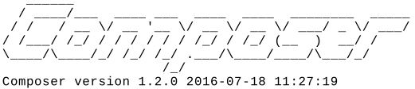
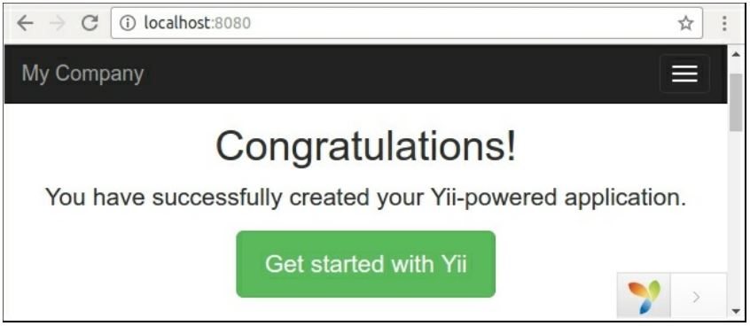

Установка фреймворка
===
Yii2-это современный PHP фреймворк представлен в виде пакета Composer. В этом рецепте мы установим фреймворк через менеджер пакетов Composer и настроим подключение к базе данных для нашего приложения.

Подготовка
---
Прежде всего, установите Composer в вашей системе.

**Замечание**
Если вы используете Openserver на Windows, команда Composer уже существует в Openserver терминальной консоли.
В Mac или Linux загрузите установщик с https://getcomposer.org/download/ и установить его глобально с помощью следующей команды:

**sudo php composer-setup.php --install-dir=/usr/local/bin --filename=composer**

В Windows без Openserver запустить 

**Composer-Setup.exe** 

cо страницы <https://getcomposer.org/doc/00-intro.md.>

Если у вас нет административных прав в системе, то в качестве альтернативы вы можете просто скачать httpsy/getcomposer.org/composer.phar  файл и использовать команду
 
**php composer. phar** 

вместо команды Composer

После установки запустить в терминале:
 
**Composer** 

Или (если вы просто скачиваете архив) его альтернатива:
 
**PHP composer.phar**

После успешной установки вы увидите следующий ответ:

Прямо сейчас вы можете установить любой пакет из https://packagist.org репозитория.

Как это сделать...
---
Можно установить базовые или расширенные шаблоны приложений. Чтобы узнать о различиях между шаблонами, см. рецепт шаблонов приложений.

**Замечание**

Обратите внимание, что во время установки менеджера пакетов Composer получает много информации с сайта GitHub. GitHub может ограничить запросы анонимных пользователей. В этом случае Composer просит Вас ввести маркер доступа. Вы просто должны  зарегистрироваться на <https://github.com> и генерировать новый маркер через с помошью руководства <https://github.com/blog/1509-personal-api-tokens>

### Установка базового шаблона проекта

Выполните следующие действия для установки базового шаблона проекта:
1 В качестве первого шага откройте ваш терминал и установите Bower-to-Composer  адаптер:
 
**composer global require "fxp/composer-asset-plugin:^1.2.0"**

Он обеспечивает простой способ загрузки, не связанных с созданием пакетов для PHP (JavaScript и CSS) из репозитория Bower.
(замечание переводчика: Если вы работаете под Windows то имя пользователя должно состоять только из латинских букв. С именем на русском это все нормально работать не будет)

2	Создание нового приложения в новом базовом каталоге:
(замечание переводчика: если вы работаете с Openserver то сначала в консоле перейдите в каталог domains 

**cd domains**

а затем создавайте каталог с приложением)

**composer create-project --prefer-dist yiisoft/yii2-app-basic basic**

3 Убедитесь, что ваш PHP содержит необходимые расширения:
 
**cd basic**

**php requirements.php**

**Замечание**
PHP в командном режиме и в режиме web-интерфейса может использовать разные php.ini файлы с различными конфигурациями и различными расширениями.

4 Создайте новую базу данных (если она нужна для вашего проекта) и настройте ее в config/db.php -файле.

5 Попробуйте запустить приложение с помощью следующей команды консоли:
**php yii serve**

6 Проверьте в браузере, что приложение работает по адресу http://localhost:8080:
(замечание переводчика: при работе с OpenServer необходимо настроить имя сайта что бы вы могли по нему обращаться к этому приложению. Это делается пункете меню Настройки->закладка Домены)

Для постоянной работы создайте новый хост на вашем сервере (Apache, Nginx и так далее) и установите веб-каталог в качестве корневого документа хоста.

### Установка расширенного шаблона проекта

Выполните следующие действия для установки расширенного шаблона проекта:
1 В качестве первого шага откройте ваш терминал и установите Bower-to-Composer  адаптер 

**composer global require "fxp/composer-asset-plugin:^1.2.0"**

Он обеспечивает простой способ загрузки, не связанных с созданием пакетов для PHP (JavaScript и CSS) из репозитория Bower.
(замечание переводчика: Если вы работаете под Windows то имя пользователя должно состоять только из латинских букв. С именем на русском это все нормально работать не будет)

2 Создание нового приложения в новом advaced каталоге:

**composer create-project --prefer-dist yiisoft/yii2-app-advanced advanced**

3 Новое приложение не содержит локальных файлов конфигурации и index.php. Для создания файлов необходимо инициализировать рабочую среду:
**cd advanced** 
**php init**

Во время инициализации выберите среду разработки Development.

4.	Убедитесь, что ваш PHP содержит необходимые расширения:

**php requirements.php**  

**Примечание:** 
PHP в режиме командной строки и в режиме веб-интерфейса может использовать другие .ini файлы с различной конфигурацией и различными расширениями.

5	Создайте новую базу данных и настройте ее в сгенерированном common/config/main-local.php файле .

6	Примените миграции приложения:

**php yii migrate**

Эта команда автоматически создаст пользовательскую таблицу в базе данных.

7 Попробуйте запустить приложение frontend с помощью следующей команды консоли:

**php yii serve --docroot=@frontend/web --port=8080**

Затем запустите серверную часть в другом окне терминала:
 
**php yii serve --docroot=@backend/web --port=8090**

8	Проверьте в браузере, что приложение работает по адресу  http: //localhost: 8080 и  http://localhost:8090 

Создайте два домена  для backend и frontend приложения на своем сервере (Apache, nginx и т. д.) и настройки серверной части веб-и frontend/веб-каталогах, как корневые каталоги.

Как это работает...
----
Прежде всего, мы установили менеджер пакетов Composer и плагин Bower asset.
После установки приложения с помощью команды composer create-project команда создает новый пустой каталог, клонирует исходный код шаблона приложения и загружает все его внутренние зависимости (фреймворк и другие компоненты) в подкаталог vendor.

При необходимости мы инициализируем конфигурацию приложения и создадим новую базу данных.
Мы можем проверить требования к системе через запуск requirements.php -скрипт в консоли или в режиме браузера.
А после клонирования кода мы можем сконфигурировать свой PHP сервер для работы с веб-каталогами как корневыми документами сервера.

Смотрите также
---
* Для получения дополнительной информации об установке yii2-app-basic обратитесь к, <http://www.yiiframework.com/doc-2.0/guide-start-installation.html>.
* Ссылка , <https://github.com/yiisoft/yii2-app-advanced/blob/mastpr/docs/guide/start-installation.md>  для  yii2-app-advanced.
* Ссылка, <https://getcomposer.org> для Composer package manager.
* Для создания маркера доступа GitHub для Composer обратитесь к  <https://github.com/blog/1509-personal-api-tokens>.

