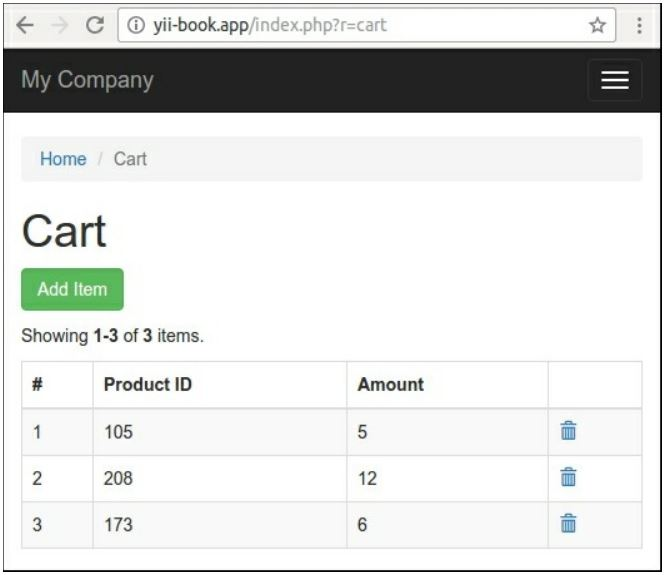

Контейнер внедрения зависимостей
===
***Dependency Inversion Principle (DIP)*** предположим, что мы создаем модульный код с низкой связью с помощью извлечения четких подсистем абстракции.
Например, если вы хотите упростить большой класс, вы можете разделить его на несколько кусков рутинного кода и извлечь каждый кусок в новый простой разделенный класс.
Принцип говорит о том, что низкоуровневые фрагменты должны реализовывать достаточную и четкую абстракцию, а высокоуровневый код должен работать только с этой абстракцией, а не с низкоуровневой реализацией.
Когда мы разделяем большой многозадачный класс на небольшие специализированные классы, мы сталкиваемся с проблемой создания зависимых объектов и внедрения их друг в друга.
Если раньше  мы могли создать один экземпляр:
```php
$service = new MyGiantSuperService();
```
А после разделения мы создадим и получим все зависимые предметы и построим наш сервис:
```php
$service = new MyService(
    new Repository(new PDO('dsn', 'username', 'password')), new Session(),
    new Mailer(new SmtpMailerTransport('username', 'password', host')), 
    new Cache(new FileSystem('/tmp/cache')),
);
```
Контейнер для инъекций зависимостей-это фабрика, которая позволяет нам не заботиться о создании наших объектов. В Yii2 мы можем настроить контейнер только один раз и использовать его для получения нашего сервиса, как это:
```php
$service = Yii::$container->get('app\services\MyService')
```
Мы можем также использовать это:

```php
$service = Yii::createObject('app\services\MyService')
```
Или мы просим контейнер внедрить его как зависимость в конструкторе другой службы:

```php
use app\services\MyService; 
class OtherService {
      public function construct(MyService $myService) { ... }
}
```
Когда мы получим экземпляр OtherService:

```php
$otherService = Yii::createObject('app\services\OtherService')
```

Во всех случаях контейнер будет разрешать все зависимости и внедрять зависимые объекты друг в друга.
В рецепте мы создаем корзину с подсистемой хранения и автоматически вставляем корзину в контроллер.

### Подготовка

Создайте новое приложение с помощью диспетчера пакетов Composer, как описано в официальном руководстве по адресу  <http://www.yiiframework.com/doc-2.0/guide-start-installation.html>

### Как это сделать...

Выполните следующие действия:

1 Создание класса корзины покупок:
```php

<?php

namespace app\cart;

use app\cart\storage\StorageInterface;

class ShoppingCart
{
    /**
     * @var StorageInterface
     */
    private $storage;
    private $_items = [];

    public function __construct(StorageInterface $storage)
    {
        $this->storage = $storage;
    }

    public function add($id, $amount)
    {
        $this->loadItems();
        if (array_key_exists($id, $this->_items)) {
            $this->_items[$id]['amount'] += $amount;
        } else {
            $this->_items[$id] = [
                'id' => $id,
                'amount' => $amount,
            ];
        }
        $this->saveItems();
    }

    public function remove($id)
    {
        $this->loadItems();
        $this->_items = array_diff_key($this->_items, [$id => []]);
        $this->saveItems();
    }

    public function clear()
    {
        $this->_items = [];
        $this->saveItems();
    }

    public function getItems()
    {
        $this->loadItems();
        return $this->_items;
    }

    private function loadItems()
    {
        $this->_items = $this->storage->load();
    }

    private function saveItems()
    {
        $this->storage->save($this->_items);
    }
}
```

2  Он будет работать только с собственными предметами. Вместо встроенного хранения элементов в сеансе он делегирует эту ответственность любому внешнему классу хранения, который будет реализовывать Интерфейс Storageinterface.

3  Класс cart просто получает объект хранения в собственный конструктор, сохраняет его экземпляр в закрытый $storage поле и вызывает  load() и save() методы.

4  Определите общий интерфейс хранения корзины с необходимыми методами:
```php
<?php

namespace app\cart\storage;

interface StorageInterface
{
    /**
     * @return array of cart items
     */
    public function load();

    /**
     * @param array $items from cart
     */
    public function save(array $items);
}
```

5  Создайте простую реализацию хранилища. Он будет хранить выбранные элементы в сеансе сервера:
```php
<?php

namespace app\cart\storage;

use yii\web\Session;

class SessionStorage implements StorageInterface
{
    /**
     * @var Session
     */
    private $session;
    private $key;

    public function __construct(Session $session, $key)
    {
        $this->key = $key;
        $this->session = $session;
    }

    public function load()
    {
        return $this->session->get($this->key, []);
    }

    public function save(array $items)
    {
        $this->session->set($this->key, $items);
    }
}
```
6  Хранилище получает любой экземпляр framework session  в constructor и использует его позже для получения и хранение предметов.

7  Настройте класс shoppingCart и его зависимости в файле config/web.php:
```php
<?php
use app\cart\storage\SessionStorage;
Yii::$container->setSingleton('app\cart\ShoppingCart');
Yii::$container->set('app\cart\storage\StorageInterface', function() { 
        return new SessionStorage(Yii::$app->session, 'primary-cart');
        });
$params = require(  __DIR__  . '/params.php');
//...
```
8  Создайте контроллер cart с расширенным конструктором:
```php
<?php

namespace app\controllers;

use app\cart\ShoppingCart;
use app\models\CartAddForm;
use Yii;
use yii\data\ArrayDataProvider;
use yii\filters\VerbFilter;
use yii\web\Controller;

class CartController extends Controller
{
    /**
     * @var ShoppingCart
     */
    private $cart;

    public function __construct($id, $module, ShoppingCart $cart, $config = [])
    {
        $this->cart = $cart;
        parent::__construct($id, $module, $config);
    }

    public function behaviors()
    {
        return [
            'verbs' => [
                'class' => VerbFilter::className(),
                'actions' => [
                    'delete' => ['post'],
                ],
            ],
        ];
    }

    public function actionIndex()
    {
        $dataProvider = new ArrayDataProvider([
            'allModels' => $this->cart->getItems(),
        ]);

        return $this->render('index', [
            'dataProvider' => $dataProvider,
        ]);
    }

    public function actionAdd()
    {
        $form = new CartAddForm();

        if ($form->load(Yii::$app->request->post()) && $form->validate()) {
            $this->cart->add($form->productId, $form->amount);
            return $this->redirect(['index']);
        }

        return $this->render('add', [
            'model' => $form,
        ]);
    }

    public function actionDelete($id)
    {
        $this->cart->remove($id);

        return $this->redirect(['index']);
    }
}
```
9  Создание формы:
```php
<?php
namespace app\models;
use yii\base\Model;
class CartAddForm extends Model {
    public $productId; 
    public $amount;
    public function rules()
    {
       return [
          [['productId', 'amount'], 'required'],
          [['amount'], 'integer', 'min' => 1],
       ];
    }
}

```
10  Создания вида views/cart/index.php :
```php
<?php
use yii\grid\ActionColumn; 
use yii\grid\GridView; 
use yii\grid\SerialColumn; 
use yii\helpers\Html;
/* @var $this yii\web\View */
/* @var $dataProvider yii\data\ArrayDataProvider */
$this->title = 'Cart';
$this->params['breadcrumbs'][] = $this->title;
?>
<div class="cart-index">
   <h1><?= Html::encode($this->title) ?></h1>
   <p><?= Html::a('Add Item', ['add'], ['class' => 'btn btn-success']) ?></p>
   <?= GridView::widget([
        'dataProvider' => $dataProvider,
        'columns' => [
            ['class' => SerialColumn::className()], 'id:text:Product ID','amount:text:Amount',
            ['class' => ActionColumn::className(),  'template' => '{delete}',]
        ],
    ])?>
</div>
```
11 Cоздаем представление views/cart/add.php:
```php
<?php
use yii\helpers\Html;
use yii\bootstrap\ActiveForm;
/* @var $this yii\web\View */
/* @var $form yii\bootstrap\ActiveForm */
/* @var $model app\models\CartAddForm */
$this->title = 'Add item';
$this->params['breadcrumbs'][] = ['label' => 'Cart', 'url' => ['index']]; $this->params['breadcrumbs'][] = $this->title;
?>
<div class="cart-add">
<h1><?= Html::encode($this->title) ?></h1>
<?php $form = ActiveForm::begin(['id' => 'contact-form']); ?>
<?= $form->field($model, 'productId') ?>
<?= $form->field($model, 'amount') ?>
<div class="form-group">
<?= Html::submitButton('Add', ['class' => 'btn btn-primary']) ?> </div>
<?php ActiveForm::end(); ?>
</div>
```
12  Добавление элементов в Главное меню:
```html
['label' => 'Home', 'url' => ['/site/index']],
['label' => 'Cart', 'url' => ['/cart/index']],
['label' => 'About', 'url' => ['/site/about']],
// ...
```
13  Откройте страницу корзины и попробуйте добавить строки:



###Как это работает..

В этом случае у нас есть основной класс shoppingCart с низкоуровневой зависимостью, определяемой интерфейсом абстракции:

```php
class ShoppingCart 
{
   public function __construct(StorageInterface $storage) { ... }
}

interface StorageInterface 
{
public function load();
public function save(array $items);
}
```
И у нас есть некоторая реализация абстракции:
```php
class SessionStorage implements StorageInterface
{
       public function  construct(Session $session, $key) { ... }
}
Right now we can create an instance of the cart manually like this:
$storage = new SessionStorage(Yii::$app->session, 'primary-cart');
$cart = new ShoppingCart($storage)
```
Это позволяет нам создавать множество различных реализаций, таких как SessionStorage, CookieStorage или DbStorage. И мы можем повторно использовать независимый от фреймворка класс ShoppingCart с StorageInterface в разных проектах и разных фреймворках. Мы должны только реализовать класс хранения с методами интерфейса для необходимой платформы.

Но вместо того, чтобы вручную создавать экземпляр со всеми зависимостями, мы можем использовать контейнер внедрения зависимостей.

По умолчанию контейнер анализирует конструкторы всех классов и рекурсивно создает все необходимые экземпляры. Например, если у нас четыре класса:
```php
class A 
{
    public function __construct(B $b, C $c) { ... }
}

class B 
{
    {...}

class C 
{
public function __construct(D $d) { ... }
}

class D 
{
    ...
}
```
Мы можем получить экземпляр класса двумя способами:
```php
$a = Yii::$container->get('app\services\A')
```
// или
```php
$a = Yii::createObject('app\services\A')
```
Контейнер автоматически создает экземпляры классов B, D, C и A и внедряет их друг в друга.
В нашем случае мы отмечаем корзину как синглтон: 
```php
Yii::$container->setSingleton('app\cart\ShoppingCart');
```
Это означает, что контейнер будет возвращать один экземпляр для каждого повторного вызова вместо создания корзины снова и снова.
Кроме того, наш ShoppingCart имеет Тип StorageInterface в своем собственном конструкторе, и контейнер знает, какой класс он должен создать для этого типа. Мы должны вручную привязать класс к интерфейсу, как это:
```php
Yii::$container->set('app\cart\storage\StorageInterface', 'app\cart\storage\CustomStorage', );
```
Но наш класс SessionStorage имеет нестандартный конструктор:
```php
class SessionStorage implements StorageInterface {
        public function __construct(Session $session, $key) { ... }
}
```
Поэтому мы используем анонимную функцию для создания экземпляра вручную:
```php
Yii::$container->set('app\cart\storage\StorageInterface', function() {
         return new SessionStorage(Yii::$app->session, 'primary-cart');
});
```
И в конце концов мы можем получить объект cart из контейнера вручную в наших собственных контроллерах, виджетах и других местах:
```php
$cart = Yii::createObject('app\cart\ShoppingCart')
```
Каждый контроллер и другие объекты будут созданы с помощью метода createObject внутри фреймворка. И мы можем использовать инжекцию  через конструктор контроллера:
```php
class CartController extends Controller {
    private $cart;
    public function  __construct($id, $module, ShoppingCart $cart, $config = [])
    {
        $this->cart = $cart;
        parent::    construct($id, $module, $config);
     }
     // ...
}
```
Используйте этот впрыснутый объект :
```php
public function actionDelete($id)
{
    $this->cart->remove($id);
    return $this->redirect(['index']);
}
```
###Смотрите также
*   Дополнительные сведения о DIP см <https://en.wikipedia.org/wiki/Dependencv inversion principle>
*   Чтобы узнать больше о контейнере внедрения зависимостей, обратитесь к <http://www.yiiframework.com/doc-2.0/gurde-concept-di-container.html>      на русском <http://yiiframework.domain-na.me/doc/guide/2.0/ru/concept-di-container> 

