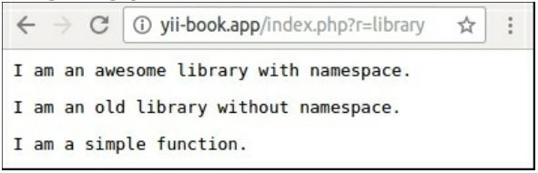

Использование внешнего кода
==
Репозитории пакетов, стандарты PSR и социальное кодирование предоставляют нам множество высококачественных многократно используемых библиотек и других компонентов с бесплатными лицензиями. Мы можем просто установить какие-либо внешние компоненты в проект вместо реинжиниринга их с нуля. Это повышает производительность разработки и делает код более высокого качества.

Подготовка 
---
Создайте новое приложение с помощью composer, как описано в официальном руководстве по <http://www.yiiframework.com/doc-2.0/guide-start-installation.html>. по русски <http://yiiframework.domain-na.me/doc/guide/2.0/ru/start-installation>

Как это работает…
---
В этом рецепте мы попытаемся прикрепить некоторые библиотеки вручную и через Composer.

### Установка библиотеки с помощью Composer
При использовании NoSQL или других баз данных без первичных ключей autoincrement необходимо создать уникальные идентификаторы вручную. Например, вместо числового идентификатора можно использовать Универсальный уникальный идентификатор (UUID). Давайте сделаем это:

1 Установим  компонент <https://github.com/ramsey/uuid> используя Composer:

**composer require ramsey/uuid**

2 Создание демонстрационного контроллера консоли:
```php
<?php
namespace app\commands;
use Ramsey\Uuid\Uuid; 
use нii\console\Controller;
class UuidController extends Controller {
public function actionGenerate()
{
$this->stdout(Uuid::uuid4()->toString(). PHP_EOL);
$this->stdout(uuid::uuid4()->toString(). PHP_EOL);
$this->stdout(uuid::uuid4()->toString(). PHP_EOL);
$this->stdout(uuid::uuid4()->toString(). PHP_EOL);
$this->stdout(uuid::uuid4()->toString(). PHP_EOL);
}
}
```
3 И просто запустите его:

***./yii uuid/generate***

4 В случае успеха, вы увидите следующий результат:

25841e6c-6060-4a81-8368-4d99aa3617dd
fcac910a-a9dc-4760-8528-491c17591a26
4d745da3-0a6c-47df-aee7-993a42ed915c 
0f3e6da5-88f1-4385-9334-b47d1801ca0f 
21a28940-c749-430d-908e-1893c52f1fe0

Вот и все! Теперь вы можете использовать класс Ramsey\uuid\uuid в своем проекте.

### Установка библиотек вручную 
Мы можем установить библиотеку автоматически,когда она предоставляется в виде пакета Composer. В других случаях мы должны установить его вручную.
Например, создайте несколько примеров библиотек:

1 Создайте  файл awesome/namespaced/Library.php со следующим кодом:
```php
<?php
namespace awesome\namespaced;
class Library {
    public function method()
    {
        return 'I am an awesome library with namespace.';
    }
}
```
2 Создайте файл old/OldLibrary.php:
```php
<?php
class OldLibrary {
    function method()
    {
        return 'I am an old library without namespace.';
    }
}
```

3 Создайте набор функций в файле old/functions.php:
```php
<?php
function simpleFunction()
{
    return 'I am a simple function.';
}
```
А теперь настройте этот файл в нашем приложении:

4 Определите новый псевдоним для корня пространства имен в файле config/web.php (в разделе псевдонимы):
```php
$config = [
    'id' => 'basic',
    'basePath' => dirname(__DIR__),
    'bootstrap' => ['log'],
    'aliases' => [
       '@awesome' => '@app/awesome',
    ],
    'components' => [
        // ...
    ],
    'params' =>  // ...
];
```
или через метод setAlias:
```php
Yii::setAlias('@awesome','@app/awesome');
```

5 Определите простой путь к файлу класса в верхней части config/web.php -файла: 
```php
Yii::$classMap['OldLibrary'] = '@old/OldLibrary.php';
```

6 Настройте автоматическую загрузку functions.php файл в composer.json: 
```php
"require-dev": {
   ...
    },
"autoload": {
    "files": ["old/functions.php"]
    },
"config": {
     ...
    },
```
И примените изменения:

***composer update***

7 А теперь создадим пример контроллера:
```php
<?php
namespace app\controllers; 
use yii\base\Controller;

class LibraryController extends Controller {
    public function actionIndex()
    {
        $awesome = new \awesome\namespaced\Library(); 
        echo '<pre>' . $awesome->method() .	'</pre>';
        $old = new \OldLibrary();
        echo '<pre>' . $old->method() .	'</pre>';
        echo '<pre>' . simpleFunction() .	'</pre>';
    }
}
```
и откройте страницу:



