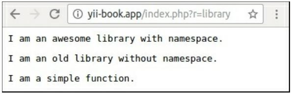

Использование кода Yii2 в других фреймворках
===
 Если вы хотите использовать код  Yii2 с другими фреймвоками, просто добавьте параметры yii2 в composer.json:
```php
{
    "extra": {
        "asset-installer-paths": {
            "npm-asset-library": "vendor/npm",
            "bower-asset-library": "vendor/bower"
        }
     }
}
```
И установите фреймворк: 

***composer require yiisoft/yii2***

Теперь откройте сценарий входа вашего приложения (на ZendFramework, Laravel, Symfony и многих других), требуйте автозапуска Yii2 и создайте экземпляр приложения Yii:

```php
require( __DIR__  . '/../vendor/autoload.php');
require( __DIR__  . '/../vendor/yiisoft/yii2/Yii.php');
$config = require(__DIR__ . '/../config/yii/web.php');
new yii\web\Application($config);
```
Вот и все! Теперь вы можете использовать экземпляры yii::$app, модели, виджеты и другие компоненты из Yii2.

Как это работает…
---
В первом случае мы просто устанавливаем новый пакет Composer в наш проект и используем его, потому что это composer.json файл определяет все аспекты автоматической загрузки файлов библиотеки.
Но во втором случае у нас не было пакетов Composer и файлы регистрировались в механизме автозапуска вручную. В Yii2 мы можем использовать псевдонимы и yii::$classMap для регистрации корней пространств имен PSR-4 и для отдельных файлов.
Но в качестве альтернативы мы можем использовать Composer autoloader для всех случаев. Просто определите расширенный раздел автозапуска в composer.файл json, как это:
```php

"autoload": {
    "psr-0": { "": "old/" },
    "psr-4": {"awesome\\": "awesome/"},
    "files": ["old/functions.php"]
}
```
Примените изменения с помощью этой команды: composer update
Прямо сейчас вы можете удалить псевдонимы и определения $classMap из файлов конфигурации и убедиться, что страница примера все еще работает правильно:


Этот пример полностью использует autoloader Composer вместо autoloader фреймворка.

Смотрите так же
---

Дополнительные сведения об интеграции внешнего кода в Yii2 и кода платформы в наши проекты см. в руководстве по адресу <http://www.yiiframework.com/doc-2.0/gurde-tutorial-yii-intpgration.html>   по русски <http://yiiframework.domain-na.me/doc/guide/2.0/ru/tutorial-yii-integration> 
* Подробнее об псевдонимах см. <http://www.yiiframework.com/doc-2.0/guide-concept-aliases.html>
 по русски <http://yiiframework.domain-na.me/doc/guide/2.0/ru/concept-aliases> 
*  Подробнее о разделе autoload композитора.json обратитесь к <https://getcomposer.org/doc/04-schema.md#autoload> 
* А также вы можете просматривать любые пакеты Composer по адресу  <https://packagist.org>

