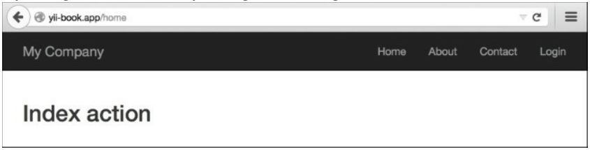
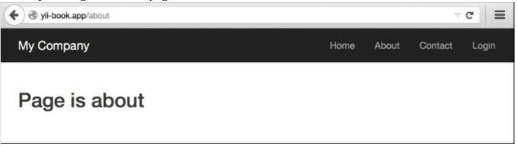

Настройка правил URL
===
В этом рецепте мы узнаем, как настроить правила URL. 
Прежде чем мы начнем позволяет настроить приложение.

Подготовка
---
1 Создайте новое приложение с помощью composer, как описано в официальном руководстве по <http://www.yiiframework.com/doc-2.0/guide-start-installation.html>. по русски <http://yiiframework.domain-na.me/doc/guide/2.0/ru/start-installation> .

2 Создайте контроллер @app/controllers/TestController.php со следующим кодом внутри:
```php
<?php

namespace app\controllers;

use yii\helpers\Html;
use yii\web\Controller;

class TestController extends Controller
{
    public function actionIndex()
    {
        return $this->renderContent(Html::tag('h2',
            'Index action'
        ));
    }

    public function actionPage($alias)
    {
        return $this->renderContent(Html::tag('h2',
            'Page is '. Html::encode($alias)
        ));
    }
}
```
Это контроллер приложений, в котором который мы собираемся настроить URL-адреса.

3 Настройте сервер приложений на использование чистых URL-адресов. Если вы используете Apache с включеными mod_rewrite и allowoverride , то вы должны добавить следующие строки в файл .htaccess в каталоге @web:
```php
Options +FollowSymLinks IndexIgnore */*
RewriteEngine on
# if a directory or a file exists, use it directly RewriteCond %{REQUEST_FILENAME} !-f 
RewriteCond %{REQUEST_FILENAME} !-d
# otherwise forward it to index.php 
RewriteRule . index.php
```

Как это работает
---

Наш веб-сайт должен отображать индексную страницу в /home и все другие страницы в /page/<alias_ here>. Кроме того, параметр /about должен приводить к странице с псевдонимом about:

1 Добавьте следующую конфигурацию компонента urlManager в @app/config/web.php:

```php

'components' => [
// . .
    'urlManager' => [
         'enablePrettyUrl' => true,
         'rules' => [
             'home' => 'test/index',
             '<alias:about>' => 'test/page',
             'page/<alias>' => 'test/page',
         ]
    ],
// ..
],
```
После сохранения изменений вы сможете просматривать следующие URL-адреса:

fe/home

fe/about

fe/page/about

/page/test

2  Попробуйте запустить /home URL, и вы получите следующее: 


Давайте рассмотрим, что было сделано и почему это работает. Начнем с правой части первого правила

3 Затем попробуйте запустить страницу /about:


Как это работает
---
```php
'home' => 'test/index',
```
Что такое test/index? В приложении, каждый контроллер и его действия имеют соответствующие внутренние маршруты. Формат для внутреннего маршрута-moduleiD/controlleriD /actioniD. Например, метод actionPage Testcontroller соответствует маршруту test/page. Таким образом, чтобы получить идентификатор контроллера, вы должны взять его имя без постфикса контроллера и сделать его первую букву строчной. Чтобы получить идентификатор действия, следует взять имя метода действия без префикса действия и снова сделать его первую букву строчной.
Итак, что такое home? Чтобы лучше понять это, нам нужно знать, по крайней мере, поверхностно, что происходит, когда мы получаем доступ к нашему приложению, используя различные URL-адреса.
Когда мы используем /home, маршрутизатор URL проверяет наши правила один за другим, начиная с вершины, пытаясь соответствовать URL, введенному с правилом. Если соответствие найдено, то маршрутизатор получает контроллер и его действие от внутреннего маршрута, назначенного правилу, и выполняет его. Итак, /home-это шаблон URL, который определяет, какие URL будут обрабатываться правилом, которому он принадлежит.

Это еще не все...
---
Можно также создать параметризованные правила, используя специальный синтаксис. Рассмотрим третье правило: 
```php
'page/<alias>' => test/page',
```
Здесь мы определяем параметр alias, который должен быть указан в URL после /page/. Это может быть практически что угодно и он будет передан в качестве параметра $alias следующим:
```php
TestController::actionPage($alias) .
```
Для такого параметра можно определить шаблон. Мы сделали это по второму правилу, а именно:

```php
'<alias:about>' => test/page',
```

Псевдоним здесь должен совпадать, иначе правило не будет применяться.

Смотрите так же
---
См. следующие ссылки для дальнейшего чтения:
* <http://www.yiiframework.com/doc-2.0/guide-runtime-routing.html>
* По русски <http://yiiframework.domain-na.me/doc/guide/2.0/ru/runtime-routing>
* <http://www.Yiiframework.com/doc-2.0/guide-runtime-url-handling.html> (ссылка не рабочая)
* <http://www.yiiframework.com/doc-2.0/yii-web-urlmanager.html>
* Рецепт Использование регулярных выражений в URL правилах

