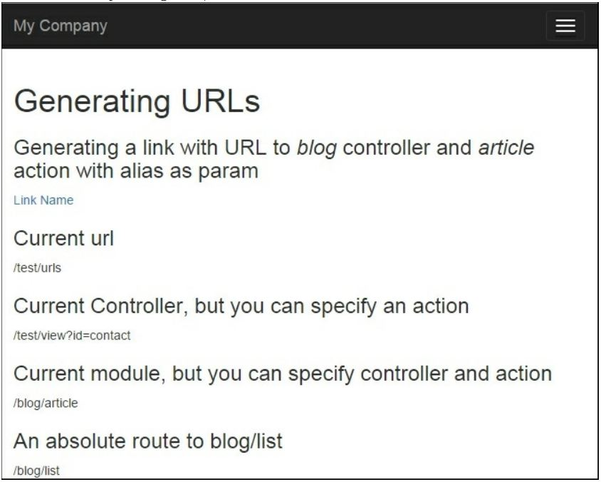

Создание Url-Адресов
==
Yii позволяет не только маршрутизировать URL-адреса к различным действиям контроллера, но и генерировать 
URL-адрес, указав правильный внутренний маршрут и его параметры. Это действительно полезно, потому что вы 
можете сосредоточиться на внутренних маршрутах при разработке приложения, и только беспокоиться о реальных 
URL-адресов, прежде чем идти в прямом эфире. Никогда не указывайте URL напрямую и убедитесь, что вы 
используете группу инструментов YII URL. Это позволит вам изменить URL-адреса без перезаписи большого 
количества кода приложения.

Подготовка 
---
1 Создайте новое приложение с помощью composer, как описано в официальном руководстве по 
<http://www.yiiframework.com/doc-2.0/guide-start-installation.html>. по русски <http://yiiframework.domain-
na.me/doc/guide/2.0/ru/start-installation>

2	Найдите @app/config/web.php файл и заменить массив правил следующим образом:
```php
'urlManager' => array(
'enablePrettyUrl' => true,
'showScriptName' => false,
),
```
3	Настройте сервер приложений на использование чистых URL-адресов. Если вы используете Apache с 
mod_rewrite и allowoverride включен, то вы должны добавить следующие строки в  файл .htaccess в 
папке @app/web:
```php
Options +FollowSymLinks 
IndexIgnore */*
RewriteEngine on
#	if a directory or a file exists, use it directly 
RewriteCond %{REQUEST_FILENAME} !-f 
RewriteCond %{REQUEST_FILENAME} !-d
#	otherwise forward it to index.php 
#	RewriteRule . index.php
```

Как это сделать...
---
1.	В каталоге @app/controllers создайте BlogController со следующим кодом:
```php
<?php
namespace app\controllers; use yii\web\Controller;
class BlogController extends Controller {
    public function actionIndex()
    {
        return $this->render('index');
    }
    public function actionRssFeed($param)
    {
        return $this->renderContent('This is RSS feed for our blog and '	. $param);
    }
    public function actionArticle($alias)
    {
        return $this->renderContent('This is an article with alias ' . $alias);
    }
    public function actionList()
    {
         return $this->renderContent('Blog\'s articles here');
    }
    public function actionHiTech()
    {
          return $this->renderContent('Just a test of action which contains more than one words in the name') ;
    }
}
```
Это наш контроллер блога, что мы собираемся генерировать пользовательские URL-адреса для.

2.	В каталоге @app/controllers создайте TestController со следующим кодом:
```php
<?php
namespace app\controllers; use Yii;
use yii\web\Controller;
class TestController extends Controller {
    public function actionUrls()
    {
        return $this->render('urls');
    }
}
```

3.	В каталоге @app/views создайте тестовый каталог и url.php  файл, и поместите следующий код 
внутри:
```php
<?php
use yii\helpers\Url; use 
yii\helpers\Html;
?>
<h1>Generating URLs</h1>
<h3>Generating a link with URL to <i>blog</i> controller and <i>article</i> action with alias as param</h3>
<?= Html::a('Link Name', ['blog/article', 'alias' => 'someAlias']); ?>
<h3>Current url</h3>
<?=Url::to(' ')?>
<h3>Current Controller, but you can specify an action</h3>
<?=Url::toRoute(['view', 'id' => 'contact']);?>
<h3>Current module, but you can specify controller and action</h3>
<?= Url::toRoute('blog/article')?>
<h3>An absolute route to blog/list </h3>
<?= Url::toRoute('/blog/list')?>
<h3> URL for <i>blog</i> controller and action <i>HiTech</i> </h3>
<?= Url::toRoute('blog/hi-tech')?>
<h3>Canonical URL for current page</h3>
<?= Url::canonical()?>
<h3>Getting a home URL</h3>
<?= Url::home()?>
<h3>Saving a URL of the current page and getting it for re-use</h3>
<?php Url::remember()?>
<?=Url::previous()?>
<h3>Creating URL to <i>blog</i> controller and <i>rss-feed</i> action while 
URL helper isn't available</h3>
<?=Yii::$app->urlManager->createUrl(['blog/rss-feed', 'param' => 'someParam'])?>
<h3>Creating an absolute URL to <i>blog</i> controller and <i>rss-
feed</i></h3> <p>It's very useful for emails and console applications</p>
<?=Yii::$app->urlManager->createAbsoluteUrl(['blog/rss-feed', 'param' =>
' someParam'])?>
```
4 Перейдите по URL http: //yii-book.app/test/urls, и вы увидите вывод. (См. полный список методов 
в предыдущем коде.):

 
Как это работает
---
Нам нужно генерировать URL-адреса, указывающие на действия контроллера (RssFeed, Article, List, HiTech) в BlogController.
В зависимости от того, где нам это нужно, есть разные способы сделать это, но основы одинаковы. Перечислим некоторые 
методы, которые генерируют адреса.
Что такое внутренний маршрут? Каждый контроллер и его действия имеют соответствующие маршруты. Формат для 
маршрута-moduleID/controllerID/actionID. Например, метод actionHitech BlogController соответствует маршруту blog/hi-
tech.
Чтобы получить идентификатор контроллера, вы должны взять его имя без постфикса контроллера и сделать его первую 
букву строчной. Чтобы получить идентификатор действия, необходимо взять имя метода действия без префикса 
действия и сделать первую букву в каждом слове строчной, и отделить их знаком тире ( - ) (например, actionHiTech будет 
hi-tech).
Переменные $_GET-это параметры, которые будут переданы действию с указанным внутренним маршрутом. Например, 
если мы хотим создать URL-адрес статьи BlogController::action, которая передает ему параметр $_GET[ 'name'], это 
можно сделать следующим образом:
```php
<?= HTML::a('Link Name', ['blog/article', 'alias' => 'someAlias']); ?>
```

Относительные URL-адреса могут использоваться внутри вашего приложения, в то время как абсолютные должны 
использоваться для указания на места за пределами вашего веб-сайта (например, другие веб-сайты) или для ссылки на 
ресурсы, предназначенные для доступа извне (RSS-каналы, электронные письма и так далее).
Вы можете сделать это легко с менеджером адрес. Диспетчер URL-адресов-это встроенный компонент приложения с 
именем urlManager. Вы должны использовать этот компонент, который доступен из веб-и консольных приложений через

```php
Yii::$app->urlManager.
```

Если не удается получить экземпляр контроллера, например при реализации консольного приложения, 
можно использовать два следующих метода создания urlManager:

```php
<?=Yii::$app->urlManager->createUrl(['blog/rss-feed', 'param' => 'someParam'])?> 
<?=Yii::$app->urlManager->createAbsoluteUrl(['blog/rss-feed', 'param' => 'someParam'])?>
```

Есть еще.
---

Дополнительные сведения см. по следующим URL-адресам:
*	<https://en.wikipedia.org/wiki/Canonical link element>
*	<http://www.yiiframework.com/doc-2.0/guide-structure-controllers.html>
	по русски <http://yiiframework.domain-na.me/doc/guide/2.0/ru/structure-controllers>
*	<http://www.yiiframework.com/doc-2.0/guide-runtime-routing.html>
	по русски <http://yiiframework.domain-na.me/doc/guide/2.0/ru/runtime-routing>
*	<http://www.viiframework.com/doc-2.0/guide-helper-url.html>
	по русски <http://yiiframework.domain-na.me/doc/guide/2.0/ru/helper-url> 
*	<http://www.yiiframework.com/doc-2.0/yii-web-urlmanager.html>
	
Смотрите так же
---
Рецепт Конфигурирование URL правил
