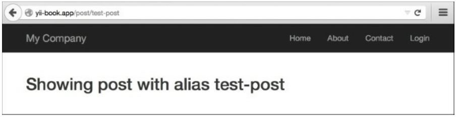
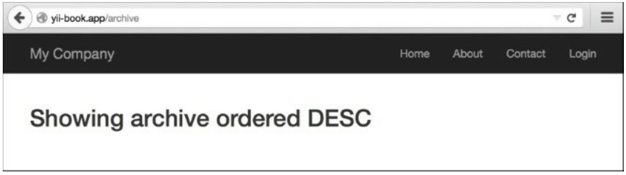
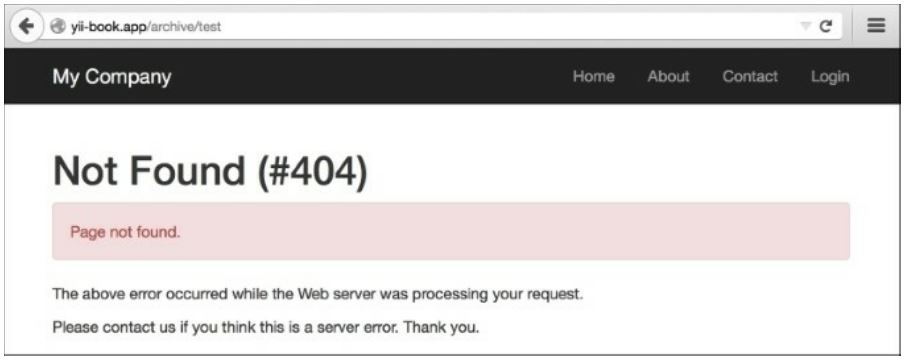
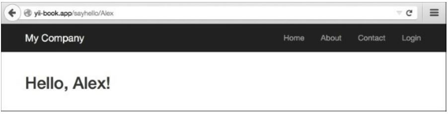

Использование регулярных выражений в правилах URL
==
Одной из скрытых особенностей YII URL router является то, что вы можете использовать регулярные выражения, которые являются довольно мощными средством для обработки строк.

Подготовка 
---
1 Создайте новое приложение с помощью composer, как описано в официальном руководстве по http://www.yiiframework.com/doc-2.0/guide-start-installation.html.
 по русски http://yiiframework.domain-na.me/doc/guide/2.0/ru/start-installation 

2 В каталоге @app/controllers создайте Postcontroller.php использует следующее:
```php
<?php
namespace app\controllers;
use yii\helpers\Html; 
use yii\web\Controller;
class PostController extends Controller {
    public function actionView($alias)
    {
        return $this->renderContent(Html::tag('h2','Showing post with alias '. Html::encode($alias)));
    }
    public function actionIndex($type = 'posts', $order = 'DESC')
    {
        return $this->renderContent(Html::tag('h2','Showing ' . Html::encode($type) . ' ordered ' . Html::encode($order)));
    }
    public function actionHello($name)
    {
         return $this->renderContent(Html::tag('h2','Hello, ' . Html::encode($name) . '!'));
    }
}
```
Это наш контроллер приложений, к которому мы собираемся получить доступ, используя наши пользовательские URL-адреса.

3 Настройте сервер приложений на использование чистых URL-адресов. Если вы используете Apache с mod_rewrite и allowoverride включен, то вы должны добавить следующие строки в  файл .htaccess в папке @web:
```php
Options +FollowSymLinks IndexIgnore */*
RewriteEngine on
# if a directory or a file exists, use it directly 
RewriteCond %{REQUEST_FILENAME} !-f 
RewriteCond %{REQUEST_FILENAME} !-d
# otherwise forward it to index.php 
RewriteRule . index.php
```

Как это сделать...
---
Мы хотим, чтобы наше действие Postcontroller принимало параметры в соответствии с некоторыми заданными правилами и давало 404 не найденных ответа HTTP для всех параметров, которые не совпадают. Кроме того, post/index должен иметь архив URL-адресов псевдонимов.
Добавьте следующую конфигурацию компонента urlManager в @app/config/web.РНР:
```php
'components' => [
    // ..
    'urlManager' => [
        'enablePrettyUrl' => true,
        'rules' => [
                   'post/<alias:[-a-z]+>' => 'post/view',
                   '<type:(archive|posts)>' => 'post/index',
                   '<type:(archive|posts)>/<order:(DESC|ASC)>' => 'post/index',
                   'sayhello/<name>' => 'post/hello',
                   ]
    ],
    // ..
],
```
Следующие URL-адреса будут успешными:
* http://yii-book.app/post/test
* http://yii-book.app/posts
* http://yii-book.app/archive
* http://yii-book.app/posts/ASC
* http://yii-book.app/sayhello

Не удастся выполнить следующие URL-адреса:

* http: //yii-book.app/archive/test
* http: //yii-book.app/post/another_post

На следующем снимке экрана показано, что URL http: //yii-book.app/post/test успешно запущен:
(от переводчика: забавная картинка с другим адресом)


На следующем снимке экрана показано, что URL http: //yii-book. app/archive тоже успешно работает:


На следующем снимке экрана показано, что URL http: //yii-book.app/archive/test не был успешно запущен и произошла ошибка:


Как это работает…
---
Регулярные выражения можно использовать как в определении параметра, так и в остальной части правила. Давайте читать наши правила одно за другим:
```php
'post/<alias:[-a-z]+>' => 'post/view',
```
Параметр alias должен содержать одну или несколько английских букв или дефис. Никакие другие символы не допускаются
```php
'(posts|archive)' => 'post/index',
'(posts|archive)/<order:(DESC|ASC)>' => 'post/index',
```
КАК СООБЩЕНИЯ, ТАК И АРХИВ ВЕДУТ К POST/INDEX. ПАРАМЕТР ORDER МОЖЕТ ПРИНИМАТЬ ТОЛЬКО ДВА ЗНАЧЕНИЯ – DESC И ASC:
```php
'sayhello/<name>' => 'post/hello',
```
Вы должны указать часть имени, но нет никаких ограничений на то, какие символы разрешены. Обратите внимание, что независимо от используемого правила, Разработчик никогда не должен предполагать, что входные данные безопасны.



Это еще не все...
---
Чтобы узнать больше о регулярных выражениях, можно использовать следующие источники:
* <http://www.php.net/manual/en/reference.pcre.pattern.syntax.php>
* Mastering Regular Expressions, Jeffrey Fried! доступна по адресу <http://regex.info/>.

Смотрите так же
---
* Рецепт Конфигурация URLправил
