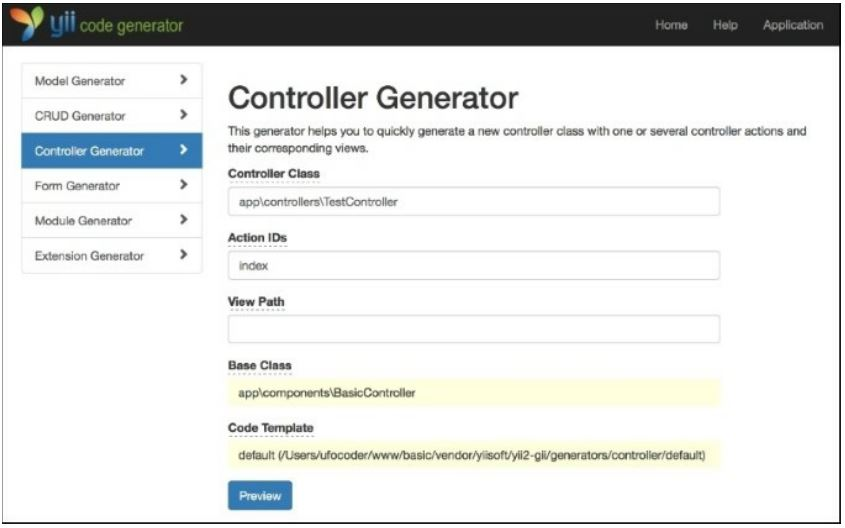

Использование базового контроллера
===

Во многих фреймворках концепция базового контроллера, расширяемая другими, описана прямо в 
руководстве. В Yii это не в руководстве, так как вы можете достичь гибкости многими другими способами. 
Тем не менее, использование базового контроллера возможно и может быть полезно.
Допустим, мы хотим добавить некоторые контроллеры, которые будут доступны только при входе 
пользователя в систему. Мы, конечно, можем установить это ограничение для каждого контроллера 
отдельно, но мы сделаем это лучше.

Подготовка
---

Создайте новое приложение с помощью composer, как описано в официальном руководстве по 
<http://www.yiiframework.com/doc-2.0/guide-start-installation.html>. по русски <http://yiiframework.domain-
na.me/doc/guide/2.0/ru/start-installation> 

Как это сделать...
---

1 Во-первых, нам понадобится базовый контроллер, который будут использовать наши пользовательские 
контроллеры. Давайте создадим @app/components/BaseController.php со следующим кодом:
```php
<?php
namespace app\components; 
use Yii;
use yii\web\Controller;
use yii\filters\AccessControl;
class BaseController extends Controller 
{
	public function actions()
		{
			return [
			'error' => ['class' => 'yii\web\ErrorAction'],
		];
	}
	public function behaviors()
	{
		return [
			'access' => [
				'class' => AccessControl::className(),
				'rules' => [
					[
						'allow' => true,
						'actions' => 'error'
					],
					[
						'allow' => true,
						'roles' => ['@'],
					],
				],
			]
		];
	}
}
```
Этот контроллер имеет схему действий с действием ошибка.


2 Теперь создайте Testcontroller с помощью Gii, но задайте значение поля базового класса как 
app/components/BaseController:


Вы получите что-то похожее на следующее:
```php
<?php
namespace app\controllers;
class Testcontroller extends \app\components\BaseController {
	public function actionIndex()
	{
		return $this->render('index');
	}
}
```

3 Теперь Ваш TestController будет доступен только в том случае, если пользователь вошел в 
систему, даже если мы не объявили его явно в классе TestController. Вы можете проверить это, 
зайдя <http://yii-book.app/index.php?r=test/index> не зарегестрировавшись  в системе.

Как это работает...
---

Хитрость заключается не более чем в наследовании базового класса. Если фильтры или правила управления 
доступом не найдены в TestController, то они будут вызваны из SecureController.

Это еще не все...
---
Если необходимо расширить метод базового контроллера, имейте в виду, что он не должен быть 
переопределен. Например, нам нужно добавить действие страницы в Карту действий контроллера:
```php
<?php
namespace app\controllers;
use yii\helpers\ArrayHelper; use app\components\BaseController;
class TestController extends BaseController {
	public function actions()
	{
		return ArrayHelper::merge(parent::actions(), [
			'page' => [
				'class' => 'yii\web\ViewAction',
			],
		]);
	}
	public function behaviors()
	{
		$behaviors = parent::behaviors();
		$rules = $behaviors['access']['rules'];
		$rules = ArrayHelper::merge(
			$rules,
			[
				[
					'allow' => true,
					'actions' => ['page']
				]
			]
		);
		$behaviors['access']['rules'] = $rules; return 
		$behaviors;
	}
	public function actionIndex()
	{
		return $this->render('index');
	}
}
```
Для получения дополнительной информации обратитесь к <https://www.yiiframework.com/doc/api/2.0/yii-base-controller>.
