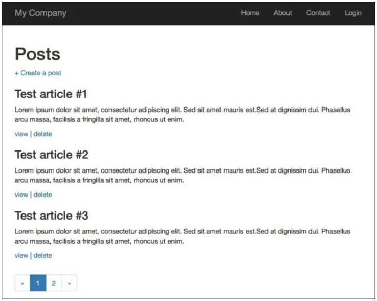

Использование автономных действий
==

В Yii можно определить действия контроллера как отдельные классы, а затем подключить их к контроллерам.
Это поможет вам повторно использовать некоторые общие функциональные возможности.
Например, можно переместить серверную часть для полей автозаполнения в действие и сэкономить некоторое время, не записывая ее снова и снова.
Другим примером является то, что мы можем создавать все операции CRUD как отдельные автономные действия. Мы будем писать, создавать, просматривать и удалять операции модели и просматривать список операций моделей.

Подготовка
---

1 Создайте новое приложение с помощью composer, как описано в официальном руководстве по <http://www.yiiframework.com/doc-2.0/guide-start-installation.html>.
по русски <http://yiiframework.domain-na.me/doc/guide/2.0/ru/start-installation>

2 Давайте создадим таблицу post. Создайте миграцию для этого с помощью следующей команды:
**./yii migrate/create create_post_table**

3 Обновите только что созданные методы миграции и список импортированных классов следующим образом:
```php
<?php
use yii\db\Schema; 
use yii\db\Migration;
class m150719_152435_create_post_table extends Migration {const TABLE_NAME = '{{%post}}';
	public function up()
	{
		$tableOptions = null;
		if ($this->db->driverName === 'mysql') {
			$tableOptions = 'CHARACTER SET utf8 COLLATE utf8_general_ci ENGINE=InnoDB';
		}
		$this->createTable(self::TABLE_NAME, [
			'id' => Schema::TYPE_PK,
			'title' => Schema::TYPE_STRING.'(255) NOT NULL',
			'content' => Schema::TYPE_TEXT.' NOT NULL',
		], $tableOptions);
		for ($i = 1; $i < 7; $i++) {
				 $this->insert(self::TABLE_NAME, [
					'title' => 'Test article #'.$i,
					'content' => 'Lorem ipsum dolor sit amet, consectetur adipiscing elit. '
					.'Sed sit amet mauris est. Sed at dignissim dui. '
					.'Phasellus arcu massa, facilisis a fringilla sit amet, '
					. ' rhoncus ut enim.',
				 ]);
		}
	}

	public function down()
	{
		$this->dropTable(self::TABLE_NAME);
	}
}
```
4 Установите все миграции с помощью следующей команды:

**./yii migrate up**

5 Создайте модель Post с помощью Gii.

Как это сделать...
---

1 Создайте автономное действие @app/actions/CreateAction.php следующим образом:
```php
<?php
namespace app\actions; 
use Yii;
use yii\base\Action;
class CreateAction extends Action {
	public $modelClass;
	public function run()
	{
		$model = new $this->modelClass();
		if ($model->load(Yii::$app->request->post()) && $model->save()) {
			$this->controller->redirect(['view', 'id' => $model->getPrimaryKey()]); 
		} else {
			return $this->controller->render('//crud/create', ['model' => $model]);
		}
	}
}
```

2 Создайте автономное действие @app/actions/DeleteAction.php следующим образом:
```php
<?php
namespace app\actions;
use yii\base\Action;
use yii\web\NotFoundHttpException;
class DeleteAction extends Action {
	public $modelClass;
	public function run($id)
	{
		$class = $this->modelClass;
		if (($model = $class::findOne($id)) === null) {
			throw new NotFoundHttpException('The requested page does not exist.');
		}
		$model->delete();
		return $this->controller->redirect(['index']);
	}
}
```

3 Создайте автономное действие @app/actions/IndexAction.php следующим образом:
```php
<?php
namespace app\actions;
use yii\base\Action; 
use yii\data\Pagination;
class IndexAction extends Action {
	public $modelClass; 
	public $pageSize = 3;
	public function run()
	{
		$class = $this->modelClass;
		$query = $class::find();
		$countQuery = clone $query;
		$pages = new Pagination([
			'totalCount' => $countQuery->count(),
		]);
		$pages->setPageSize($this->pageSize);
		$models = $query->offset($pages->offset)->limit($pages->limit)->all();
		return $this->controller->render('//crud/index', [
			'pages' => $pages,
			'models' => $models
		]);
	}
}
```

4 Создайте автономное действие @app/actions/ViewAction.php следующим образом:
```php
<?php
namespace app\actions;
use yii\base\Action;
use yii\web\NotFoundHttpException;
class ViewAction extends Action {
	public $modelClass;
	public function run($id)
	{
		$class = $this->modelClass;
		if (($model = $class::findOne($id)) === null) {
			throw new NotFoundHttpException('The requested page does not exist.');
		}
		return $this->controller->render('//crud/view', [
			'model' => $model
		]);
	}
}
```

5 Создайте файл представления @app/views/crud/create.php следующим образом:
```php
<?php
use yii\helpers\Html; 
use yii\widgets\ActiveForm;
/*
* @var yii\web\View $this 
* */
?>
<h1><?= Yii::t('app', 'Create post'); ?></h1>
<?php $form = ActiveForm::begin();?>
<?php $form->errorSummary($model); ?>
<?= $form->field($model, 'title')->textInput() ?>
<?= $form->field($model, 'content')->textarea() ?>
<?= Html::submitButton(Yii::t('app', 'Create'), ['class' => 'btn btn-primary']) ?> 
<?php ActiveForm::end(); ?>
```php

6 Создайте файл представления @app/views/crud/index.php следующим образом:
```php
<?php
use yii\widgets\LinkPager; 
use yii\helpers\Html; 
use yii\helpers\Url;
/*
* @var yii\web\View $this
* @var yii\data\Pagination $pages
* @var array $models 
* */
?>
<h1>Posts</h1>
<?= Html::a('+ Create a post', Url::toRoute('post/create')); ?>
<?php foreach ($models as $model):?>
<h3><?= Html::encode($model->title);?></h3>
<p><?= Html::encode($model->content);?></p>
<p>
<?= Html::a('view', Url::toRoute(['post/view', 'id' => $model->id]));?> | <?= Html::a('delete', Url::toRoute(['post/delete', 'id' => $model->id]));?>
</p>
<?php endforeach; ?>
<?= LinkPager::widget(['pagination' => $pages,]); ?>
```

7 Создайте файл представления @app/views/crud/view.php следующим образом:
```php
<?php
use yii\helpers\Html; 
use yii\helpers\Url;
/*
* @var yii\web\View $this
* @var app\models\Post $model 
* */
?>
<p><?= Html::a('< back to posts', Url::toRoute('post/index')); ?></p>
<h2><?= Html::encode($model->title);?></h2>
<p><?= Html::encode($model->content);?></p>
```
   Чтобы использовать автономные действия, мы объявили его в карте действий, переопределив метод actions. 
   
   8 Запустите post/index:
   

Как это работает…
---
Каждый контроллер может быть построен из отдельных действий, как пазл из кусочков. Разница в том, что вы можете сделать автономные действия очень гибкими и использовать их во многих местах.
В наших действиях мы определили публичное свойство Model class, которое помогает настроить определенный класс модели в методе actions PostController.

Смотрите так же
---
 Для получения дополнительной информации обратитесь к  <http://www.yiiframework.com/doc-2.0/guide-structure- controllers.html#standalone-actions>.
По русски <http://yiiframework.domain-na.me/doc/guide/2.0/ru/structure-controllers>

