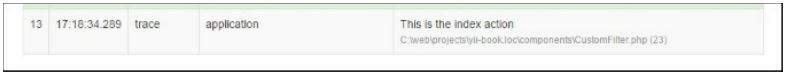

Создание пользовательского фильтра
==
Фильтры-это объекты, которые выполняются до и / или после действий контроллера. Например, фильтр управления доступом может выполняться перед действиями, чтобы гарантировать, что к ним разрешен доступ определенным конечным пользователям; фильтр сжатия содержимого может выполняться после действий по сжатию содержимого ответа перед его отправкой конечным пользователям.
Фильтр может состоять из предфильтра (логика фильтрации, применяемая перед действиями) и / или постфильтра (логика, применяемая после действий). Фильтры-это, по сути, особый вид поведения. Таким образом, использование фильтров аналогично использованию поведения.
Допустим, у нас есть веб-приложение, которое предоставляет пользовательский интерфейс для работы только в указанные часы, например, с 10 утра до 6 вечера.

Подготовка
---
Создайте новое приложение с помощью composer, как описано в официальном руководстве по <http://www.yiiframework.com/doc-2.0/guide-start-installation.html>.
(по русски <http://yiiframework.domain-na.me/doc/guide/2.0/ru/start-installation>

Как это сделать...
---

1 Создайте контроллер @app/controllers/TestController. php, следующим образом:
```php
<?php
namespace app\controllers;
use app\components\CustomFilter; 
use yii\helpers\Html; 
use yii\web\Controller;
class TestController extends Controller {
	public function behaviors()
	{
		return [
			'access' => [
				'class' => CustomFilter::className(),
			],
		];
	}
	public function actionIndex()
	{
		return $this->renderContent(Html::tag('h1','This is a test content'));
	}
}
```

2 Создайте новый фильтр @app/components/CustomFilter.php, следующим образом:
```php
<?php
namespace app\components;
use Yii;
use yii\base\ActionFilter; 
use yii\web\HttpException;
class CustomFilter extends ActionFilter {
	const WORK_TIME_BEGIN = 10; 
	const WORK_TIME_END = 18;
	protected function canBeDisplayed()
	{
		$hours = date('G');
		return $hours >= self::WORK_TIME_BEGIN && $hours <= self::WORK_TIME_END;
	}
	public function beforeAction($action)
	{
		if (!$this->canBeDisplayed())
			{
				$error = 'This part of website works from '
				. self::WORK_TIME_BEGIN .	' to '
				. self::WORK_TIME_END .	' hours.';
				throw new HttpException(403, $error);
			}
		return parent::beforeAction($action);
	}
	public function afterAction($action, $result)
	{
		if (Yii::$app->request->url == '/test/index') {
			Yii::trace("This is the index action");
		}
		return parent::afterAction($action, $result);
	}
}
```


3 Если вы посетите эту страницу за пределами указанного периода времени, вы получите следующее:

Как это работает...
---
Сначала мы добавили часть кода в наш контроллер, который реализует наш пользовательский фильтр:
```php
public function behaviors()
{
	return [
		'access' => [
			'class' => CustomFilter::className(),
		],
	];
}
```
По умолчанию фильтр применяется ко всем действиям контроллера, но мы можем указать действия, для которых он будет применяться, или даже исключить действия из нашего фильтра.
У вас есть два действия внутри него—beforeAction и afterActions. Первый запускается перед действиями контроллера, а следующий-после.
В нашем простом примере мы определили условие, которое не разрешает доступ к веб-сайту, если время раньше 10 утра, а в методе after мы просто запускаем метод трассировки, если текущий путь-test/index.
Результат можно увидеть в отладчике, в разделе журнал:


В реальных приложениях фильтры более сложны, а также Yii2 предоставляет множество встроенных фильтров, таких как core, authentication, content negotiator, http cache end и т. д.

Смотрите так же
---
Для получения дополнительной информации обратитесь к <http://www.yiiframework.com/doc-2.0/guidestructure-filters.html>
По русски <http://yiiframework.domain-na.me/doc/guide/2.0/ru/structure-filters> 
