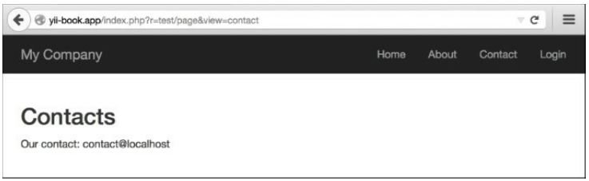
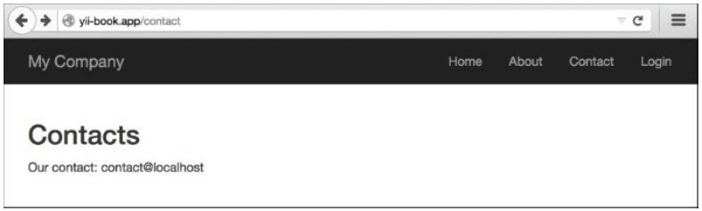

Отображение статических страниц
===
Если у вас есть несколько статических страниц и Вы не собираетесь менять их очень часто, то не стоит запрашивать базу данных и внедрять для них управление страницами.

Подготовка
---
Создайте новое приложение с помощью composer, как описано в официальном руководстве по <http://www.yiiframework.com/doc-2.0/guide-start-installation.html>. по русски <http://yiiframework.domain-na.me/doc/guide/2.0/ru/start-installation>

Как это работает
---

1 Создайте файл контроллера тестирования @app/controllers/TestController.php, следующим образом:
```php
<?php
namespace app\controllers;
use yii\web\Controller;
class TestController extends Controller {
    public function actions()
    {
        return [
                'page' => [
                            'class' => 'yii\web\ViewAction',
                          ]
                ];
    }
}
```

2 Теперь поместите свои страницы в views/test/ pages и назовите их index.php и contact.php. Содержание index.php выглядит следующим образом:
```php
<h1>Index</h1> content of index file
Contact.php content is:
<h2>Contacts</h2>
<p>Our contact: contact@localhost</p>
```

3 Теперь вы можете проверить свои страницы, введя URL,
<http://yii-book.app/index.php?r=test/page&view=contact>:


4 Кроме того, вы можете ввести URL-адрес http: //yii-book. app/test/page/view/about, если Вы настроили чистые URL-адреса с форматом пути.

Как это работает...
---
Мы подключаем внешнее действие с именем \yii\web\viewAction, которое просто пытается найти представление с именем, совпадающим с предоставленным параметром $_GET. Если оно там, то оно показывает его. Если нет, то это даст вам 404 "не найдена страница". Если viewParam не задан, будет использоваться значение defaultview.

Есть еще.
---
О ViewAction
Есть некоторые полезные параметры \yii\web\ViewAction, которые мы можем использовать. Они перечислены в следующей таблице:
Имя параметра|Описание
-------------------------------------
defaultView|Имя представления по умолчанию, если параметр YII\web\ViewAction::$viewParam GET не указан пользователем. По умолчанию 'index'. Это должно быть в формате path/to/view, аналогичном тому, который указан в параметре GET.
layout|Имя макета, применяемого к запрошенному представлению. Это будет присвоено yii\base\Controller::$layout перед отображением представления. Значения по умолчанию null, если  будут использованы. Если false, макет не будет применен.
viewParam|Имя параметра GET, содержащего запрошенное имя представления.
viewPrefix|Строка с префиксом к указанному пользователем имени представления для формирования полного имени представления. Например, если пользователь запрашивает tutorial/chap1, соответствующее имя представления будет pages/tutorial/chap1, при условии, что префикс pages. Фактический вид файла определяется в yii\base\View::findViewFile().

Настройка правил URL
---
Действие viewAction позволяет минимизировать контроллер, но URL-адреса выглядят как http://yii-book.app/index.php?r=test/page&page=about. Чтобы сделать URL короткими и удобочитаемыми, добавьте правило URL в компонент urlManager:
```php
'<view:about>' => 'test/page'
```
Если компонент urlManager настроен правильно, вы получите следующее:


Чтобы настроить компонент urlManager, см. рецепт в разделе Настройка правил URL.

Смотрите так же
---
Дополнительные сведения см. по следующим URL-адресам:
* <http://www.yiiframework.com/doc-2.0/yir-web-v'ewaction.html>
* <http://www.yiiframework.com/doc-2.0/guide-structure-views.html#rendering-static-pages>
* По русски <http://yiiframework.domain-na.me/doc/guide/2.0/ru/structure-views#rendering-static-pages> 
* Рецепт Конфигурирование URL
