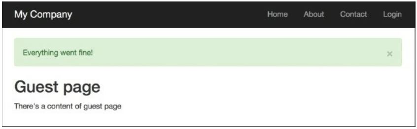
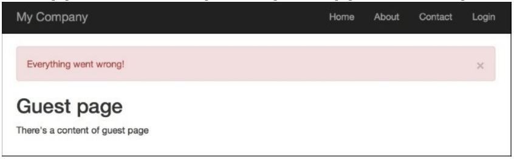

Использование flash-cообщений
===
Когда вы редактируете модель с помощью формы, удаляете модель или выполняете любую другую операцию, хорошо сообщить пользователям, прошла ли она хорошо или произошла ошибка. Как правило, после какого-то действия, такого как редактирование формы, произойдет перенаправление, и нам нужно отобразить сообщение на странице, на которую мы хотим перейти. Однако, как мы передаем его от текущей страницы к цели перенаправления и очищаем впоследствии? Флэш-сообщения помогут нам сделать это.

Подготовка
---
Создайте новое приложение с помощью composer, как описано в официальном руководстве по <http://www.yiiframework.com/doc-2.0/guide-start-installation.html>.
по русски <http://yiiframework.domain-na.me/doc/guide/2.0/ru/start-installation>

Как это сделать...
---
1 Давайте создадим @app/controllers/TestController.php контроллер следующим образом:
```php
<?php
namespace app\controllers; use Yii;
use yii\web\Controller;
use yii\filters\AccessControl;
class TestController extends Controller {
    public function behaviors()
    {
        return [
            'access' => [
                'class' => AccessControl::className(),
                'rules' => [
                    [
                    'allow' => true,
                    'roles ' => ['@'],
                    'actions' => ['user']
                    ],
                    [
                    'allow' => true,
                    'roles' => ['?'],
                    'actions' => ['index', 'success', 'error']
                    ],
                ],
                'denyCallback' => function ($rule, $action) {
                    Yii::$app->session->setFlash('error', 'This section is only for registered users.');
                    $this->redirect(['index']);
                },
            ],
        ];
    }
    public function actionUser()
    {
        return $this->renderContent('user')
    }

    public function actionSuccess()
    {
        Yii::$app->session->setFlash('success', 'Everything went fine!'); 
        $this->redirect(['index']);
    }

    public function actionError()
    {
        Yii::$app->session->setFlash('error', 'Everything went wrong!'); 
        $this->redirect(['index']);
    }
    public function actionIndex()
    {
        return $this->render('index');
    }
}
```
2 Кроме того, создайте @app/views/common/alert. php посмотреть следующим образом:
```php
<?php
use yii\bootstrap\Alert;
?>
<?php if (Yii::$app->session->hasFlash('success')):?>
    <?= Alert::widget([
        'options' => ['class' => 'alert-success'],
        'body' => Yii::$app->session->getFlash('success'),]);
    ?>
<?php endif ?>
<?php if (Yii::$app->session->hasFlash('error')) :?>
    <?= Alert::widget([
        'options' => ['class' => 'alert-danger'],
        'body' => Yii::$app->session->getFlash('error'),
    ]);?>
<?php endif; ?>
```

3 Создайте @app/views/test/index.php файл представления  следующим образом:
```php
<?php
/* @var $this yii\web\View */
?>
<?= $this->render('//common/alert') ?>
<h2>Guest page</h2>
<p>There's a content of guest page</p>
```

4 Создайте @app/views/test/user.php  файла представления следующим образом:
```php
<?php
/* @var $this yii\web\View */
?>
<?= $this->render('//common/alert') ?>
<h2>User page</h2>
<p>There's a content of user page</p>
```

5 Теперь, если вы перейдете на <http://yii-book.app/index.php?r=test/success>, вы будете перенаправлены на <http://yii-book.app/index.php?r=test/index> и сообщение об успешном выполнении будет отображаться как


6 Более того, если вы заходите на http://yii-book.app/index. php?r=test/error, вы будете перенаправлены на ту же страницу, но с сообщением об ошибке. Обновление страницы индекса скроет сообщение


7 Затем попробуйте запустить <http://yii-book.app/index.php?r=test/user>. Вы будете перенаправлены на <http://yii-book.app/index.php?r=test/index> и сообщение об ошибке, выполненные в функции denyCallback:

Как это работает…
---
Мы установили флэш-сообщение с Yii::$app->session->("sucess", " Все прошло хорошо!'). Внутренне, он сохраняет сообщение в состояние сеанса, поэтому на самом низком уровне наше сообщение хранится в $_SESSION до тех пор, пока Yii::$app->session->getFlash( 'success') не будет вызван и ключ $_SESSION не будет удален.
Флэш-сообщение будет автоматически удалено после получения запроса.

Есть еще.
---
**Метод getAllFlashes()**
Иногда нужно справиться со всеми вспышками. Вы можете сделать это простым способом, следующим образом:
```php
$flashes = Yii::$app->session->getAllFlashes();
<?php foreach ($flashes as $key => $message): ?>
    <?= Alert::widget([
        'options' => ['class' => 'alert-info'],
        'body' => $message,
        ]);
    ?>
<?php endforeach; ?>
```
**Метод removeAllFlashes()**
Когда вам нужно очистить все ваши вспышки, используйте следующее:
```php
Yii::$app->session->removeAllFlashes();
```
**Метод removeFlash()**
Если необходимо удалить метод flash с указанным ключом, используйте следующее:
```php
Yii::$app->session->removeFlash('success');
```
В этом примере мы добавили очень полезную функцию обратного вызова, которая устанавливает сообщение об ошибке и выполняет перенаправление на страницу test/index.

Смотрите так же
---
Для получения дополнительной информации обратитесь к:
* <http://www.viiframework.com/doc-2.0/vii-web-session.html>
* <http://www.yiiframework.com/doc-2.0/yii-bootstrap-alert.html>

