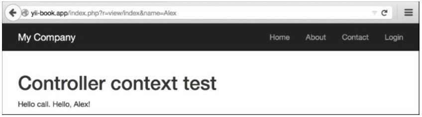

Использование контекста контроллера в представлении
===
Виды Yii довольно мощные и имеют множество функций. Одним из них является то, что вы можете использовать контекст контроллера в представлении. Итак, давайте попробуем.

Подготовка
---
Создайте новое приложение с помощью composer, как описано в официальном руководстве по <http://www.yiiframework.com/doc-2.0/guide-start-installation.html>.
     по русски <http://yiiframework.domain-na.me/doc/guide/2.0/ru/start-installation>
     
Как это сделать...
---

1 Создайте controllers/ViewController.php следующим образом:
```php
<?php
namespace app\controllers;
use yii\web\Controller;
class ViewController extends Controller {
	public $pageTitle;
	public function actionIndex()
		{
			$this->pageTitle = 'Controller context test'; return $this->render('index');
		}
	public function hello()
		{
			if (!empty($_GET['name'])) {
			echo 'Hello, '	. $_GET['name'] . '!';
		}
	}
}
```

2 Сейчас мы будем создавать views/view.php. Он показывает, что мы можем сделать:
```php
<h1><?= $this->context->pageTitle ?></h1>
<p>Hello call. <?php $this->context->hello() ?></p>
```

3 Для того чтобы испытать его, вы можете следовать /index.php?r=view/index&name=Alex:


Как это работает...
---
Мы используем $this в представлении для ссылки на текущий контроллер. При этом мы можем вызвать метод контроллера и доступ к его свойствам. Наиболее полезным свойством является pageTitle, который ссылается на Заголовок текущей страницы. Существует множество встроенных методов, которые чрезвычайно полезны в представлениях, таких как renderPartials и widget.

Есть еще.
---
<http://www.yiiframework.com/doc-2.0/guide-structure-views.html#accessing-data-in-views> 
По русски <http://yiiframework.domain-na.me/doc/guide/2.0/ru/structure-views#accessing-data-in-views> 
URL содержит документацию API для controller, где вы можете получить хороший список методов, которые вы можете использовать в своем представлении
