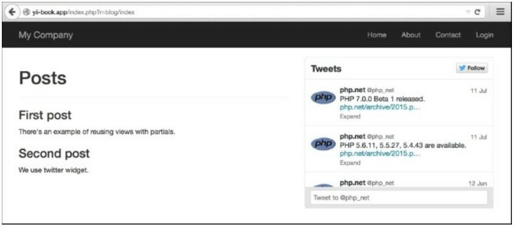
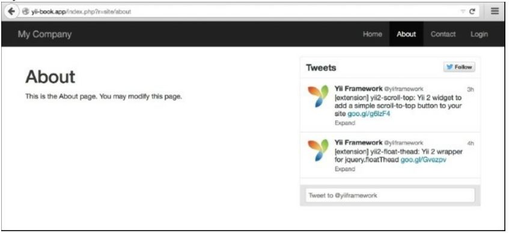

Повторное использование представлений с частями
===
Yii поддерживает partials, поэтому, если у вас есть блок без особой логики, который вы хотите 
повторно использовать или хотите реализовать шаблоны электронной почты, partials являются 
правильным способом, чтобы сделать это.
Представьте, что у нас есть две учетные записи Twitter, одна для нашего блога, а другая для 
деятельности компании, и наша цель-вывод графиков Twitter на указанных страницах.

Подготовка
---
1	Создайте новое приложение с помощью composer, как описано в официальном 
руководстве по <http://www.yiiframework.com/doc-2.0/guide-start-installation.html>.
 по русски <http://yiiframework.domain-na.me/doc/guide/2.0/ru/start-installation>

 2	Создайте виджет Twitter на https://twitter.com/settings/widgets/ для пользователей php_net и 
yii framework и найдите значение data-widget-id для каждого созданного виджета.

Как это сделать...
---

1	Создайте контроллер @app/controllers/BlogController.php, следующим образом:
```php
<?php
namespace app\controllers;
use yii\web\Controller;
class BlogController extends Controller 
{
	public function actionIndex()
	{
	$posts = [
				[
				'title' => 'First post',
				'content' => 'There\'s an example of reusing views with 
				partials.',
				],
				[
				'title' => 'Second post',
				'content' => 'We use twitter widget.'
				],
			];
	return $this->render('index', ['posts' => $posts]);
	}
}
```

2	Создайте файл представления с именем @app/views/common/twitter.php и вставить код из Twitter. Вы получите что-то вроде следующего:
```php
<?php
/* @var $this \yii\web\View */
/* @var $widget_id integer */
/* @var $screen_name string */
?>
<script>!function(d,s,id){var js,fjs=d.getElementsByTagName(s) 
[0],p=/Ahttp:/.test(d.location)?'http':'https';if(!d.getElementById(id))
{js=d.createElement(s);js.id=id;js.src=p+"://platform.twitter.com/widgets.js
";fjs.p 
arentNode.insertBefore(js,fjs);}}(document,"script","twitter-wjs");</script>
<?php if ($widget_id && $screen_name): ?>
<a class="twitter-timeline"
data-widget-id="<?= $widget_id?>" 
href="https://twitter.com/<?= 
$screen_name?>" 
height="300">
Tweets by @<?= $screen_name?>
</a>
<?php endif;?>
```

3	Создайте файл представления @app/views/blog/index. php   следующим образом:
```php
<?php
/* @var $category string */
/* @var $posts array */
/* @var $this \yii\web\View */
?>
<div class="row">
	<div class="col-xs-7">
		<h1>Posts</h1>
		<hr>
		<?php foreach ($posts as $post): ?>
			<h3><?= $post['title']?></h3>
			<p><?= $post['content']?></p>
		<?php endforeach;?>
	</div>
	<div class="col-xs-5">
		<?= $this->render('//common/twitter', [
			'widget_id' = > '620531418213576704',
			'screen_name' => 'php_net',
		]);?>
	</div>
</div>
```

4	Замените @app/views/site/about.php  следующим содержанием:
```php
<?php
use yii\helpers\Html;
/* @var $this yii\web\View */
$this->title = 'About';
?>
<div class="col-xs-7">
	<h1><?= Html::encode($this->title) ?></h1>
	<p>This is the About page. You may modify this page.</p>
</div>
<div class="col-xs-5">
	<?= $this->render('//common/twitter', [
		'widget_id' => '620526086343012352',
		'screen_name' => 'yiiframework'
	]);?>
</div>
```

5	Запустите  index.php?r=blog/index:


6 Запустите index.php?r=site/about:


Как это работает...
---
В текущем примере два представления отображают @app/views/common/twitter.php с дополнительными параметрами для формирования виджетов Twitter внутри себя. Обратите внимание, что представления 
можно отображать в контроллерах, виджетах или в любом другом месте, вызывая методы визуализации 
представления. 
В каждом файле представления мы можем получить доступ к двум экземплярам класса View с помощью $this, поэтому любой файл представления можно отобразить в другом представлении, вызвав метод render 

Есть еще...
---
Для получения дополнительной информации обратитесь к
<http://www.yiiframework.com/doc-2.0/guidestructureviews.html#rendering-views>.
По русски  http://yiiframework.domain-na.me/doc/guide/2.0/ru/structure-views#rendering-in-views

