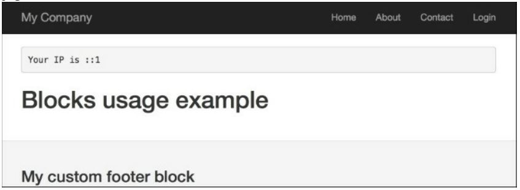

Использование блоков
===
Одной из функций Yii, которую вы можете использовать в своих представлениях, являются блоки. Основная идея заключается в том, что вы можете записать некоторые Выходные данные, а затем использовать их позже в представлении. Хорошим примером может быть определение дополнительных областей содержимого для макета и их заполнение в другом месте.
В предыдущей версии, Yii 1.1, блоки назывались клипами.

Подготовка
---
Создайте новое приложение с помощью composer, как описано в официальном руководстве по <http://www.yiiframework.com/doc-2.0/guide-start-installation.html>.
по русски <http://yiiframework.domain-na.me/doc/guide/2.0/ru/start-installation>

Как это сделать...
---

1 В нашем примере нам нужно определить две области в макете-beforeContent и footer.

2 Откройте @app/views/layouts/main.php и вставьте следующий код строки просто до выхода содержания:
```php
<?php if(!empty($this->blocks['beforeContent'])) 
	echo $this->blocks['beforeContent']; 
?>
```

3 Затем замените код футера на следующий код:
```php
<footer class="footer">
	<div class="container">
		<?php if (!empty($this->blocks['footer'])): 
			echo $this->blocks['footer'] ?>
		<?php else: ?>
			<p class="pull-left">&copy; My Company <?= date('Y') ?></p>
			<p class="pull-right"><?= Yii::powered() ?></p>
		<?php endif; ?>
	</div>
</footer>
```
4 Вот и все! Затем добавьте новое действие в controllers/SiteController.php, именованные блоки:
```php
public function actionBlocks()
{
	return $this->render('blocks');
}
```

5 Теперь создайте файл представления, views/site/blocks.php, со следующим содержанием:
```php
<?php
use \yii\Helpers\Html;
/* @var $this \yii\web\View */
?>
<?php $this->beginBlock('beforeContent');
echo Html::tag('pre', 'Your IP is '	. Yii::$app->request->userIP);
$this->endBlock(); ?>
<?php $this->beginBlock('footer');
echo Html::tag('h3', 'My custom footer block');
$this->endBlock(); ?>
<h1>Blocks usage example</h1>
```

6 Теперь, когда вы открываете /index. php?r=site/blocks , вы должны узнать свой IP до содержимого страницы и заметки в футере


Как это работает...
---

Мы помечаем регионы кодом, который просто проверяет наличие определенного блока,и если блок существует, код выводит его. Затем мы записываем содержимое блоков, определенных с помощью специальных методов контроллера beginBlock и endBlock.
Из контроллера, вы можете легко достигнуть переменных нашего блока через 
```php
$this->view->blocks[' blockID' ].
```

Есть еще.
---
* Рецепт Использования контекста контроллера в представлении
* <http://www.yiiframework.com/doc-2.0/guide-structure-views.html#using-blocks>
* <По русски http://yiiframework.domain-na.me/doc/guide/2.0/ru/structure-views#using-blocks>
