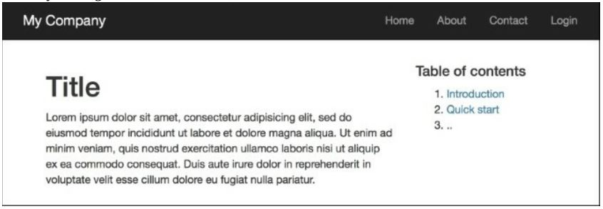
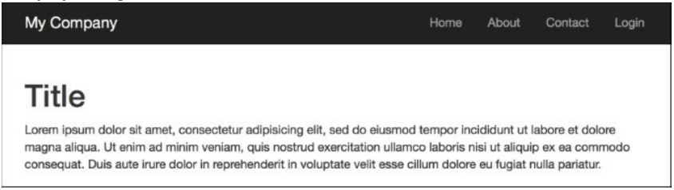

Определение нескольких макетов
===
Большинство приложений используют один макет для всех своих представлений. Однако бывают ситуации, когда требуется несколько макетов. Например, приложение может использовать разные макеты на разных страницах: два дополнительных столбца для блогов, один дополнительный столбец для статей и никаких дополнительных столбцов для портфолио.

Подготовка
---
Создайте новое приложение с помощью composer, как описано в официальном руководстве по <http://www.yiiframework.com/doc-2.0/guide-start-installation.html>.
по русски <http://yiiframework.domain-na.me/doc/guide/2.0/ru/start-installation>
 
Как это сделать...
---
1 Создайте два макета в views/layouts: блог и статьи. Блог будет содержать следующий код:
```php
<?php $this->beginContent('//layouts/main')?>
<div>
	<?= $content ?>
</div>
<div class="sidebar tags">
	<ul>
		<li><a href="#php">PHP</a></li>
		<li><a href="#yii">Yii</a></li>
	</ul>
</div>
<div class="sidebar links">
	<ul>
		<li><a href="http://yiiframework.com/">Yiiframework</a></li>
		<li><a href="http://php.net/">PHP</a></li>
	</ul>
</div>
<?php $this->endContent()?>
```

2 Статьи будут содержать следующий код:
```php
<?php
/* @var $this yii\web\View */
?>
<?php $this->beginContent('@app/views/layouts/main.php'); ?>
<div class="container">
	<div class="col-xs-8">
		<?= $content ?>
	</div>
	<div class="col-xs-4">
		<h4>Table of contents</h4>
		<ol>
			<li><a href="#intro">Introduction</a></li>
			<li><a href="#quick-start">Quick start</a></li>
			<li>..</li>
		</ol>
	</div>
</div>
<?php $this->endContent() ?>
```

3 Создайте файл представления, views/site/content.php, следующим образом:
```php
<h1>Title</h1>
<p>Lorem ipsum dolor sit amet, consectetur adipisicing elit, sed do eiusmod tempor incididunt ut labore et dolore magna aliqua. Ut enim ad minim veniam, quis nostrud exercitation ullamco laboris nisi ut aliquip ex ea commodo consequat. Duis aute irure dolor in reprehenderit in voluptate velit esse cillum dolore eu fugiat nulla pariatur.</p>
```

4 Создайте три контроллера с именем BlogController, ArticleController и PortfolioController, с действиями индекса во всех трех. Содержание controllers/BlogController.php выглядит следующим образом:
```php
<?php
namespace app\controllers;
use yii\web\Controller;
class BlogController extends Controller {
	public $layout = 'blog';
	public function actionIndex()
	{
		return $this->render('//site/content');
	}
}
```

5 Содержание controllers/ArticleController. php выглядит следующим образом:
```php
<?php
namespace app\controllers; 
use yii\web\Controller;
class ArticleController extends Controller {
	public $layout = 'articles';
	public function actionIndex()
	{
		return $this->render('//site/content');
	}
}
```

6 Содержание controllers/PortfolioController.php выглядит следующим образом:
```
<?php
namespace app\controllers; use yii\web\Controller;
class PortfolioController extends Controller {
	public function actionIndex()
	{
		return $this->render('//site/content');
	}
}
```

7 Теперь попробуйте запустить **http://yii-book.app/?r=blog/index:**


8 Затем попробуйте запустить http://yii-book.app/?r=article/index:


9 Наконец, попробуйте запустить http: //yii-book.app/?r=portfolio/index:


Как это работает...
---
Мы определили два дополнительных макета для блога и статей. Поскольку мы не хотим копировать и вставлять общие части из основного макета, мы применяем дополнительные декораторы макета, используя $this->beginContent и $this-> endContent.

Смотрите так же
---
* <http://www.yiiframework.com/doc-2.0/guide-structure-views.html#nested-layouts>  URL предоставляет дополнительные сведения о макетах.
По русски <http://yiiframework.domain-na.me/doc/guide/2.0/ru/structure-views#nested-layouts> 
* Рецепт Использования контекста контроллера в представлении
* Рецепт Использование декоратора
