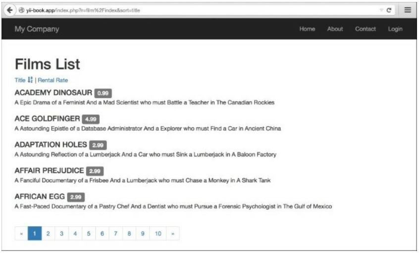

Разбивка на страницы и сортировка данных
===
В последних выпусках Yii фокус был перенесен с использования Active Record напрямую на таблицы, списки и поставщики данных. Тем не менее, иногда лучше использовать Active Record напрямую. Давайте посмотрим, как перечислить разбитые на страницы записи AR с возможностью их сортировки. В этом разделе мы хотели бы создать список фильмов и отсортировать их по некоторым атрибутам из базы данных. В нашем примере мы отсортируем наши фильмы по названию фильма и атрибутам арендной ставки.

Подготовка
---
1 Создайте новое приложение с помощью composer, как описано в официальном руководстве  <http://www.yiiframework.com/doc-2.0/guide-start-installation.html>. 
по русски <http://yiiframework.domain-na.me/doc/guide/2.0/ru/start-installation>

2 Скачать база данных "sakila" <http://dev.mysql.com/doc/index-other.html>.

3 Выполните загруженные SQLs; сначала схема, затем данные.

4 Настройте подключение к БД в config/main.php для использования базы данных Sakila.

5 Используйте Gii для создания модели Film.

Как это сделать...
---

1 Во-первых, необходимо создать @app/controllers/FilmController.php:
```php
<?php
namespace app\controllers;
use app\models\Film; 
use yii\web\Controller; 
use yii\data\Pagination; 
use yii\data\Sort;
class FilmController extends Controller {
    public function actionIndex()
    {
        $query = Film::find();
        $countQuery = clone $query;
        $pages = new Pagination(['totalCount' => $countQuery->count()]); 
            $pages->pageSize = 5;
            $sort = new Sort([
                'attributes' => [
                'title',
                'rental_rate'
            ]
        ]);
        $models = $query->offset($pages->offset)
            ->limit($pages->limit)
            ->orderBy($sort->orders)
            ->all();
        return $this->render('index', [
            'models' => $models,
            'sort' => $sort,
            'pages' => $pages
            ]);
    }
}
```

2 Теперь давайте реализуем @app/views/film/index.php, следующим образом:
```php
<?php
use yii\widgets\LinkPager;
/**
* @var \app\models\Film $models
* @var \yii\web\View $this
* @var \yii\data\Pagination $pages
* @var yii\data\Sort $sort */
?>
<h1>Films List</h1>
<p><?=$sort ->link('title')?> | <?=$sort->link('rental_rate')?></p>
<?php foreach ($models as $model): ?>
    <div class="list-group">
        <h4 class="list-group-item-heading"> <?=$model->title ?>
            <label class="label label-default"> <?=$model->rental_rate ?></label>
        </h4>
        <p class="list-group-item-text"><?=$model->description ?></p>
    </div>
<?php endforeach ?>
<?=LinkPager::widget([
    'pagination' => $pages ]); ?>
```
    
3 Попробуйте загрузить http://yii-book.app/index.php?r=film/index. Вы должны получить рабочую пагинацию и ссылки, которые позволяют сортировать список по названию фильма или по арендной ставке:


Как это работает...
---
Во-первых, мы получили общее количество моделей и инициализировали новый экземпляр компонента разбиения на страницы, передав переменную totalcount нашему экземпляру разбиения на страницы. 
Затем мы использовали поле $pages->pageSize, чтобы настроить Размер страницы для нашей пагинации. 
После этого мы создали экземпляр сортировщика для модели, указав атрибуты модели, которые мы хотели отсортировать, и применив условия заказа К запросу, вызвав orderBy и передав $ sort->orders в качестве параметра. 
Затем мы вызвали all (), чтобы получить записи из БД.
На этом этапе у нас есть список моделей, страницы и данные, используемые для пейджера ссылок, и сортировщик, который мы используем для создания ссылок сортировки.
В представлении мы используем собранные данные. Во-первых, мы генерируем ссылки с помощью метода Sort::link. Затем мы перечислим модели. Наконец, используя LinkPager виджеты, то вывести постраничную навигацию.

Смотрите так же
---
Дополнительные сведения о разбиении на страницы и сортировке см. по следующим ссылкам:
*<http://www.yiiframework.com/doc-2.0/yii-data-pagination.html>
*<http://www.yiiframework.com/doc-2.0/yii-data-sort.html>
* <http://www.yiiframework.com/doc-2.0/guide-output-pagination.html> 
по русски <http://yiiframework.domain-na.me/doc/guide/2.0/ru/output-pagination>
* <http://www.yiiframework.com/doc-2.0/guide-output-sorting.html>
 <по русски http://yiiframework.domain-na.me/doc/guide/2.0/ru/output-sorting>
