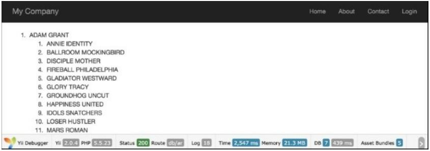

Получение данных из базы данных
===
Сегодня большинство приложений используют базы данных. Будь то небольшой сайт или социальная сеть, по крайней мере, некоторые части питаются от баз данных.
Yii предлагает три способа работы с базами данных. Они заключаются в следующем:
* Active Record
* Query Builder
* SQL использующий DAO

Мы будем использовать все эти методы, чтобы получить данные из таблиц film, film_actor и actor и показать их в списке. Кроме того, мы сравним время выполнения и использование памяти, чтобы определить, в каких случаях мы должны использовать эти методы.

Подготовка
---
1 Создайте новое приложение с помощью composer, как описано в официальном руководстве  <http://www.yiiframework.com/doc-2.0/guide-start-installation.html>. 
по русски <http://yiiframework.domain-na.me/doc/guide/2.0/ru/start-installation>

2 Скачать база данных "sakila" <http://dev.mysql.com/doc/index-other.html>.

3 Выполните загруженные SQLs; сначала схема, затем данные.

4 Настройте подключение к БД в config/main.php для использования базы данных Sakila.

5 Используйте Gii для создания модели Film.

Как это сделать...
---
1 Cоздайте app/controllers/DbController.php как здесь описано:
```php
<?php

namespace app\controllers;

use app\models\Actor;
use Yii;
use yii\db\Query;
use yii\helpers\ArrayHelper;
use yii\helpers\Html;
use yii\web\Controller;

/**
 * Class DbController.
 */
class DbController extends Controller
{
    /**
     * Example of Active Record usage.
     *
     * @return string
     */
    public function actionAr()
    {
        $records = Actor::find()
                        ->joinWith('films')
                        ->orderBy('actor.first_name, actor.last_name, film.title')
                        ->all();

        return $this->renderRecords($records);
    }

    /**
     * Example of Query class usage.
     *
     * @return string
     */
    public function actionQuery()
    {
        $rows = (new Query())
            ->from('actor')
            ->innerJoin('film_actor', 'actor.actor_id=film_actor.actor_id')
            ->leftJoin('film', 'film.film_id=film_actor.film_id')
            ->orderBy('actor.first_name, actor.last_name, actor.actor_id, film.title')
            ->all();
        return $this->renderRows($rows);
    }

    /**
     * Example of SQL execution usage.
     *
     * @return string
     */
    public function actionSql()
    {
        $sql = 'SELECT *
           FROM actor a
             JOIN film_actor fa ON fa.actor_id = a.actor_id
             JOIN film f ON fa.film_id = f.film_id
             ORDER BY a.first_name, a.last_name, a.actor_id, f.title';

        $rows = Yii::$app->db->createCommand($sql)->queryAll();

        return $this->renderRows($rows);
    }

    /**
     * Render records for Active Record array.
     *
     * @param array $records
     *
     * @return string
     */
    protected function renderRecords(array $records = [])
    {
        if (!$records) {
            return $this->renderContent('Actor list is empty.');
        }

        $items = [];

        foreach ($records as $record) {
            $actorFilms = $record->films
                ? Html::ol(ArrayHelper::getColumn($record->films, 'title'))
                : null;
            $actorName = $record->first_name . ' ' . $record->last_name;
            $items[] = $actorName . $actorFilms;
        }

        return $this->renderContent(Html::ol($items, [
            'encode' => false,
        ]));
    }

    /**
     * Render rows for result of query.
     *
     * @param array $rows
     *
     * @return string
     */
    protected function renderRows(array $rows = [])
    {
        if (!$rows) {
            return $this->renderContent('Actor list is empty.');
        }

        $items = [];
        $films = [];

        $actorId = null;
        $actorName = null;
        $actorFilms = null;

        $lastActorId = $rows[0]['actor_id'];

        foreach ($rows as $row) {
            $actorId = $row['actor_id'];
            $films[] = $row['title'];

            if ($actorId != $lastActorId) {
                $actorName = $row['first_name'] . ' ' . $row['last_name'];
                $actorFilms = $films ? Html::ol($films) : null;

                $items[] = $actorName.$actorFilms;
                $films = [];
                $lastActorId = $actorId;
            }
        }

        if ($actorId == $lastActorId) {
            $actorFilms = $films ? Html::ol($films) : null;
            $items[] = $actorName . $actorFilms;
        }

        return $this->renderContent(Html::ol($items, [
            'encode' => false,
        ]));
    }
}
```
2 Здесь, у нас есть три действия, соответствующие трем различным методам получения данных из базы данных.

3 После выполнения предыдущих действий db/ar, db/query и db/sql вы должны получить дерево, показывающее 200 актеров и 1000 фильмов, в которых они действовали, как показано на следующем снимке экрана:



4 Внизу есть статистика, которая дает информацию об использовании памяти и времени выполнения. Абсолютные числа могут отличаться при выполнении этого кода, но разница между используемыми методами должна быть примерно одинаковой:

Метод            |Использование памяти (megabytes)|Время выполнения (seconds)
-----------------|------------------------------------------------|---------------------------
Active Record|21.4|2.398
Query Builder|28.3|0.477
SQL (DAO)    |27.6|0.481


Как это работает...
---
Метод actionAr получает экземпляры модели с использованием подхода Active Record.
Мы начинаем с модели Actor, сгенерированной с Gii, чтобы получить всех актеров, и указываем joinwith = > 'films', чтобы получить соответствующие фильмы, используя один запрос или нетерпеливую загрузку через отношение, которое gii строит для нас из внешних ключей таблицы innoDB. Затем мы просто переберем всех актеров и каждого актера, каждый фильм. Затем для каждого элемента, мы печатаем его имя.
Функция actionQuery использует Построитель запросов. Сначала мы создадим запрос для текущего соединения с базой данных с помощью \yii\db\Query. Затем мы добавляем части запросов по одному from, joininner, и leftJoin. Эти методы автоматически экранируют значения, таблицы и имена полей. Функция all () функции \yii\db\Query возвращает массив необработанных строк базы данных. Каждая строка также является массивом, индексированным с именами полей результатов. Мы передаем результат renderRows, который выводит его.
С actionSql мы делаем то же самое, за исключением того, что мы передаем SQL напрямую вместо добавления его частей по одному. Стоит отметить, что мы должны экранировать значения параметров вручную, используя Yii::app()->db->quotevalue, прежде чем использовать их в строке запроса:
Метод renderRows отображает Построитель запросов.
Метод renderRecords отображает активные записи.

Method |Active Record |Query Builder |SQL (DAO)
-------|--------------|--------------|---------
|Синтаксис |Это сделает SQL для вас. Gii будет генерировать модели и отношения для вас. Работает с моделями, полностью ОО-стиль, и очень чистый API. В результате создается массив правильно вложенных моделей. |Чистый API, подходит для построения запроса на лету. Создает необработанные массивы данных в результате. |Хорошо для сложного SQL. Ручные значения и цитирование ключевых слов. Не очень подходит для построения запроса на лету. Создает необработанные массивы данных в результате.
|Производительность |Более высокое использование памяти и время выполнения по сравнению с SQL и Построителем запросов. |Okay. |Okay.
|Дополнительные особенности |Кавычки значения и имена автоматически. Поведения. До / после крючков. Утверждение. Прототипирование выбирает. |Кавычки значения и имена автоматически.|None.
|Лучшее для |Обновление, удаление и создание действий для отдельных моделей (модель дает огромное преимущество при работе с формами).|Работа с большим объемом данных и построение запросов на лету. |Сложные запросы, которые вы хотите завершить с помощью чистого SQL и иметь максимальную возможную производительность.

Есть еще...
---
Чтобы узнать больше о работе с базами данных в Yii, обратитесь к следующим ресурсам:
* <http://www.yiiframework.eom/doc-2.0/guide-db-dao.html>
по русски <http://yiiframework.domain-na.me/doc/guide/2.0/ru/db-dao>
* <http://www.yiiframework.com/doc-2.0/guide-db-query-builder.html>
по русски <http://yiiframework.domain-na.me/doc/guide/2.0/ru/db-query-builder>
* <http://www.yiiframework.com/doc-2.0/guide-db-active-rerord.html>
по русски <http://yiiframework.domain-na.me/doc/guide/2.0/ru/db-active-record>
