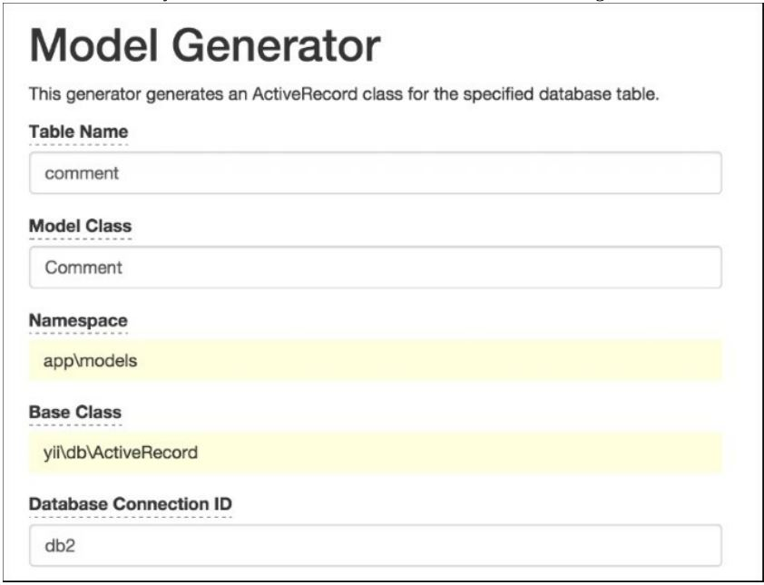
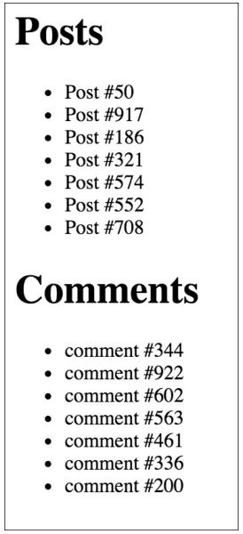

Определение и использование нескольких подключений к БД
===
Несколько подключений к базам данных не используются очень часто для новых автономных веб-приложений. Однако при создании дополнительного приложения для существующей системы, скорее всего, потребуется другое подключение к базе данных.
Из этого рецепта вы узнаете, как определить несколько подключений к БД и использовать их с DAO, Построителем запросов и моделями активных записей.

Подготовка
---

1 Создайте новое приложение с помощью composer, как описано в официальном руководстве  <http://www.yiiframework.com/doc-2.0/guide-start-installation.html>. 
по русски <http://yiiframework.domain-na.me/doc/guide/2.0/ru/start-installation>

2 Создайте две базы данных MySQL с именами dbi и db2.

3 Создайте таблицу с именем post в dbi следующим образом:
```php
DROP TABLE IF EXISTS 'post';
CREATE TABLE IF NOT EXISTS 'post' (
'id' INT(10) UNSIGNED NOT NULL AUTO_INCREMENT,
'title' VARCHAR(255) NOT NULL,
'text' TEXT NOT NULL,
PRIMARY KEY ('id')
);
```

4 Создайте таблицу с именем comment в db2 следующим образом:
```php
DROP TABLE IF EXISTS 'comment';
CREATE TABLE IF NOT EXISTS 'comment' (
'id' INT(10) UNSIGNED NOT NULL AUTO_INCREMENT,
'text' TEXT NOT NULL,
'post_id' INT(10) UNSIGNED NOT NULL,
PRIMARY KEY ('id')
);
```

Как это сделать...
---

1 Начнем с настройки соединений с БД. Откройте config/main.php и определить первичное соединение, как описано в официальном руководстве:
```php
'db' => ['connectionString' =>'mysql:host=localhost;dbname=db1',
         'username' => 'root',
         'password' => '',
         'charset' => 'utf8',
        ],
```

2 Скопируйте его, переименуйте компонент db в db2 и измените строку подключения соответствующим образом. Кроме того, необходимо добавить имя класса следующим образом:
```php
'db2' => [
		'class'=>'yii\db\Connection ',
		'connectionString' => 'mysql:host=localhost;dbname=db2',
		'username' => 'root',
		'password' => '',
		'charset' => 'utf8',
		],
```

3 Вот и все. Теперь у вас есть два подключения к базе данных, и вы можете использовать их с DAO и Построителем запросов следующим образом:
```php
$rows1 = Yii::$app->db->createCommand($sql)->queryAll();
$rows2 = Yii::$app->db2->createCommand($sql)->queryAll();
```

4 Теперь, если нам нужно использовать Активные модели записей, нам сначала нужно создать модели Post и Comment с помощью Gii. Можно выбрать соответствующее соединение для каждой модели. Задайте ID соединения с базой данных db2  при создании модели Comments, как показано на следующем снимке экрана:


5 Теперь Вы можете использовать модель Comment как обычно и создавать controllers/ DbController.php, следующим образом:
```php
<?php

namespace app\controllers;

use app\models\Post;
use app\models\Comment;
use Yii;
use yii\helpers\ArrayHelper;
use yii\helpers\Html;
use yii\web\Controller;

/**
 * Class DbController
 * @package app\controllers
 */
class DbController extends Controller
{
    public function actionIndex()
    {
        $post        = new Post();
        $post->title = "Post #" . rand(1, 1000);
        $post->text  = "text";
        $post->save();

        $posts = Post::find()->all();

        echo Html::tag('h1', 'Posts');
        echo Html::ul(ArrayHelper::getColumn($posts, 'title'));

        $comment         = new Comment();
        $comment->post_id = $post->id;
        $comment->text   = "comment #" . rand(1, 1000);
        $comment->save();

        $comments = Comment::find()->all();

        echo Html::tag('h1', 'Comments');
        echo Html::ul(ArrayHelper::getColumn($comments, 'text'));
    }
}
```

5 Запустите db/index несколько раз, и вы увидите записи, добавленные в обе базы данных, как показано на следующем снимке экрана:



Как это работает...
---
В Yii можно добавлять и настраивать собственные компоненты с помощью файла конфигурации. Для нестандартных компонентов, таких как db2, необходимо указать класс компонента. Аналогичным образом можно добавить db3, db4 или любой другой компонент, например facebookApi. Остальные пары ключ/значение массива назначаются открытым свойствам компонента соответственно.

Есть еще.
---
В зависимости от используемой РСУБД, есть дополнительные вещи, которые мы можем сделать, чтобы упростить использование нескольких баз данных.

**Перекрестные отношения между базами**

Если Вы используете MySQL, можно создать отношения между базами данных для ваших моделей. Чтобы сделать это, вы должны вставить префикс  с именем базы данных в имя таблицы модели Comment, следующим образом:
```php
class Comment extends\yii\db\ActiveRecord {
	//...
	public function tableName()
	{
		return 'db2.comment';
	}
	//...
}
```
Теперь, если связь комментариев определена  модели Post  в связывающем методе , можно использовать следующий код:
```
$posts = Post::find()->joinWith('comments')->all();
```

Смотрите так же
---

Для получения дополнительной информации обратитесь к   <http://www.yiiframework.com/doc-2.0/guide-db-dao.html#creating-db- connections>. По русски <http://yiiframework.domain-na.me/doc/guide/2.0/ru/db-dao> 
