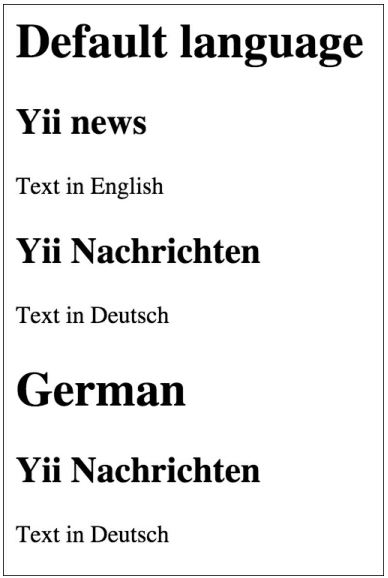

Настройка класса ActiveQuery
===
По умолчанию все активные запросы записей поддерживаются yii\db\ActiveQuery. Использование настраиваемого запроса класс в активном классе записей следует переопределить метод yii\db\ActiveRecord::find() и возврат экземпляра настраиваемого класса запросов.

Подготовка
---

1 Создайте новое приложение с помощью composer, как описано в официальном руководстве  <http://www.yiiframework.com/doc-2.0/guide-start-installation.html>. 
по русски <http://yiiframework.domain-na.me/doc/guide/2.0/ru/start-installation>

2 Настройте подключение к базе данных и создайте таблицу с именем post, как показано ниже:
```php
DROP TABLE IF EXISTS 'post';
CREATE TABLE IF NOT EXISTS 'post' (
'id' INT(10) UNSIGNED NOT NULL AUTO_INCREMENT,
'lang' VARCHAR(5) NOT NULL DEFAULT 'en',
'title' VARCHAR(255) NOT NULL,
'text' TEXT NOT NULL,
PRIMARY KEY ('id')
);
INSERT INTO 'post'('id','lang','title','text')
VALUES (1,'en_us','Yii news','Text in English'),
(2,'de','Yii Nachrichten','Text in Deutsch');
```

3 Создания модели Post с помощью GII с возможностью генерировать ActiveQuery, что создает класс PostQuery.

Как это сделать...
---

1 Добавьте следующий метод в models/PostQuery.php:
```php
<?php
namespace app\models;
/**
* This is the ActiveQuery class for [[Post]].
*
* @see Post
*/
class PostQuery extends \yii\db\ActiveQuery
{
/**
* @param $lang
*
* @return $this
*/
    public function lang($lang)
    {
        return $this->where([ 'lang' => $lang ]);
    }
}
```

2 Вот и все. Теперь мы можем использовать нашу модель. Создавая controllers/DbController.php следующим образом:
```php
<?php
namespace app\controllers;
use app\models\Post;
use yii\helpers\Html;
use yii\web\Controller;
/**
* Class DbController.
* @package app\controllers
*/
class DbController extends Controller
{
    public function actionIndex()
    {
        // Get posts written in default application language
        $posts = Post::find()->all();
        echo Html::tag('h1', 'Default language');
        foreach ($posts as $post) {
            echo Html::tag('h2', $post->title);
            echo $post->text;
        }
        // Get posts written in German
        $posts = Post::find()->lang('de')->all();
        echo Html::tag('h1', 'German');
        foreach ($posts as $post) {
            echo Html::tag('h2', $post->title);
            echo $post->text;
            }
    }
}
```

3 Теперь запустите db/index, и вы получите результат, аналогичный показанному ниже
screenshot:


Как это работает...
---
Мы переписали метод find в модели Post и расширили класс ActiveQuery. Метод lang возвращает ActiveQuery с указанным значением языка. Для поддержки цепных вызовов lang возвращает экземпляр модели самостоятельно.

Есть еще.
---
Согласно руководству Yii2, в Yii 1.1 было понятие, называемое областью. Область больше не поддерживается напрямую в Yii 2.0, и для достижения той же цели следует использовать настраиваемые классы запросов и методы запросов.

Смотрите так же
---
Дополнительные сведения см. по следующим URL-адресам:
* <http://www.yiiframework.com/doc-2.0/guide-db-active-record.html#customizing-query-classes>
по русски <http://yiiframework.domain-na.me/doc/guide/2.0/ru/db-active-record#customizing-query-classes> 
* <http://www.yiiframework.com/doc-2.0/guide-intro-upgrade-from-v1.html#active-record>
по русски <http://yiiframework.domain-na.me/doc/guide/2.0/ru/intro-upgrade-from-v1#active-record> 
