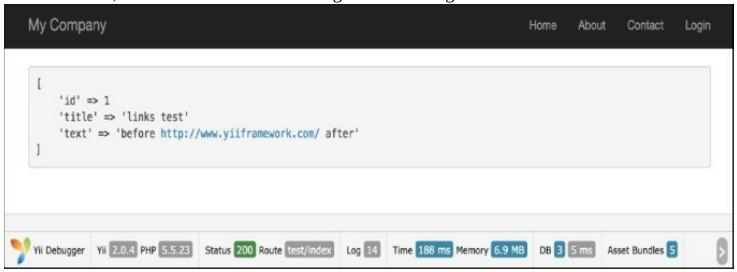

Обработка полей модели с помощью событийных методов AR
===
Активная реализация записи в Yii очень мощна и имеет много особенностей. Одной из таких функций являются событийные методы, которые можно использовать для предварительной обработки полей модели перед их помещением в базу данных или получением из базы данных, а также для удаления данных, связанных с моделью, и т. д.
В этом рецепте мы свяжем все URL-адреса в тексте сообщения и перечислим все существующие активные записи, похожие на события.

Подготовка
---
1 Создайте новое приложение с помощью composer, как описано в официальном руководстве  <http://www.yiiframework.com/doc-2.0/guide-start-installation.html>. 
по русски <http://yiiframework.domain-na.me/doc/guide/2.0/ru/start-installation>

2 Настройте подключение к базе данных и создайте таблицу с именем post, как показано ниже:
```php
DROP TABLE IF EXISTS 'post';
CREATE TABLE IF NOT EXISTS 'post' (
'id' INT(10) UNSIGNED NOT NULL AUTO_INCREMENT,
'title' VARCHAR(255) NOT NULL,
'text' TEXT NOT NULL,
PRIMARY KEY ('id')
);
```

3 Создайте модель post с помощью Gii.

Как это сделать...
---
1 Добавьте следующий метод в models/Post.php:
```php
/**
* @param bool $insert
*
* @return bool
*/
    public function beforeSave($insert)
    {
        $this->text = preg_replace('~((?:https?|ftps?)://.*?)( |$)~iu',
            '<a href="\1">\1</a>\2', $this->text);
        return parent::beforeSave($insert);
    }
```

2 Вот и все. Теперь попробуйте сохранить сообщение, содержащее ссылку. Создание controllers/TestController.php следующим образом:
```php
<?php
namespace app\controllers;
use app\models\Post; 
use yii\helpers\Html; 
use yii\helpers\VarDumper; 
use yii\web\Controller;
/**
* Class TestController.
* @package app\controllers
*/
class TestController extends Controller {
	public function actionIndex()
	{
		$post = new Post();
		$post->title = 'links test';
		$post->text = 'before http://www.yiiframework.com/ after'; $post->save();
		return $this->renderContent(Html::tag('pre', VarDumper::dumpAsString( $post->attributes)));
	}
}
```

3 Вот и все. Теперь запустите test/index. Вы должны получить следующий результат:


Как это работает...
---
Метод beforeSave реализуется в классе ActiveRecord и выполняется непосредственно перед сохранением модели. Используя регулярное выражение, мы заменяем все, что выглядит как URL-адрес, ссылкой, которая использует этот URL-адрес, и вызываем родительскую реализацию, чтобы реальные события вызывались правильно. Чтобы предотвратить сохранение, вы можете вернуть false.

Смотрите так же
---
* Для получения дополнительной информации обратитесь к 
<http://www.yiiframework.com/doc-2.0/guide-db-active-record.html#active-record-life-cycles>
по русски http://yiiframework.domain-na.me/doc/guide/2.0/ru/db-active-record#ar-life-cycles 
* Рецепт Работа с событиями в главе 1, Основы
* Рецепт Автоматизации временных меток
* Рецепт Настройка автора  автоматически
* Рецепт Настройка slug автоматически
