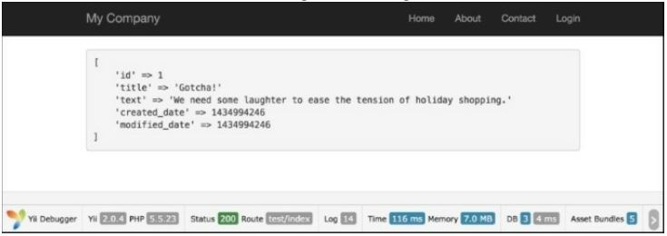

Автоматизация временных меток
===
Например, у нас есть простое приложение. Как и в любом блоге, в нем есть посты, комментарии и так далее. Мы хотели бы, чтобы заполнить время во время создания/обновления событий для сообщений. Предположим, что наша модель записи называется моделью Blogpost.

Подготовка
---
1 Создайте новое приложение с помощью composer, как описано в официальном руководстве  <http://www.yiiframework.com/doc-2.0/guide-start-installation.html>. 
по русски <http://yiiframework.domain-na.me/doc/guide/2.0/ru/start-installation>

2 Настройте подключение к базе данных и создайте таблицу с именем blog_post следующим образом:
```php
DROP TABLE IF EXISTS 'blog_post';
CREATE TABLE IF NOT EXISTS 'blog_post' (
'id' INT(10) UNSIGNED NOT NULL AUTO_INCREMENT,
'title' VARCHAR(255) NOT NULL,
'text' TEXT NOT NULL,
'created_date' INTEGER,
' modified_date'INTEGER,
PRIMARY KEY ('id')
);
```

3 Используйте Gii для создания модели для таблицы blog_post.

Как это сделать...
---
1 Добавьте следующий метод в models/BlogPost.php:
```php
/**
* @return array 
* */
public function behaviors()
{
	return [
		'timestamp'=> [
			'class' => 'yii\behaviors\TimestampBehavior', 'createdAtAttribute' => 'creation_date', 'updatedAtAttribute' => 'modified_date'
		]
	];
}
```

2 Создание controllers/TestController.php следующим образом:
```php
 <?php
 
 namespace app\controllers;
 
 use app\models\BlogPost;
 use yii\helpers\Html;
 use yii\helpers\VarDumper;
 use yii\web\Controller;
 
 /**
  * Class TestController.
  */
 class TestController extends Controller
 {
     public function actionIndex()
     {
         $blogPost = new BlogPost();
         $blogPost->title = 'Gotcha!';
         $blogPost->text = 'We need some laughter to ease the tension of holiday shopping.';
         $blogPost->save();
         return $this->renderContent(Html::tag('pre',VarDumper::dumpAsString($blogPost->attributes)));
     }
 }
 ```
 
3 Вот и все. Теперь запустите test/index. Вы должны получить следующий результат:


Как это работает...
---
По умолчанию поведение Метки времени заполняет created_at (метка времени, указывающая на время создания модели) и updated_at (время обновления модели). Это стандартная практика, чтобы назвать эти поля, но если мы хотели бы внести изменения, мы можем указать поля, которые будут обновлены, и события модели.

Есть еще.
---
Например, наши поля называются creation_date и modified_date.
Давайте настроим нашу модель поведения в соответствии с этими полями. Кроме того, мы должны добавить код нашего поведения в нашу почтовую модель:
```php
<?php
namespace app\models; 
use Yii;
use yii\db\BaseActiveRecord;
class Post extends \yii\db\ActiveRecord {
	// . .
	public function behaviors()
		{
			return [
					[
						'class' => 'yii\behaviors\TimestampBehavior',
						'attributes' => [BaseActiveRecord::EVENT_BEFORE_INSERT => 'creation_date', BaseActiveRecord::EVENT_BEFORE_UPDATE => 'modified_date',]
					]
					];
		}
	// ..
}
```
В этом примере мы указали на атрибуты creation_date и modified_date перед созданием и обновлением нашей модели соответствующим образом с помощью специальных событий ActiveRecord: EVENT_BEFORE_INSERT и EVENT_BEFORE_UPDATE.

Кроме того...
---
Можно сохранить метку времени для пользовательских сценариев. Допустим, вы хотите обновить поле last_login, например, для определенного действия контроллера. В этом случае можно вызвать обновление метки времени для конкретного атрибута с помощью следующих:
```php
$model->touch('last_login');
```
Имейте в виду, что touch() нельзя использовать для новых моделей. В этом случае Вы получите InvalidCallException:
```php
$model = new Post();
$model->touch('creation_date ' );
```
Метод touch() вызывает сохранение модели внутри себя, поэтому вам не нужно сохранять модель после ее вызова.

Смотрите так же
---
Для получения дополнительной информации обратитесь к
<http://www.yiiframework.com/doc-2.0/guide-concept-behaviors.html#using-timestamp-behavior> 
По русски <http://yiiframework.domain-na.me/doc/guide/2.0/ru/concept-behaviors#using-timestamp-behavior> 
