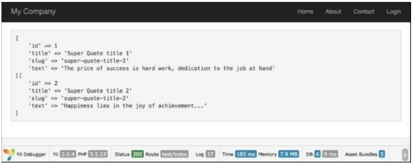
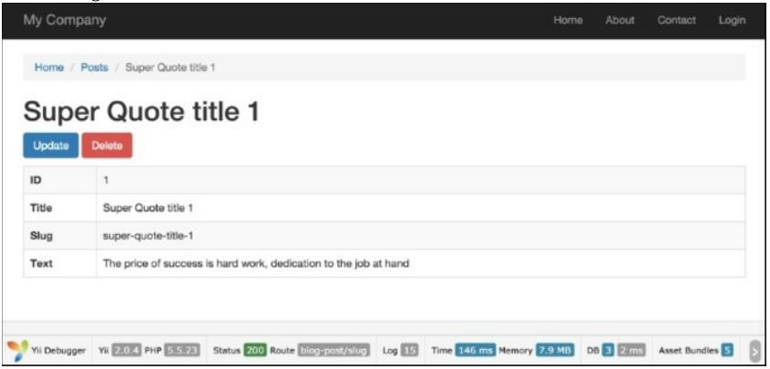
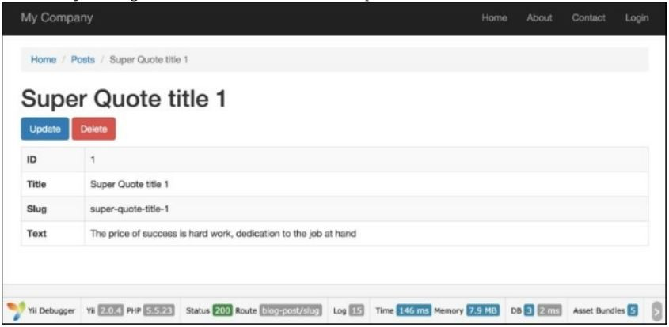

Настройка slug автоматически
==
В интернете slug-это короткий текст, используемый в URL-адресе для идентификации и описания ресурса. Slug - это часть URL, которая идентифицирует страницу с помощью удобочитаемых ключевых слов. Sluggable поведение-это поведение модели Yii2, которое позволяет нам генерировать уникальные slug.
В этом разделе мы будем направлять вас через изменение маршрутов URL представления Yii по умолчанию для объектов модели, чтобы быть более удобным для пользователя и поисковой системы. Yii обеспечивает встроенную поддержку для этого через своё sluggable поведение.

Подготовка
---
1 Создайте новое приложение с помощью composer, как описано в официальном руководстве  <http://www.yiiframework.com/doc-2.0/guide-start-installation.html>. 
по русски <http://yiiframework.domain-na.me/doc/guide/2.0/ru/start-installation>

2 Настройте подключение к базе данных и создайте таблицу с именем blog_post следующим образом:
```php
DROP TABLE IF EXISTS 'blog_post';
CREATE TABLE IF NOT EXISTS 'blog_post' (
	'id' INT(10) UNSIGNED NOT NULL AUTO_INCREMENT,
	'title' VARCHAR(255) NOT NULL,
	'slug' VARCHAR(255) NOT NULL,
	'text' TEXT NOT NULL,
	PRIMARY KEY ('id')
);
```

3 Используйте Gii для создания модели для таблицы post.

Как это сделать...
---

1 Добавьте следующий метод поведения в models/BlogPost.php:
```php
<?php
namespace app\models; 
use Yii;
use yii\db\BaseActiveRecord;
class BlogPost extends \yii\db\ActiveRecord {
// ..
	public function behaviors()
	{
		return [
			[
			'class' => 'yii\behaviors\SluggableBehavior', 'attribute' => 'title',
			'slugAttribute' => 'slug',
			'immutable'=> false,
			'ensureUnique' => true
			]
		];
	}
// ..
}
```

2 Создайте controllers/TestController.php следующим образом:
```php
<?php
namespace app\controllers;
use app\models\BlogPost;
use Yii;
use yii\helpers\Html;
use yii\helpers\VarDumper;
use yii\web\Controller;
/**
* Class TestController
* @package app\controllers 
* */
class TestController extends Controller {
	public function actionIndex()
	{
		$blogPostA	=	new BlogPost();
		$blogPostA->title = 'Super Quote title 1';
		$blogPostA->text = 'The price of success is hard work, dedication to the job at hand';
		$blogPostA->save();
		$blogPostB	=	new BlogPost();
		$blogPostB->title = 'Super Quote title 2';
		$blogPostB->text = 'Happiness lies in the joy of achievement...'; 
		$blogPostB->save();
		return $this->renderContent( '<pre>'. VarDumper::dumpAsString( $blogPostA->attributes ). VarDumper::dumpAsString($blogPostB->attributes ) . '</pre>');
	}
}
```

2 Результат будет следующим:


Как это работает...
---
Yii предлагает некоторые приятные усовершенствования sluggableBehavior для полезных сценариев.
Например, как только поисковая система записывает пули, вы, вероятно, не хотите, чтобы URL-Адрес страницы изменение.
Неизменяемый атрибут говорит Yii сохранить пули же после его первого создания-даже если Заголовок будет обновляться.
Если пользователи вводят сообщения, которые перекрываются в содержимом, свойство ensureunique будет автоматически 
 добавьте уникальный суффикс к дубликатам. Это гарантирует, что каждое сообщение имеет уникальный URL-адрес, даже если сообщение идентично.
Если вы создадите еще один пост с точно таким же названием, вы увидите, что его slug увеличено до hot-update-for-ios-devices-2.
 
**Примечание: **Если возникает ошибка, связанная с неизменяемым свойством, может потребоваться запустить обновление Composer, чтобы получить последнюю версию Yii.

Есть еще.
---
1 Используйте Gii для создания CRUD для класса модели app\models\Post и класса контроллера app\controllers\BlogPostController.

2 Добавьте следующее действие в controllers/BlogPostController.php:
```php
/**
* @param $slug
*
* @return string
* @throws NotFoundHttpException
*/
	public function actionSlug($slug)
	{
		$model = BlogPost::findOne(['slug'=>$slug]);
		if ($model === null) {
			throw new NotFoundHttpException('The requested page does not exist.');
		}
		return $this->render('view', ['model' => $model,]);
	}

3 Так и есть. Если вы запустите blogpost/slug со значением slug как sluggablebehavior-test, вы получите следующий результат:


4 Предлагается, чтобы предыдущий рецепт slug был успешно завершен с созданным экземпляром  модели Post.

5 Чтобы украсить URL, добавьте следующий компонент urlManager в config\web.РНР:
```php
//..
'urlManager' => [
	'enablePrettyUrl' => true,
	'rules' => [
		'blog-post' => 'blog-post/index',
		'blog-post/index' => 'blog-post/index',
		'blog-post/create' => 'blog-post/create',
		'blog-post/view/<id:\d+>' => 'blog-post/view',
		'blog-post/update/<id:\d+>' => 'blog-post/update',
		'blog-post/delete/<id:\d+>' => 'blog-post/delete',
		'blog-post/<slug>' => 'blog-post/slug',
		'defaultRoute' => '/site/index',
	],
]
//..
```

6 Важно, что 'blog-post/<slug>' => 'blog-post/slug' - это последнее в списке URL. 

7 Теперь, если вы идете на страницу, используя ваш slug URL, например, index.php/blog-post/super-quote-title-i/, вы получите результат, подобный тому, что в шаге 3:



Смотрите так же
---

Для получения дополнительной информации обратитесь к:
<http://www.yiiframework.com/doc-2.0/vii-behaviors-sluggablebehavior.hrml>
<http://www.yiiframework.com/doc-2.0/guide-runtime-routing.html#url-rules> 
по русски <http://yiiframework.domain-na.me/doc/guide/2.0/ru/runtime-routing#url-rules>
