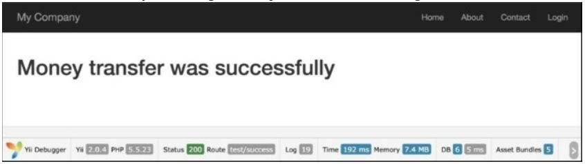
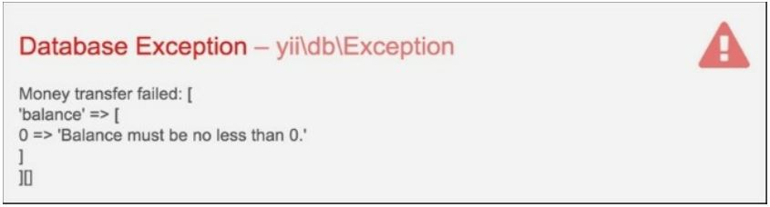

Транзакции 
===
В современных базах данных транзакции также делают некоторые другие вещи, такие как обеспечение того, что Вы не можете получить доступ к данным, которые другой человек написал наполовину. Однако основная идея все та же—сделки там, чтобы обеспечить, что бы ни случилось, данные работы будут в здравое состояние. Они гарантируют
что не будет ситуации, когда деньги снимаются с одного счета, но не зачисляются на другой.
Yii2 поддерживает мощный механизм транзакций с точками сохранения. Классический пример-перевод денег с одного банковского счета на другой. Для этого необходимо сначала вывести сумму с исходного счета, а затем внести ее на целевой счет. Операция должна быть выполнена в полном объеме. Если вы остановитесь на полпути, деньги будут потеряны, и это очень плохо. Например, у нас есть счет получателя и счет отправителя. Мы хотели бы перевести деньги от отправителя
получателю. Предположим, что у нас есть модель счета. Наша модель счета будет очень простой и будет содержать только поля id и баланс.

Подготовка...
---
1 Создайте новое приложение с помощью диспетчера пакетов Composer, как описано в официальном руководстве по адресу <http://www.yiiframework.com/doc-2.0/guide-start-installation.html>.
По русски <http://yiiframework.domain-na.me/doc/guide/2.0/ru/start-installation> 

2 Создайте миграцию, которая добавляет таблицу учетных записей, с помощью следующей команды:

**./yii migrate/create create_account_table**

3 Кроме того, обновите только что созданный перенос, используя следующий код:
```php
<?php
use yii\db\Schema;
use yii\db\Migration;
class m150620_062034_create_account_table extends Migration
{
    const TABLE_NAME = '{{%account}}';
    public function up()
    {
        $tableOptions = null;
        if ($this->db->driverName === 'mysql') {
            $tableOptions = 'CHARACTER SET utf8 COLLATE utf8_general_ci ENGINE=InnoDB';
        }
        $this->createTable(self::TABLE_NAME, [
            'id' => Schema::TYPE_PK,
            'balance' => ' NUMERIC(15,2) DEFAULT NULL',
        ], $tableOptions);
    }
    public function down()
    {
        $this->dropTable(self::TABLE_NAME);
    }
}
```

4 Затем установите миграцию с помощью следующей команды:

***./yii migrate up***

5 Используйте Gii для создания модели для таблицы Account.

6 Создайте миграцию, которая добавит несколько тестовых моделей счетов с балансом для нашей таблицы:

***./yii migrate/create add_account_records***

7 Кроме того, обновите только что созданный перенос, используя следующий код:
```php
<?php
use yii\db\Migration;
use app\models\Account;
class m150620_063252_add_account_records extends Migration
{
    public function up()
    {
        $accountFirst = new Account();
        $accountFirst->balance = 1110;
        $accountFirst->save();
        $accountSecond = new Account();
        $accountSecond->balance = 779;
        $accountSecond->save();
        $accountThird = new Account();
        $accountThird->balance = 568;
        $accountThird->save();
        return true;
    }
    public function down()
    {
        $this->truncateTable('{{%account}}');
        return false;
    }
}
```

Как это сделать...
---

1 Добавьте следующее правило в метод rules, в models/Account.php:
```php
public function rules()
{
    return [
        //..
        [['balance'], 'number', 'min' => 0],
        //..
    ];
}
```

2 Предположим, что наш баланс может быть только положительным и не может быть отрицательным.

3 Создайте TestController с действиями успеха и ошибки:

```php
<?php
namespace app\controllers;
use app\models\Account;
use Yii;
use yii\db\Exception;
use yii\helpers\Html;
use yii\helpers\VarDumper;
use yii\web\Controller;
class TestController extends Controller
{
    public function actionSuccess()
    {
        $transaction = Yii::$app->db->beginTransaction();
        try {
            $recipient = Account::findOne(1);
            $sender = Account::findOne(2);
            $transferAmount = 177;
            $recipient->balance += $transferAmount;
            $sender->balance -= $transferAmount;
            if ($sender->save() && $recipient->save()) {
                $transaction->commit();
                return $this->renderContent(Html::tag('h1', 'Money transfer was successfully'));
            } else {
                $transaction->rollBack();
                throw new Exception('Money transfer failed:' .
                    VarDumper::dumpAsString($sender->getErrors()) .
                    VarDumper::dumpAsString($recipient->getErrors())
                );
            }
        } catch ( Exception $e ) {
            $transaction->rollBack();
            throw $e;
        }
    }
    public function actionError()
    {
        $transaction = Yii::$app->db->beginTransaction();
        try {
            $recipient = Account::findOne(1);
            $sender = Account::findOne(3);
            $transferAmount = 1000;
            $recipient->balance += $transferAmount;
            $sender->balance -= $transferAmount;
            if ($sender->save() && $recipient->save()) {
                $transaction->commit();
                return $this->renderContent(
                Html::tag('h1', 'Money transfer was successfully'));
            } else {
                $transaction->rollBack();
                throw new Exception('Money transfer failed: ' .
                    VarDumper::dumpAsString($sender->getErrors()) .
                    VarDumper::dumpAsString($recipient->getErrors())
                    );
            }
        } catch ( Exception $e ) {
            $transaction->rollBack();
            throw $e;
        }
    }
```
Выполните test/success, и вы должны получить Выходные данные, показанные на следующем снимке экрана:


5. В этом случае механизм транзакций не обновит баланс получателя и отправителя, если произошла ошибка.

6. Выполните test/error, и вы должны получить Выходные данные, показанные на следующем снимке экрана:



Как вы помните, мы добавили правило в Модель счета, поэтому баланс нашего счета может быть только положительным.
Транзакция будет откатываться в этом случае, и это предотвращает ситуацию, когда деньги снимаются со счета отправителя, но не зачисляются на счет получателя.

Смотрите так же
---
Для получения дополнительной информации обратитесь к:
* <http://www.yiiframework.com/doc-2.0/guide-db-dao.html#performing-transactions>
по русски  <http://yiiframework.domain-na.me/doc/guide/2.0/ru/db-dao#performing-transactions> 
* <http://www.yiiframework.com/doc-2.0/guide-db-dao.html#nesting-transactions>
по русски <http://yiiframework.domain-na.me/doc/guide/2.0/ru/db-dao#nesting-transactions> 
