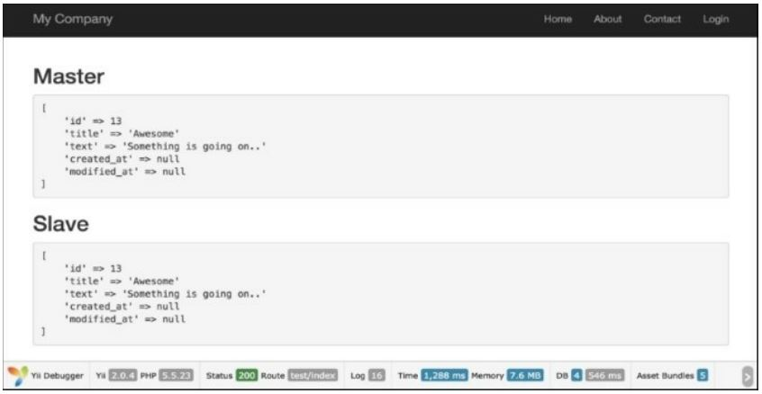

Репликация и разделение операций чтения и записи
===
В этом рецепте мы рассмотрим, как сделать репликацию и разделение чтения и записи. Мы увидим, как ведомые и главные серверы помогают нам в том, чтобы сделать это.

Подготовка 
---

1 Создайте новое приложение с помощью диспетчера пакетов Composer, как описано в официальном руководстве по адресу
<http://www.yiiframework.com/doc-2.0/guide-start-installation.html>.
По русски <http://yiiframework.domain-na.me/doc/guide/2.0/ru/start-installation>

2 Настройте подключение к базе данных и создайте таблицу с именем post, как показано ниже:
```php
DROP TABLE IF EXISTS 'blog_post';
CREATE TABLE IF NOT EXISTS 'blog_post' (
'id' INT(10) UNSIGNED NOT NULL AUTO_INCREMENT,
'title' VARCHAR(255) NOT NULL,
'text' TEXT NOT NULL,
'created_at' INTEGER,
' modified_at'INTEGER,
PRIMARY KEY ('id')
);
```

3 Создание модели BlogPost для таблицы blog_post.


4 Настройте репликацию Master-slave между серверами баз данных, например, как в статье
<https://www.digitalocean.com/community/tutorials/how-to-set-up-mastpr-slave-replication-in-mysql/>.


5 Настройте компонент БД в config/main.php; вот пример конфигурации:
```php
'components' =>[
	// ..
	'db' => [
		'class' => 'yii\db\Connection',
		'dsn' => 'mysql:host=4.4.4.4;dbname=masterdb',
		'username' => 'master',
		'password' => 'pass',
		'charset' => 'utf8 ',
		'slaveConfig' => [
			'username' => 'slave',
			'password' => 'pass',
		],
		// list of slave configurations
		'slaves' => [
			['dsn' => 'mysql:host=5.5.5.5;dbname=slavedb']
		]
	],
	// ..
]
```

Как это сделать...
---

1 Создать TestController.php следующим образом:
```php
<?php
namespace app\controllers;
use app\models\BlogPost;
use Yii;
use yii\helpers\Html;
use yii\helpers\VarDumper;
use yii\web\Controller;
/**
* Class TestController
* @package app\controllers
*/
class TestController extends Controller
{
	public function actionIndex(){
		$masterModel = new BlogPost();
		$masterModel->title = 'Awesome';
		$masterModel->text = 'Something is going on..';
		$masterModel->save();
		$postId = $masterModel->id;
		$replModel = BlogPost::findOne($postId);
		return $this->renderContent(
		Html::tag('h2', 'Master') .
		Html::tag('pre', VarDumper::dumpAsString(
			$masterModel
			? $masterModel->attributes
			: null
		)) .
		Html::tag('h2', 'Slave') .
			Html::tag('pre', VarDumper::dumpAsString(
				$replModel
				? $replModel->attributes
				: null
			))
		);
	}
}
```

2 Запустите test/index, и вы должны получить Выходные данные, показанные на следующем снимке экрана:


Как это работает...
---
Ведомые серверы используются для чтения данных, в то время как главный сервер используется для записи. После сохранения модели ActiveRecord на главном сервере новые записи реплицируются на подчиненный сервер, а затем $replModel находит записи на нем.

Есть еще.
---
Компонент\yii\db\connection поддерживает балансировку нагрузки и отработку отказа между ведомыми устройствами. При выполнении запроса на чтение в первый раз компонент \yii\db\connection случайным образом выберет ведомое устройство и попытается подключиться к нему. Если раб найден мертвым, он попробует еще один. Если ни один из ведомых устройств не доступен, это соединится с ведущим устройством. Настроив кэш состояния сервера, можно запомнить мертвый сервер, чтобы он не повторялся в течение определенного периода времени.

Смотрите так же
---
Дополнительные сведения см. по следующим URL-адресам:
* <http://www.yiiframework.com/doc-2.0/guide-db-dao.html#replication-and-read-write-splitting>
по русски <http://yiiframework.domain-na.me/doc/guide/2.0/ru/db-dao#read-write-splitting>
* <http://dev.mysql.com/doc/refman/5.G/en/replication.html>
* <http://docs.mongodb.org/manual/tutorial/deploy-replica-set/>
* <http://docs.mongodb.org/manual/tutorial/deploy-replica-set-for-testing/>
