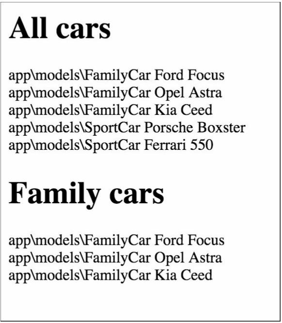

Реализация наследования одной таблицы
===
Реляционные базы данных не поддерживают наследование. Если нам нужно сохранить наследование в базе данных, мы должны каким-то образом поддерживать его с помощью кода. Этот код должен быть эффективным, чтобы генерировать как можно меньше соединений. Общее решение этой проблемы было описано Мартином Фаулером и называется наследованием одной таблицы.
Когда мы используем этот шаблон, мы храним все данные дерева классов в одной таблице и используем поле type для определения модели для каждой строки.
В качестве примера мы реализуем наследование одной таблицы для следующего дерева классов:

Car

  |- SportCar

  |- FamilyCar

Подготовка
---

1 Создайте новое приложение с помощью диспетчера пакетов Composer, как описано в официальном руководстве по адресу
<http://www.yiiframework.com/doc-2.0/guide-start-installation.html>. По русски <http://yiiframework.domain-na.me/doc/guide/2.0/ru/start-installation>

2 Создание и настройка базы данных. Добавить следующую таблицу:
```php
DROP TABLE IF EXISTS 'car';
CREATE TABLE 'car' (
'id' int(10) UNSIGNED NOT NULL AUTO_INCREMENT,
'name' varchar(255) NOT NULL,
'type' varchar(100) NOT NULL,
PRIMARY KEY ('id')
);
INSERT INTO 'car' ('name', 'type')
VALUES ('Ford Focus', 'family'),
('Opel Astra', 'family'),
('Kia Ceed', 'family'),
('Porsche Boxster', 'sport'),
('Ferrari 550','sport');
```

3 Используйте Gii для создания модели автомобиля для таблицы car и создания ActiveQuery для модели автомобиля.

Как это сделать...
---
1 Добавьте следующий метод и свойство в models/CarQuery.php:
```php
/**
* @var
*/
public $type;
/**
* @param \yii\db\QueryBuilder $builder
*
* @return \yii\db\Query
*/
public function prepare($builder)
{
    if ($this->type !== null) {
        $this->andWhere(['type' => $this->type]);
    }
    return parent::prepare($builder);
}
```

2 Создание models/sportcar.php следующим образом:
```php
<?php
namespace app\models;
use Yii;
/**
* Class SportCar
* @package app\models
*/
class SportCar extends Car
{
    const TYPE = 'sport';
    /**
    * @return CarQuery
    */
    public static function find()
    {
        return new CarQuery(get_called_class(), ['where' => ['type' =>self::TYPE]]);
    }
    /**
    * @param bool $insert
    *
    * @return bool
    */
    public function beforeSave($insert)
    {
        $this->type = self::TYPE;
        return parent::beforeSave($insert);
    }
}
```

3 Создание models/FamilyCar.php следующим образом:
```php
<?php
namespace app\models;
use Yii;
/**
* Class FamilyCar
* @package app\models
*/
class FamilyCar extends Car
{
    const TYPE = 'family';
    /**
    * @return CarQuery
    */
    public static function find()
    {
        return new CarQuery(get_called_class(), ['where' => ['type' =>self::TYPE]]);
    }
    /**
    * @param bool $insert
    *
    * @return bool
    */
    public function beforeSave($insert)
    {
        $this->type = self::TYPE;
        return parent::beforeSave($insert);
    }
}
````
4 Добавьте следующий метод к models/Car.php:
```php
/**
* @param array $row
*
* @return Car|FamilyCar|SportCar
*/
public static function instantiate($row)
{
    switch ($row['type']) {
    case SportCar::TYPE:
        return new SportCar();
    case FamilyCar::TYPE:
        return new FamilyCar();
    default:
        return new self;
    }
}
```

5 Add TestController with the following code:
```php
<?php
namespace app\controllers;
use app\models\Car;
use app\models\FamilyCar;
use Yii;
use yii\helpers\Html;
use yii\web\Controller;
/**
* Class TestController
* @package app\controllers
*/
class TestController extends Controller
{
    public function actionIndex()
    {
        echo Html::tag('h1', 'All cars');
        $cars = Car::find()->all();
        foreach ($cars as $car) {
            // Each car can be of class Car, SportCar or FamilyCar
            echo get_class($car).' '.$car->name."<br />";
       }
        echo Html::tag('h1', 'Family cars');
        $familyCars = FamilyCar::find()->all();
        foreach($familyCars as $car)
        {
            // Each car should be FamilyCar
            echo get_class($car).' '.$car->name."<br />";
        }
    }
}
```

6 Запустите test/index, и вы должны получить выходные данные, показанные на следующем снимке экрана:


Как это работает...
---
Автомобиль базовой модели типичная -используемая модель YII AR за исключением того, что он имеет 2 добавленных метода. Метод tableName явно объявляет имя таблицы, которое будет использоваться для модели. Для одной только модели автомобиля это не имеет смысла, но для дочерних моделей он вернет ту же таблицу автомобилей, что и мы хотим —одну таблицу для всего дерева классов. Метод instantiate используется AR внутренне для создания экземпляра модели из необработанных данных при вызове таких методов, как Car::find()->all(). Мы используем оператор switch для создания различных классов на основе атрибута type и используем один и тот же класс, если значение атрибута не указано или указывает на несуществующий класс.
Модели Sportcar и FamilyCar просто устанавливают область AR по умолчанию, поэтому при поиске моделей с помощью методов SportCar:: model () - > мы получим только модель SportCar.

Смотрите так же
---
Используйте следующие ссылки, чтобы узнать больше о шаблоне наследования одной таблицы и реализации Active Record Yii:
* <http://martinfowler.com/eaaCatalog/singleTableInheritance.html>
* <https://blog.liip.ch/archive/2012/03/27/table-inheritance-with-doctrine.html>
* <http://www.yiiframework.com/doc/api/CActiveRecord>/
