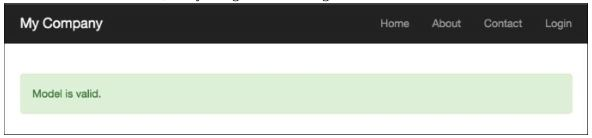
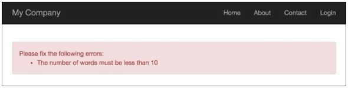
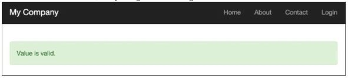
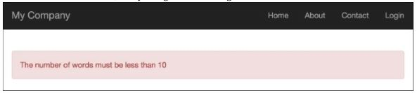

Написание собственных валидаторов
===
Yii обеспечивает хороший набор встроенных валидаторов форм, которые охватывают наиболее типичные потребности разработчиков и легко настраиваются. Однако, в некоторых случаях разработчику может потребоваться создать пользовательский валидатор.
Этот рецепт является хорошим примером создания автономного валидатора, который проверяет количество слов.

Подготовка
---
Создайте новое приложение с помощью диспетчера пакетов Composer, как описано в официальном руководстве по адресу
<http://www.yiiframework.com/doc-2.0/guide-start-installation.html>.
По русски <http://yiiframework.domain-na.me/doc/guide/2.0/ru/start-installation>

Как это сделать...
---

1 Создайте автономный валидатор в @app/components/WordsValidator.php следующим образом:
```php
<?php
namespace app\components;
use yii\validators\Validator;
class WordsValidator extends Validator
    {
    public $size = 50;
    public function validateValue($value){
        if (str_word_count($value) > $this->size) {
            return ['The number of words must be less than {size}', ['size' =>$this->size]];
        }
        return false;
    }
}
```

2 Создайте модель статьи в @app/models/Article.php следующим образом:
```php
<?php
namespace app\models;
use app\components\WordsValidator;
use yii\base\Model;
class Article extends Model
{
    public $title;
    public function rules()
    {
        return [
        ['title ',	'string'],
        ['title', WordsValidator::className(), 'size' => 10],
        ];
    }
}
```

3 Создайте @app/controllers/ModelValidationController.php следующим образом:
```php
<?php
namespace app\controllers;
use app\models\Article;
use yii\helpers\Html;
use yii\web\Controller;
class ModelValidationController extends Controller
{
    private function getLongTitle()
    {
        return 'There is a very long content for current article, '.'it should be less then ten words';
    }
    private function getShortTitle()
    {
        return 'There is a shot title';
    }
    private function renderContentByModel($title)
    {
        $model = new Article();
        $model->title = $title;
        if ($model->validate()) {
            $content = Html::tag('div', 'Model is valid.',[
                'class' => 'alert alert-success',
                ]);
        } else {
            $content = Html::errorSummary($model, [
                'class' => 'alert alert-danger',
            ]);
        }
        return $this->renderContent($content);
    }
    public function actionSuccess()
    {
        $title = $this->getShortTitle();
        return $this->renderContentByModel($title);
    }
    public function actionFailure()
    {
        $title = $this->getLongTitle();
        return $this->renderContentByModel($title);
    }
}
```

4 Запустите действие success контроллера modelValidation, открыв index.php?r=model-validation/success, и вы получите следующее:


5 Запустите действие failure контроллера modelValidation, открыв index.php?r=model-validation/failure, и вы получите следующее: 


6 Создайте @app/controllers/AdhocValidationController.php следующим образом:
```php
<?php
namespace app\controllers;
use app\components\WordsValidator;
use app\models\Article;
use yii\helpers\Html;
use yii\web\Controller;
class AdhocValidationController extends Controller
{
    private function getLongTitle()
    {
        return 'There is a very long content for current article, '.'it should be less then ten words';
    }

    private function getShortTitle()
    {
        return 'There is a shot title';
    }

    private function renderContentByTitle($title)
    {
        $validator = new WordsValidator(['size' => 10,]);
        if ($validator->validate($title, $error)) {
            $content = Html::tag('div', 'Value is valid.',[
                'class' => 'alert alert-success',
            ]);
        } else {
            $content = Html::tag('div', $error, [
                'class' => 'alert alert-danger',
            ]);
        }
        return $this->renderContent($content);
    }

    public function actionSuccess()
    {
        $title = $this->getShortTitle();
        return $this->renderContentByTitle($title);
    }

    public function actionFailure()
    {
        $title = $this->getLongTitle();
        return $this->renderContentByTitle($title);
    }
}
```
Запустите успешное действие AdhocValidationController, открыв index.php?r=adhoc-validation/success, и вы получите следующее:


Запустите действие failure контроллера adhocvalidation, открыв index.php?r=adhoc-validation/failure URL-адрес, и вы получите следующее:


Как это работает...
---
Сначала мы создали автономный валидатор, который проверяет количество слов с помощью стандартной функции STR_WORD_COUNT PHP, а затем продемонстрировали два варианта использования валидатора:
* Использование средства проверки в качестве правила проверки в модели статьи
* Использование валидатора в качестве специального валидатора
Валидатор имеет атрибут size, который устанавливает максимальное значение для количества слов.

Смотрите так же
---
Дополнительные сведения см. по следующим URL-адресам:
* <http://www.yiiframework.com/doc-2.0/guide-input-validation.html>
по русски <http://yiiframework.domain-na.me/doc/guide/2.0/ru/input-validation>
* <http://www.yiiframework.com/doc-2.0/guide-tutorial-corevalidators.html>
