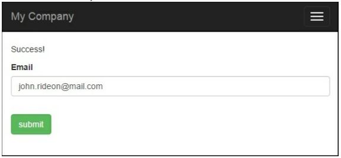
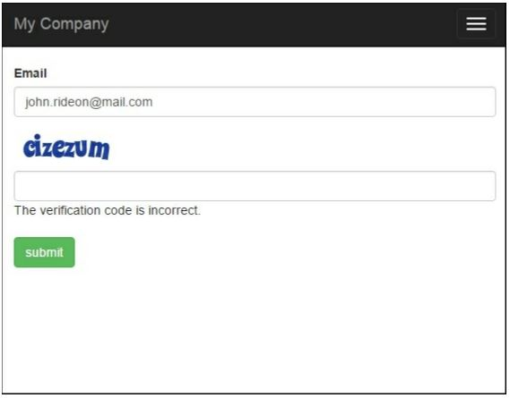

Добавление и настройка CaptchaWidget
===
В настоящее время, в Интернете, если вы оставите форму без защиты от спама, вы получите массу спам-данных, введенных в течение короткого времени. Yii включает компонент Captcha который делает добавлять такое предохранение легким.
Единственная проблема заключается в том, что нет систематического руководства о том, как его использовать. В следующем примере мы добавим защиту Captcha в простую форму.

Подготовка 
---

1 Создайте новое приложение с помощью диспетчера пакетов Composer, как описано в официальном руководстве по адресу <http://www.yiiframework.com/doc-2.0/guide-start-installation.html>.  По русски <http://yiiframework.domain-na.me/doc/guide/2.0/ru/start-installation>

2 Создайте модель формы @app/models/EmailForm.php, следующим образом:
```php
<?php
namespace app\models;
use yii\base\Model;
class EmailForm extends Model
{
    public $email;
    public function rules()
    {
        return [
            ['email',	'email']
        ];
    }
}
```

3 Создайте контроллер @app/controllers/EmailController.php, следующим образом:
```php
<?php
namespace app\controllers;
use Yii;
use yii\web\Controller;
use app\models\EmailForm;
class EmailController extends Controller
{
    public function actionIndex(){
        $success = false;
        $model = new EmailForm();
        if ($model->load(Yii::$app->request->post()) && $model->validate()) {
            Yii::$app->session->setFlash('success', 'Success!');
        }
        return $this->render('index', [
            'model' => $model,
            'success' => $success,
        ]);
    }
}
```

4 Создайте представление @app/views/email/index.php, следующим образом:
```php
<?php
use yii\helpers\Html;
use yii\captcha\Captcha;
use yii\widgets\ActiveForm;
?>
<?php if (Yii::$app->session->hasFlash('success')): ?>
    <div class="alert alert-success"><?=Yii::$app->session->getFlash('success')?></div>
<?php else: ?>
    <?php $form = ActiveForm::begin()?>
        <div class="control-group">
            <div class="controls">
                <?= $form->field($model, 'email')->textInput(['class' => 'form-control ']); ?>
                <?php echo Html::error($model, 'email', ['class' => 'help-block'])?>
            </div>
        </div>
        <?php if (Captcha::checkRequirements() && Yii::$app->user->isGuest): ?>
            <div class="control-group">
                <?= $form->field($model, 'verifyCode')->widget(\yii\captcha\Captcha::classname(), ['captchaAction' => 'email/captcha']) ?>
            </div>
        <?php endif; ?>
        <div class="control-group">
            <label class="control-label" for=""></label>
            <div class="controls">
                <?=Html::submitButton('Submit', ['class' => 'btn btn-success'])?>
            </div>
        </div>
    <?php ActiveForm::end()?>
<?php endif;?>
```
5 Теперь у нас есть форма отправки электронной почты, как показано на следующем снимке экрана, которая проверяет поле электронной почты. Давайте добавим капчу:


Как это сделать...
---

1 Во-первых, нам нужно настроить модель формы. Нам нужно добавить $verifyCode, который будет содержать введенный код проверки и добавить для него правило проверки:
```php
<?php
namespace app\models;
use yii\base\Model;
use yii\captcha\Captcha;
class EmailForm extends Model
{
    public $email;
    public $verifyCode;
    public function rules()
    {
        return [
            ['email',	'email' ],
            ['verifyCode', 'captcha', 'skipOnEmpty' =>  !Captcha::checkRequirements(), 'captchaAction' => 'email/captcha']
        ];
    }
}
```

2 Затем нам нужно добавить внешнее действие к контроллеру. Добавьте в него следующий код:
```php
public function actions()
{
    return [
        'captcha' => [
            'class' => 'yii\captcha\CaptchaAction',
        ],
    ];
}
```

3 В виде нам нужно показать дополнительное поле и изображение капчи. Следующий код сделает это за нас:
```php
<?php if (Captcha::checkRequirements() && Yii::$app->user->isGuest): ?>
    <div class="control-group">
        <?=Captcha::widget([
            'model' => $model,
            'attribute' => 'verifyCode',
            ]);?>
        <?php echo Html::error($model, 'verifyCode')?>
    </div>
<?php endif; ?>
```

4 Кроме того, не забудьте добавить Импорт Captcha в разделе заголовка представления:
```php
<?php
use yii\helpers\Html;
use yii\captcha\Captcha;
?>
```

5 Вот и все. Теперь вы можете запустить контроллер электронной почты и увидеть Captcha в действии, как показано на следующем снимке экрана:


Если на экране нет ошибок и нет поля Captcha в форме, скорее всего, у вас нет установленных и настроенных расширений GD PHP или Imagick. Imagick или GD требуется для Captcha, потому что он генерирует изображения. Мы добавили несколько проверок Captcha::checkRequirements (), поэтому приложение не будет использовать Captcha, если изображение не может быть отображено, но оно все равно будет работать.

Как это работает...
---
В представлении мы вызываем виджет Captcha, который отображает тег img с атрибутом src, указывающим на действие Captcha, которое мы добавили к контроллеру. В этом действии генерируется изображение со случайным словом. Сгенерированное слово-это код, который пользователь должен ввести в форму. Он хранится в пользовательском сеансе, и изображение отображается пользователю. Когда пользователь вводит в форму адрес электронной почты и код подтверждения, мы присваиваем эти значения модели формы, а затем проверяем ее. Для верификации поля кода мы используем Captchavalidator. Он получает код из сеанса пользователя и сравнивает его с введенным кодом. Если они не совпадают, данные модели считаются недопустимыми.

Кое что еще...
---
Если вы ограничиваете доступ к действиям контроллера с помощью метода контроллера accessRules, не забудьте предоставить каждому доступ к ним:

```php
public function behaviors()
{
    return [
        'access' => [
            'class' => AccessControl::className(),
            'rules' => [
                [
                    'actions' => ['index', 'captcha'],
                    'allow' => true,
                ]
            ],
        ],
    ];
}
```
