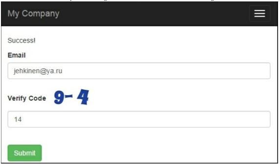

Настройка капчи
==
Стандартная капча Yii достаточно хороша, чтобы защитить вас от спама, но есть ситуации, когда вы можете захотеть настроить ее, такие как:
* Вы сталкиваетесь со спам-ботом, который может читать текст изображения, и вам нужно добавить больше безопасности
* Вы хотите, чтобы сделать его более интересным или легче ввести текст капчи
В нашем примере мы изменим капчу Yii, чтобы она потребовала от пользователя решить действительно простую арифметическую головоломку вместо того, чтобы просто повторять текст на изображении.

Подготовка 
---
В качестве отправной точки для этого примера мы возьмем результат добавления и настройки рецепта CaptchaWidget. В качестве альтернативы, Вы можете принять любую форму, которая использует Captcha, так как мы не сильно много изменяем существующий код .

Как это сделать...
---
Нам нужно настроить captchaAction, который генерирует код и отображает его изображение.
Код должен быть случайным числом и представление должно быть арифметическим выражением, которое дает тот же результат:

1 Создайте @app/components/MathCaptchaAction.php следующим образом:
```php
<?php
namespace app\components;
use \Yii;
use yii\captcha\CaptchaAction;
class MathCaptchaAction extends CaptchaAction
{
    protected function renderImage($code)
    {
        return parent::renderImage($this->getText($code));
    }
    protected function generateVerifyCode()
    {
        return mt_rand((int)$this->minLength,(int)$this->maxLength);
    }
    protected function getText($code)
    {
        $code = (int) $code;
        $rand = mt_rand(1, $code-1);
        $op = mt_rand(0, 1);
        if ($op) {
            return $code - $rand . " + "	. $rand;
        } else {
            return $code + $rand . " - " . " " . $rand;
        }
    }
}
```

2 Теперь, в методе действий нашего контроллера, нам нужно заменить captchaAction нашим собственным действием Captcha, следующим образом:
```php
public function actions()
{
    return [
        'captcha' => [
            'class' => 'app\components\MathCaptchaAction',
            'minLength' => 1,
            'maxLength' => 10,
        ],
    ];
}
```

3 Теперь, запустите форму и попробуйте новую капчу. Он покажет арифметические выражения с числами от 1 до 10 и потребует ввода ответа, как показано на следующем снимке экрана:


Мы переопределяем два метода CaptchaAction. В generateVerifyCode(), мы генерируем случайное число, а не текст. Затем, поскольку нам нужно отобразить выражение, а не просто показать текст, мы переопределяем renderImage. Само выражение создается в то gettext () метод.
Свойства $minLength и $maxLenght уже определены в CaptchaAction, поэтому нам не нужно добавлять их в наш класс Math CaptchaAction.

Смотрите так же
---
Для получения дополнительной информации обратитесь к следующему:
* <http://www.yiiframework.eom/doc-2.0/yii-captcha-captcha.html>
* <http://www.yiiframework.com/doc-2.0/vii-captcha-captchaartion.html>
* Рецепт Использование базового контроллера Глава  2, Маршрутизация, контроллеры и представления.
