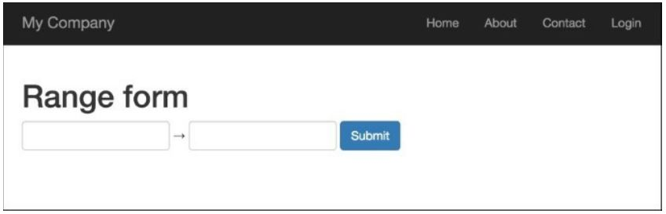
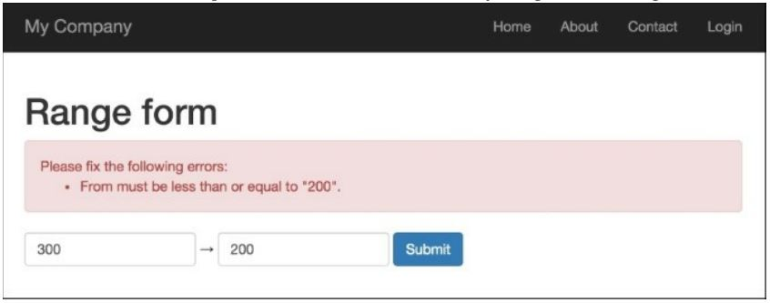
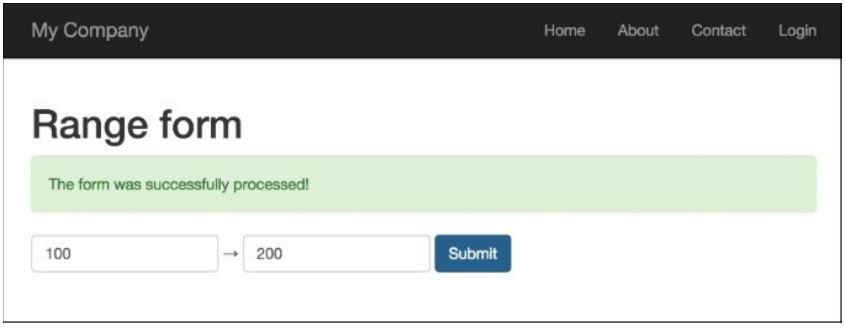

Создание пользовательского виджета ввода
===
Yii имеет очень хороший набор виджетов формы, но, как и в каждом фреймворке, Yii не имеет их всех. В этом рецепте мы узнаем, как создать свой собственный виджет ввода. Для нашего примера, мы создадим виджет ввода диапазона.

Подготовка
---
Создайте новое приложение с помощью диспетчера пакетов Composer, как описано в официальном руководстве по адресу <http://www.yiiframework.com/doc-2.0/guide-start-installation.html>. По русски <http://yiiframework.domain-na.me/doc/guide/2.0/ru/start-installation>

Как это сделать...
---
1 Создайте файл виджета @app/components/RangeInputWidget.php, следующим образом:
```php
<?php
namespace app\components;
use yii\base\Exception;
use yii\base\Model;
use yii\base\Widget;
use yii\helpers\Html;
class RangeInputWidget extends Widget
{
    public $model;
    public $attributeFrom;
    public $attributeTo;
    public $htmlOptions = [];

    protected function hasModel()
    {
        return $this->model instanceof Model&& $this->attributeFrom !== null&& $this->attributeTo !== null;
    }
    public function run()
    {
        if (!$this->hasModel()) {
            throw new Exception('Model must be set');
        }
        return Html::activeTextInput($this->model, $this->attributeFrom, $this->htmlOptions) .' &rarr; ' .Html::activeTextInput($this->model, $this->attributeTo, $this->htmlOptions);
    }
}
```

2 Создайте файл контроллера @app/controllers/RangeController.php, следующим образом:
```php
<?php
namespace app\controllers;
use Yii;
use yii\web\Controller;
use app\models\RangeForm;
class RangeController extends Controller
{
    public function actionIndex()
    {
        $model = new RangeForm();
        if ($model->load(Yii::$app->request->post()) && $model->validate()) {
            Yii::$app->session->setFlash('rangeFormSubmitted','The form was successfully processed!');
        }
        return $this->render('index', array(
            'model' => $model,
        ));
    }
}
```

3 Создайте файл формы @app/models/RangeForm.php, следующим образом:
```php
<?php
namespace app\models;
use yii\base\Model;
class RangeForm extends Model
{
    public $from;
    public $to;
    public function rules()
    {
        return [
            [['from',	'to'], 'number', 'integerOnly' => true],
            ['from', 'compare', 'compareAttribute' => 'to', 'operator' => '<='],
        ];
    }
}
```

4 Создайте файл представления @app/views/range/index.php, следующим образом:
```php
<?php
use yii\helpers\Html;
use yii\bootstrap\ActiveForm;
use app\components\RangeInputWidget;
?>
<h1>Range form</h1>
<?php if (Yii::$app->session->hasFlash('rangeFormSubmitted')): ?>
    <div class="alert alert-success">
        <?= Yii::$app->session->getFlash('rangeFormSubmitted'); ?>
    </div>
<?php endif?>
<?= Html::errorSummary($model, ['class'=>'alert alert-danger'])?>
<?php $form = ActiveForm::begin([
    'options' => ['class' => 'form-inline']
    ]); ?>
    <div class="form-group">
        <?= RangeInputWidget::widget([
            'model' => $model,
            'attributeFrom' => 'from',
            'attributeTo' => 'to',
            'htmlOptions' => [
                'class' =>'form-control'
            ]
        ]) ?>
    </div>
    <?= Html::submitButton('Submit', ['class' => 'btn btn-primary', 'name' =>'contact-button']) ?>
<?php ActiveForm::end(); ?>
```
5 Запустите контроллер диапазона, открыв index.php?r=range и вы получите следующее:


6 Введите 200 в первом поле ввода текста и 300 во втором, и вы получите следующее:


7 Виджет выдает ошибку, если первое значение больше второго; то есть оно. Попробуйте ввести правильные значения, 100 и 200, для первого и второго входов соответственно:


Как это работает...
---
Пишем виджет ввода диапазона, который требует четыре параметра:
* model: если она не задана, будет выдано исключение
* attributeFrom: это используется, чтобы установить минимальный диапазон значений
* attributeTo: это используется, чтобы установить максимальный диапазон значений
* htmloptions: передается на каждый вход
Этот виджет используется при проверке формы и настроен на проверку того, что первое значение меньше или равно второму значению.

Кое что еще.
---
Yii2 framework имеет официальное расширение Twitter Bootstrap, которое предоставляет Вам пакет PHP-оболочек над виджетами Twitter Bootstrap. Перед тем, как написать свой собственный виджет, проверьте, существует ли виджет Bootstrap в http://www.yiiframework.com/doc-2.0/extbootstrap-index.html.

Смотрите так же
---
Чтобы узнать больше о виджетах, вы можете использовать следующие ресурсы:
* <http://www.viiframework.com/doc-2.0/yii-base-wirlget.html>
* <https://github.com/viisoft/yii2-bootstrap/blob/master/docs/guide/usage-widgets.md>
* статья про виджеты <https://github.com/yiisoft/yii2-bootstrap/blob/master/docs/guide/README.md>

