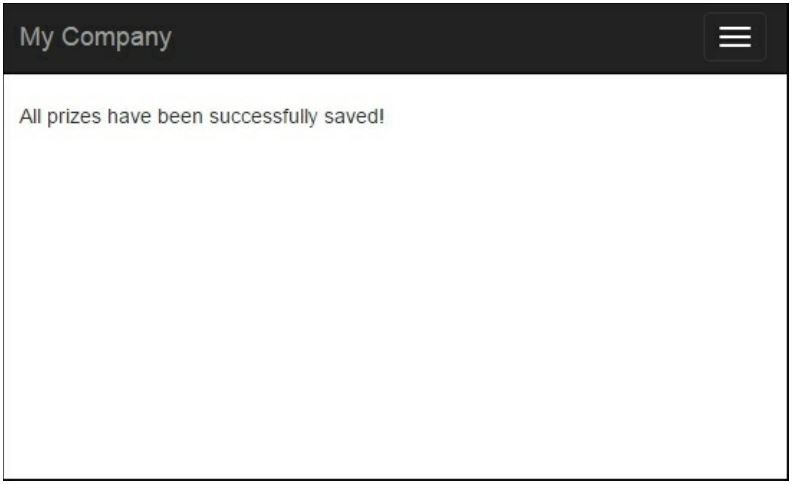
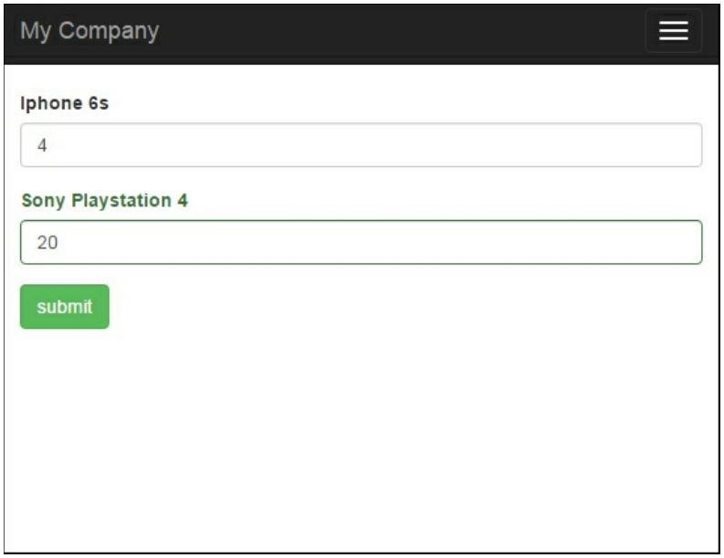

Табличный ввод
===
В этом разделе мы покажем вам, как использовать модель, чтобы сохранить и проверить связанные модели. Иногда вам нужно будет обрабатывать несколько моделей одного и того же вида в одной форме.
Например, у нас есть конкурсы и призы для конкурсов. Любой конкурс может содержать неограниченное количество призов. Таким образом, нам нужна возможность создать конкурс с призами, проверить их, отобразить все ошибки и сохранить основную модель (модель конкурса) и все связанные модели (модели призов) в базу данных.

Подготовка
---
1  Создайте новое приложение с помощью диспетчера пакетов Composer, как описано в официальном руководстве по адресу <http://www.yiiframework.com/doc-2.0/guide-start-installation.html>  По русски <http://yiiframework.domain-na.me/doc/guide/2.0/ru/start-installation>

2 Создавайте миграции для конкурсных и призовых таблиц с помощью следующих команд:

**./yii migrate/create create_table_contest_and_prize_table**

Обновите только что созданные методы миграции up () и down () следующим кодом
```php
public function up()
{
    $tableOptions = null;
    if ($this->db->driverName === 'mysql') {
        $tableOptions = 'CHARACTER SET utf8 COLLATE utf8_general_ci ENGINE=InnoDB';
    }
    $this->createTable('{{%contest}}',	[
        'id' => Schema::TYPE_PK,
        'name' => Schema::TYPE_STRING .	' NOT NULL',
        ], $tableOptions);
    $this->createTable('{{%prize}}', [
        'id' => Schema::TYPE_PK,
        'name' => Schema::TYPE_STRING,
        'amount' => Schema::TYPE_INTEGER,
    ], $tableOptions);
    $this->createTable('{{%contest_prize_assn}}',	[
        'contest_id' => Schema::TYPE_INTEGER,
        'prize_id' => Schema::TYPE_INTEGER,
    ], $tableOptions);
    $this-addForeignKey('fk_contest_prize_assn_contest_id',
        '{{%contest_prize_assn}}', 'contest_id', {{%contest}}', 'id');
    $this->addForeignKey('fk_contest_prize_assn_prize_id',
        '{{%contest_prize_assn}}', 'prize_id', '{{%prize}}',	'id');
}
public function down()
{
    $this-dropForeignKey('fk_contest_prize_assn_contest_id','{{%contest_prize_assn}}');
    $this->dropForeignKey('fk_contest_prize_assn_prize_id','{{%contest_prize_assn}}');
    $this->dropTable('{{%contest_prize_assn}}');
    $this->dropTable('{{%prize}}');
    $this->dropTable('{{%contest}}');
}
```

3 Затем установите миграцию с помощью следующей команды:

**./yii migrate/up**

4 С помощью GII, создайте модели Contest, Priz, и  ContestPrizeAssn.

Как это сделать...
---

1 Давайте создадим @app/controllers/ContestController.php со следующим кодом:
```php
<?php
namespace app\controllers;
use app\models\Contest;
use app\models\ContestPrizeAssn;
use app\models\Prize;
use Yii;
use yii\base\Model;
use yii\helpers\VarDumper;
use yii\web\Controller;
class ContestController extends Controller
{
    public function actionCreate()
    {
        $contestName = 'Happy New Year';
        $firstPrize = new Prize();
        $firstPrize->name = 'Iphone 6s';
        $firstPrize->amount = 4;
        $secondPrize = new Prize();
        $secondPrize->name = 'Sony Playstation 4';
        $secondPrize->amount = 2;
        $contest = new Contest();
        $contest->name = $contestName;
        $prizes = [$firstPrize, $secondPrize];
        if ($contest->validate() && Model::validateMultiple($prizes)) {
            $contest->save(false);
            foreach ($prizes as $prize) {
                $prize->save(false);
                $contestPrizeAssn = new ContestPrizeAssn();
                $contestPrizeAssn->prize_id = $prize->id;
                $contestPrizeAssn->contest_id = $contest>id;
                $contestPrizeAssn->save(false);
            }
            return $this->renderContent('All prizes have been successfully saved!');
        } else {
            return $this->renderContent(VarDumper::dumpAsString($contest->getErrors()));
        }
    }

    public function actionUpdate()
    {
        $prizes = Prize::find()->all();
        if (Model::loadMultiple($prizes, Yii::$app->request->post()) &&Model::validateMultiple($prizes)){
            foreach ($prizes as $prize) {
                $prize->save(false);
            }
            return $this->renderContent('All prizes have been successfully saved!');
        }
        return $this->render('update', ['prizes' => $prizes]);
    }
}
```

2 Создать @app/views/contest/update.php и поместите в него следующий код:
```php
<?php
use yii\helpers\Html;
use yii\widgets\ActiveForm;
$form = ActiveForm::begin();
foreach ($prizes as $i => $prize) {
    echo $form->field($prize, "[$i]amount")->label($prize->name);
}
echo Html::submitButton('submit' , ['class' => 'btn btn-success']);

ActiveForm::end();
?>
Как это работает...
---
Следующая информация показывает, как реализовать табличный ввод с помощью Yii.
В действии contest/update , мы сможем отобразить все призы с их креплениями и редактировать их все сразу. Мы использовали два специальных метода Yii:
* Model: : loadMultiple (): ***This method populates a set of models with data from the end user***
* Model: : validateMultiple(): ***This methods takes a set of models and validates them all at once***
Поскольку мы уже проверяли наши модели с помощью validateMultiple(), мы передаем false в качестве параметра save(), чтобы избежать выполнения проверки дважды.
Во-первых, визит на страницу /index. php?r=contest/create . После посещения, вы увидите страницу, которая будет проверять и создавать "С Новым Годом" с двумя призами, и передаст призы текущей модели конкурса. Обратите внимание, что модель конкурса и призы будут сохранены в базе данных только в том случае, если они действительны:


Это обеспечивается следующим условием:
```php
if ($contest->validate() && Model::validateMultiple($prizes)) { ...}
```
Перейдите в /index.php?r=contest/update, и вы увидите эту форму:


В @app/views/contest/update.php для каждого приза мы выводим имя и ввод с суммой.
Мы должны добавить индекс к каждому входному имени, чтобы Model:: loadMultiple() мог определить, какую модель заполнить какими значениями.
В заключение, этот подход используется для сбора табличных входных данных при обработке всех атрибутов из формы представления и заполнении родительских и связанных моделей из формы.

Смотрите так же
---
Для получения дополнительной информации, обратитесь к следующему адресу:
<http://www.yiiframework.com/doc-2.0/guide-input-tabular-input.html#collecting-tabular-input>
по русски <http://yiiframework.domain-na.me/doc/guide/2.0/ru/input-tabular-input> 
