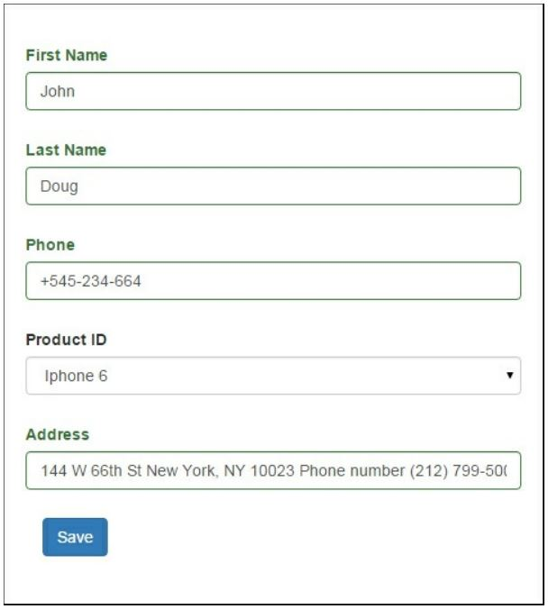

Сложные формы с несколькими моделями
===
При работе с некоторыми сложными данными, возможно, потребуется использовать несколько различных моделей для сбора входных данных пользователя. Например, у вас есть бланк заказа с информацией о пользователе, такие как имя, фамилия и номер телефона; у вас также есть адрес доставки и какой-то продукт.
Вы хотели бы сохранить все эти данные в одной форме. С моделями Yii и формами поддержки, вы можете легко сделать это.
Предполагая, что информация о пользователе будет храниться в пользовательской таблице и в форме заказа, мы сохраним информацию о продукте и user_id пользователя, который заказал продукт. У нас также есть таблица продуктов с некоторой информацией в ней.

Подготовка
---

1 Создайте новое приложение с помощью диспетчера пакетов Composer, как описано в официальном руководстве по адресу <http://www.yiiframework.com/doc-2.0/guide-start-installation.html>. 
По русски <http://yiiframework.domain-na.me/doc/guide/2.0/ru/start-installation>

2 Создавайте миграции для конкурсных и призовых таблиц с помощью следующих команд:
***./yii migrate/create create_order_tables***

3 Обновите созданные методы миграции up() и down () следующим кодом:
```php
<?php
use yii\db\Schema;
use yii\db\Migration;
use app\models\Product;
class m150813_161817_create_order_form_tables extends Migration
{
    public function up()
    {
        $tableOptions = null;
        if ($this->db->driverName === 'mysql') {
            $tableOptions = 'CHARACTER SET utf8 COLLATE utf8_general_ci ENGINE=InnoDB';
        }
        $this->createTable('user', [
            'id' => Schema::TYPE_PK,
            'first_name' => Schema::TYPE_STRING .	' NOT NULL',
            'last_name' => Schema::TYPE_STRING .	' NOT NULL',
            'phone' => Schema::TYPE_STRING .	' NOT NULL',
            ], $tableOptions);
        $this->createTable('product', [
            'id' => Schema::TYPE_PK,
            'title' => Schema::TYPE_STRING .	' NOT NULL',
            'price' => Schema::TYPE_FLOAT .	'(6,2) ',
            ], $tableOptions);
        $this->createTable('order', [
            'id' => Schema::TYPE_PK,
            'user_id' => Schema::TYPE_INTEGER .	' NULL',
            'address' => Schema::TYPE_STRING .	' NOT NULL',
            'product_id' => Schema::TYPE_INTEGER .	' NOT NULL',
            ], $tableOptions);
        $product1 = new Product();
        $product1->title = 'Iphone 6';
        $product1->price = 400.5;
        $product1->save();
        $product3 = new Product();
        $product3->title = 'Samsung Galaxy Note 5';
        $product3->price = 900;
        $product3->save();
        $this->addForeignKey('fk_order_product_id', 'order', 'product_id',' product',	'id');
    }
    public function down()
    {
        $this->dropTable('order');
        $this->dropTable('user');
        $this->dropTable('product');
    }
}
```

4 Затем установите миграцию с помощью следующей команды:

***./yii migrate/up***

5 С помощью Gii создайте модели пользователей, заказов и продуктов.

Как это сделать...
---
1 Создайте @app/controllers/TestController со следующим кодом:
```php
<?php
namespace app\controllers;
use app\models\Order;
use app\models\User;
use Yii;
use yii\web\Controller;
class TestController extends Controller
{
    public function actionOrder()
    {
        $user = new User();
        $order = new Order();
        if ($user->load(Yii::$app->request->post()) && $order->load(Yii::$app->request->post())) {
        if ($user->validate() && $order->validate()) {
            $user->save(false);
            $order->user_id = $user->id;
            $order->save(false);
            $this->redirect(['/test/result', 'id' => $order->id]);
        }
    }
        return $this->render('order', ['user' => $user, 'order' => $order]);
    }
    public function actionResult($id)
    {
        $order = Order::find($id)->with('product', 'user')->one();
        return $this->renderContent(
            'Product: ' . $order->product->title . '</br>' .
            'Price: ' . $order->product->price . '</br>' .
            'Customer: '. $order->user->first_name .''. $order->user->last_name.</br>'.
            'Address: '. $order->address
        );
    }
}
```

2 Затем создайте файл представления с именем @app/views/test/order.php и добавьте следующий код:
```php
<?php
    use yii\helpers\Html;
    use yii\widgets\ActiveForm;
    use app\models\Product;
    use yii\helpers\ArrayHelper;
    /**
    * @var $user \app\models\User
    * @var $order \app\models\Order
    */
    $form = ActiveForm::begin([
        'id' => 'order-form',
        'options' => ['class' => 'form-horizontal'],
    ]) 
?>
<?= $form->field($user, 'first_name')->textInput(); ?>
<?= $form->field($user, 'last_name')->textInput(); ?>
<?= $form->field($user, 'phone')->textInput(); ?>
<?= $form->field($order, 'product_id')->dropDownList(ArrayHelper::map(Product::find()->all(), 'id', 'title')); ?>
<?= $form->field($order, 'address')->textInput(); ?>
<?= Html::submitButton('Save', ['class' => 'btn btn-primary']) ?>
<?php ActiveForm::end() ?>
```

Как это работает...
---
Вы можете увидеть форму по адресу http: //yii-book.app/index.php?r=test/order. Наша форма собирает информацию от пользователя и моделей заказа.
Давайте заполним нашу форму:


После сохранения, вы увидите следующий результат:


В контроллере мы проверяем и храним его. Конечно, этот пример очень прост. В реальных проектах у вас может быть более одной модели, и вы сможете использовать этот подход для них. Этот подход очень полезен, если требуется создать или обновить несколько экземпляров в одной форме.

Смотрите так же
---
Для получения дополнительной информации обратитесь к <http://www.yiiframework.com/doc-2.0/guide-inpnt-mnltiple-models.html> 
По русски <http://yiiframework.domain-na.me/doc/guide/2.0/ru/input-multiple-models> 
