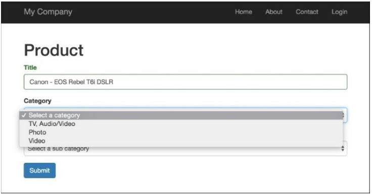
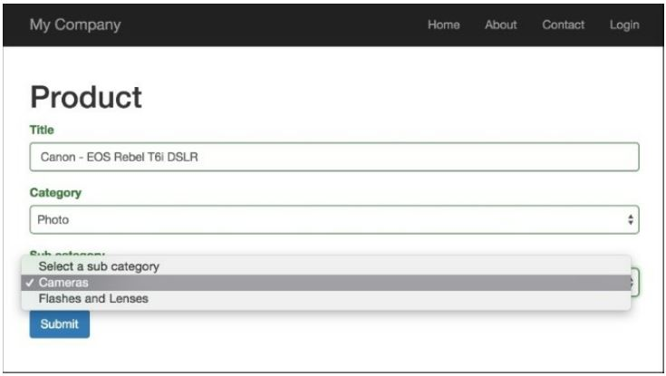

Раскрывающийся список, зависящий от AJAX
===
Часто вам понадобится форма с двумя раскрывающимися списками, и одно раскрывающееся значение будет зависеть от значения другого раскрывающегося списка. Используя встроенные функции AJAX Yii, вы можете создать такое выпадающее меню.

Подготовка 
---

1 Создайте новое приложение с помощью диспетчера пакетов Composer, как описано в официальном руководстве по адресу <http://www.yiiframework.com/doc-2.0/guide-start-installation.html>. 
По русски  <http://yiiframework.domain-na.me/doc/guide/2.0/ru/start-installation>

2 Создайте @app/model/Product.php следующим образом:
```php
<?php
namespace app\models;
use yii\db\ActiveRecord;
class Product extends ActiveRecord
{
    public function rules()
    {
        return [
            ['title ',	'string'],
            [['title', 'category_id', 'sub_category_id'], 'required'],
                ['category_id', 'exist', 'targetAttribute' => 'id', 'targetClass' =>'app\models\Category ' ],
                ['sub_category_id', 'exist', 'targetAttribute' => 'id', 'targetClass'=> 'app\models\Category'],
        ];
    }
    public function attributeLabels()
    {
        return [
            'category_id' => 'Category',
            'sub_category_id' => 'Sub category',
        ]; 
    }
}
```

3 Создайте модель @app/models/Category.php следующим образом:
```php
<?php
namespace app\models;
use yii\db\ActiveRecord;
class Category extends ActiveRecord
{
    public function rules()
    {
        return [['title ',	'string'],];
    }
    /**
    * @return array
    */
    public static function getSubCategories($categoryId)
    {
        $subCategories = [];
        if ($categoryId) {
            $subCategories = self::find()
                ->where(['category_id' => $categoryId])
                ->asArray()
                ->all();
        }
        return $subCategories;
    }
}
```

4 Создайте миграцию create_category_and_product_tables с помощью следующей команды:

***./yii migrate/create create_category_and_product_tables***

5 Обновите только что созданные методы миграции и список импортированных классов следующим образом:
```php
<?php
use yii\db\Schema;
use yii\db\Migration;
class m150813_005030_create_categories extends Migration
{
    public function up()
    {
        $tableOptions = null;
        $this->createTable('{{%product}}',[
            'id' => Schema::TYPE_PK,
            'category_id' => Schema::TYPE_INTEGER .' NOT NULL',
            'sub_category_id' => Schema::TYPE_INTEGER .' NOT NULL',
            'title' => Schema::TYPE_STRING .' NOT NULL',
        ], $tableOptions);
        $this->createTable('{{%category}} ',	[
            'id' => Schema::TYPE_PK,
            'category_id' => Schema::TYPE_INTEGER,
            'title' => Schema::TYPE_STRING .' NOT NULL',
        ], $tableOptions);
        $this->addForeignKey('fk_product_category_id','{{%product}}',
            'category_id', '{{%category}}', 'id');
        $this->addForeignKey('fk_product_sub_category_id',	'{{%product}}',
            'category_id', '{{%category}}', 'id');
        $this->batchInsert('{{%category}}', ['id', 'title'], [
            [1, 'TV, Audio/Video'],
            [2,	' Photo'],
            [3, 'Video']
        ]);
        $this->batchInsert('{{%category}}', ['category_id', 'title'], [
            [1, 'TV'],
            [1, 'Acoustic System'],
            [2, 'Cameras'],
            [2, 'Flashes and Lenses '],
            [3, 'Video Cams'],
            [3, 'Action Cams'],
            [3, 'Accessories']
        ]);
    }
    public function down()
    {
        $this->dropTable('{{%product}}');
        $this->dropTable('{{%category}}');
    }
}
```

Как это сделать...
---

1 Создайте файл контроллера @app/controllers/DropdownController.php, следующим образом:
```php
<?php
namespace app\controllers;
use app\models\Product;
use app\models\Category;
use app\models\SubCategory;
use Yii;
use yii\helpers\ArrayHelper;
use yii\helpers\Json;
use yii\web\Controller;
use yii\web\HttpException;
class DropdownController extends Controller
{
    public function actionGetSubCategories($id)
    {
        if (!Yii::$app->request->isAjax) {
            throw new HttpException(400, 'Only ajax request is allowed.');
        }
        return Json: :encode(Category::getSubCategories($id));
    }
    public function actionIndex()
    {
        $model = new Product();
        if ($model->load(Yii::$app->request->post()) && $model->validate()) {
            Yii::$app->session->setFlash('success','Model was successfully saved');
        }
        return $this->render('index', [
            'model' => $model,
        ]);
    }
}
```

2 Создайте файл представления @app/views/dropdown/index.php, следующим образом:
```php
<?php
use yii\bootstrap\ActiveForm;
use yii\helpers\Html;
use yii\helpers\Url;
use app\models\Category;
use yii\helpers\ArrayHelper;
use yii\web\View;
$url = Url::toRoute(['dropdown/get-sub-categories']);
$this->registerJs("
(function() {
    var select = $('#product-sub_category_id');
    var buildOptions = function(options) {
        if (typeof options === 'object') {
            select. children('option' ).remove();
            $('<option />')
                .appendTo(select)
                .html('Select a sub category')
            $.each(options, function(index, option) {
                $('<option />', {value:option.id})
                .appendTo(select)
                .html(option.title);
            });
        }
    };
    var categoryOnChange = function(category_id){
        $.ajax({
            dataType : ' j son',
            url: '" . $url . "&id=' + category_id ,
            success: buildOptions
        });
    };
    window.buildOptions = buildOptions;
    window.categoryOnChange = categoryOnChange;
})();
", View::POS_READY);
?>
<h1>Product</h1>
<?php if (Yii::$app->session->hasFlash('success')): ?>
    <div class="alert alert-success"><?= Yii::$app->session->getFlash('success'); ?
></div>
<?php endif; ?>
<?php $form = ActiveForm::begin(); ?>
    <?= $form->field($model, 'title')->textInput() ?>
    <?= $form->field($model, 'category_id')->dropDownList(ArrayHelper::map(
        Category::find()->where('category_id IS NULL')->asArray()->all(),'id','title'), [
        'prompt' => 'Select a category',
        'onChange' => 'categoryOnChange($(this).val());',
    ]) ?>
    <?= $form->field($model, 'sub_category_id')->dropDownList(
        ArrayHelper::map(Category::getSubCategories($model->sub_category_id), 'id' , 'title'),	[
        'prompt' => 'Select a sub category',
    ]) ?>
    <div class="form-group">
        <?= Html::submitButton('Submit', ['class' => 'btn btn-primary']) ?>
    </div>
<?php ActiveForm::end(); ?>
```
3 Запустите контроллер раскрывающегося списка, открыв  index.php?r=dropdown, затем добавьте новый продукт со значением Canon-EOS Rebel T6i DSLR для поля заголовка:


4 Как вы можете видеть, Категория ввода имеет три варианта. Давайте выберем опцию фото и после этого, второй выбор ввода будет иметь еще два варианта:


5 Вот и все. Если вы выберете другую категорию, вы получите подкатегории этой категории.

Как это работает...
---
В этом примере у нас есть два зависимых списка с категориями и подкатегориями и одна модель, Category. Основная идея проста: мы просто привязали событие JQuery onChange к полю category_id в нашей форме. Каждый раз, когда пользователь изменяет это поле, наше приложение отправляет запрос AJAX в действие get-sub-categories. Это действие возвращает список подкатегорий в формате JSON, а затем на стороне клиента мы строим список параметров для нашего списка подкатегорий.
