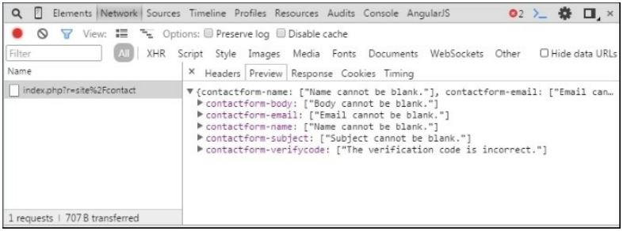

AJAX валидация
===
Некоторые проверки могут выполняться только на стороне сервера, поскольку только сервер имеет необходимую информацию. Например, чтобы проверить уникальность имени компании или электронной почты пользователя, мы должны проверить соответствующие таблицы на стороне сервера. В этом случае следует использовать встроенную проверку AJAX. Yii2 поддерживает проверку формы AJAX, которая по существу отправляет значения формы на сервер, проверяет их и отправляет обратно ошибки проверки, все, не выходя из страницы. Он делает это каждый раз, когда вы выходите из (измененного) поля.

Подготовка 
---
Создайте новое приложение с помощью диспетчера пакетов Composer, как описано в официальном руководстве по адресу <http://www.yiiframework.com/doc-2.0/guide-start-installation.html>. 
По русски <http://yiiframework.domain-na.me/doc/guide/2.0/ru/start-installation>

Как это сделать...
---

1 В базовом шаблоне приложения у нас есть простая контактная форма. Вы можете увидеть эту страницу на http://yii-book.app/index.php?r=site/contact. Откройте и измените связанную форму представления @app/views/site/contact.php. Чтобы включить проверку AJAX для всей формы, настройте параметр enableAjaxValidation как true в конфигурации формы:
```php
$form = ActiveForm::begin([
      'id' => 'contact-form',
      'enableAjaxValidation' => true,
]);
```

2 Кроме того, следует добавить обработку для проверки AJAX на стороне сервера. Этот фрагмент кода просто проверяет, является ли текущий запрос AJAX и если это запрос POST. Если это так, мы получим ошибки в формате JSON:
```php
if (Yii::$app->request->isAjax && $model->load(Yii::$app->request->post())) {
    Yii::$app->response->format = Response::FORMAT_JSON;
    return ActiveForm::validate($model);
}
```

3 Давайте изменим наш actionContact() в siteController следующим кодом:
```php
public function actionContact()
{
    $model = new ContactForm();
    if (Yii::$app->request->isAjax && $model->load(Yii::$app->request->post())) {
        Yii::$app->response->format = Response::FORMAT_JSON;
        return ActiveForm::validate($model);
    }
    if ($model->load(Yii::$app->request->post()) && $model->contact(Yii::$app->params['adminEmail'])) {
        Yii::$app->session->setFlash('contactFormSubmitted');
        return $this->refresh();
    } else {
        return $this->render('contact', [
        'model' => $model,
        ]);
    }
}
```

Как это работает...
---
Предыдущий код проверит, является ли текущий запрос AJAX. Если это так, он ответит на этот запрос, запустив проверку и вернув ошибки в формате JSON.
Вы можете проверить ответ сервера в панели отладки в браузере. Попробуйте отправить пустую форму и вы увидите ответ.
Например, в браузере Google Chrome, нажмите F12 и выберите вкладку "Сеть" в панели инструментов развития. Вы увидите массив JSON с ошибками и сообщениями:


Смотрите так же
---
<http://www.yiiframework.com/doc-2.0/guide-input-validation.html#ajaxvalidation>
по русски <http://yiiframework.domain-na.me/doc/guide/2.0/ru/input-validation>

