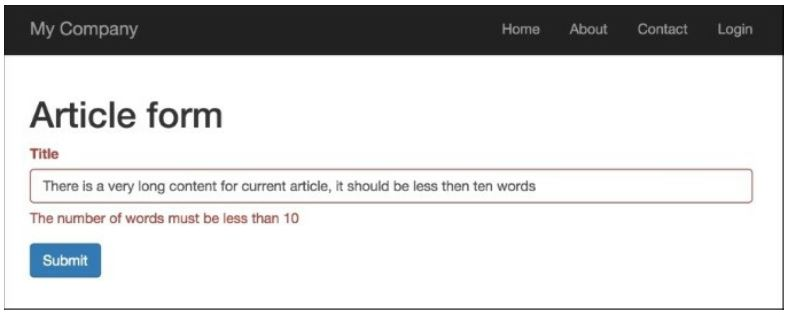
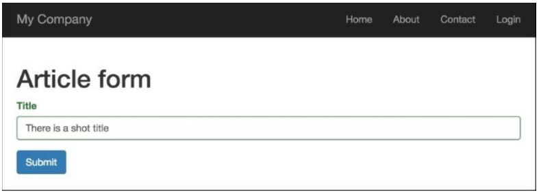

Создание пользовательской проверки на стороне клиента
===
При написании собственного рецепта валидаторов мы создали автономный валидатор. В этом рецепте мы изменим валидатор, чтобы создать дополнительную валидацию на стороне клиента, которая также проверяет количество слов.

Подготовка
---
Создайте новое приложение с помощью диспетчера пакетов Composer, как описано в официальном руководстве по адресу <http://www.yiiframework.com/doc-2.0/guide-start-installation.html>. 
По русски http://yiiframework.domain-na.me/doc/guide/2.0/ru/start-installation

Как это сделать...
---

1 Создайте @app/components/WordsValidator.php следующим образом:
```php
<?php
namespace app\components;
use yii\validators\Validator;
class WordsValidator extends Validator
{
    public $size = 50;
    public $message = 'The number of words must be less than {size}';
    public function validateValue($value)
    {
        preg_match_all('/(\w+)/i', $value, $matches);
        if (count($matches[0]) > $this->size) {
            return [$this->message, ['size' => $this->size]];
        }
    }
    public function clientValidateAttribute($model, $attribute, $view)
    {
        $message = strtr($this->message, ['{size}' => $this->size]);
        return <<<JS
            if (value.split(/\w+/gi).length > $this->size ) {
                messages.push("$message");
            }
        JS;
    }
}
```

2 Создать @app/models/Article.php следующим образом:
```php
<?php
namespace app\models;
use app\components\WordsValidator;
use yii\base\Model;
class Article extends Model
{
    public $title;
    public function rules()
    {
        return [
            ['title ',	'string'],
            ['title', WordsValidator::className(), 'size' => 10],
        ];
    }
}
```

3 Создайте @app/controllers/ValidationController.php следующим образом:
```php
<?php
namespace app\controllers;
use app\models\Article;
use Yii;
use yii\web\Controller;
class ValidationController extends Controller
{
    public function actionIndex()
    {
        $model = new Article();
        if ($model->load(Yii::$app->request->post()) && $model->validate()) {
            Yii::$app->session->setFlash('success', 'Model is valid');
        }
        return $this->render('index', [
            'model' => $model,
        ]);
    }
}
```

4 Создайте @app/views/validation/index.php следующим образом:
```php
<?php
use yii\bootstrap\ActiveForm;
use yii\helpers\Html;
?>
<h1>Article form</h1>
<?php if (Yii::$app->session->hasFlash('success')): ?>
      <div class="alert alert-success">
          <?= Yii::$app->session->getFlash('success'); ?>
      </div>
<?php endif; ?>
<?php $form = ActiveForm::begin(); ?>
      <?= $form->field($model, 'title') ?>
      <div class="form-group">
            <?= Html::submitButton('Submit', ['class' => 'btn btn-primary']) ?>
      </div>
<?php ActiveForm::end(); ?>
```

Как это работает...
---
Запустите контроллер проверки, открыв index. php?r=validation. Вы увидите пример неправильного значения, если введете более десяти слов:


Если ввести менее десяти слов, проверка на стороне клиента будет успешной:


Во-первых, мы создали @app/components/wordsvalidator.php, который расширяет класс @yii\validators\validator и добавляет вновь созданный класс validator в атрибут title
Модель статьи:
```php
    ['title', WordsValidator::className(), 'size' => 10],
```
Внутри нашего валидатора мы определили два специальных метода: validatevalue () и  clientValidateAttribute().
Наш класс validator реализует метод validatevalue () для поддержки проверки данных вне контекста модели данных. Второй метод просто возвращает JavaScript, необходимый для выполнения проверки на стороне клиента.

Есть еще...
---
Если мы хотим скрыть реализацию валидатора или хотим контролировать все процессы валидации только на стороне сервера, мы можем создать Отложенный объект.
Во-первых, измените валидатор Wordsvalidator следующим образом:
```php
<?php
namespace app\components;
use yii\validators\Validator;
use yii\helpers\Url;
class WordsValidator extends Validator
{
    public $size = 50;
    public $message = 'The number of words must be less than {size}';
    public function validateValue($value)
    {
        if (str_word_count($value) > $this->size) {
            return ['The number of words must be less than {size}', ['size' => $this->size]];
        }
        return false;
    }
    public function clientValidateAttribute($model, $attribute, $view)
    {
        $url = Url::toRoute(['validation/check-words']);
        return <<<JS
            deferred.push($.get("$url", {words: value}).done(function(data) {
                if (!data.result) {
                    messages.push(data.error);
                }
            }));
        JS;
    }
}
```
В предыдущем коде переменная deferred предоставляемая Yii, который является массивом отложенных объектов.  Метод $get ()jQuery создает Отложенный объект, который передается в отложенный массив.
Во-вторых, добавьте это действие checkWords в контроллер проверки:
```php
public function actionCheckWords()
{
    \Yii::$app->response->format = \yii\web\Response::FORMAT_JSON;
    $value = Yii::$app->getRequest()->get('words');
    $validator = new WordsValidator([
        'size' => 10,
    ]);
    $result = $validator->validate($value, $error);
    return ['result' => $result,'error' => $error];
}
```

Смотрите еще
---
Дополнительные сведения см. по следующим URL-адресам:
* <https://www.yiiframework.com/doc/guide/2.0/en/input-validation#implementing-client-side-validation>
по русски <http://yiiframework.domain-na.me/doc/guide/2.0/ru/input-validation#implementing-client-side-validation> 
* <https://www.yiiframework.com/doc/guide/2.0/en/input-validation#deferred-validation>
по русски <http://yiiframework.domain-na.me/doc/guide/2.0/ru/input-validation#deferred-validation> 
