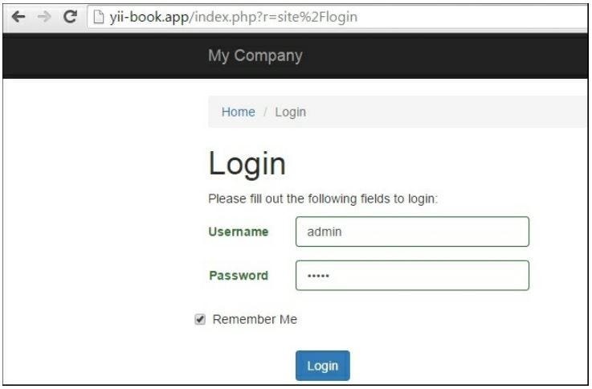
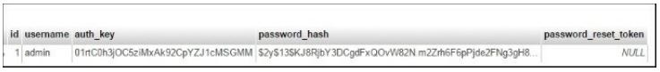

Идентификация
==
Большинство веб-приложений предоставляют пользователям возможность входа в систему или сброса забытых паролей. В Yii2 у нас нет такой возможности по умолчанию. Для базового шаблона приложения Yii по умолчанию предоставляет только двух тестовых пользователей, которые статически описаны в пользовательской модели. Таким образом, мы должны реализовать специальный код, чтобы иметь возможность включить вход пользователя из базы данных.

Подготовка 
---

1 Создайте новое приложение с помощью диспетчера пакетов Composer, как описано в официальном руководстве по адресу <http://www.yiiframework.com/doc-2.0/guide-start-installation.html>. 
По русски <http://yiiframework.domain-na.me/doc/guide/2.0/ru/start-installation>

2 В разделе компонента конфигурации добавьте:
```php
'user' => [
    'identityClass' => 'app\models\User',
    'enableAutoLogin' => true,
],
```

3 Создайте таблицу User. Создайте миграцию, введя следующую команду:

***./yii migrate/create create_user_table***

4 Измените созданую миграции следующим кодом:
```php
<?php
use yii\db\Schema;
use yii\db\Migration;
class m150626_112049_create_user_table extends Migration
{
    public function up()
    {
        $tableOptions = null;
        if ($this->db->driverName === 'mysql') {
            $tableOptions = 'CHARACTER SET utf8 COLLATE utf8_general_ci ENGINE=InnoDB';
        }
        $this->createTable('{{%user}}', [
            'id' => Schema::TYPE_PK,
            'username' => Schema::TYPE_STRING .	' NOT NULL',
            'auth_key' => Schema::TYPE_STRING .	'(32) NOT NULL',
            'password_hash' => Schema::TYPE_STRING .	' NOT NULL',
            'password_reset_token' => Schema::TYPE_STRING,
        ], $tableOptions);
    }
    public function down()
    {
        $this->dropTable('{{%user}}');
    }
}
```

5 Обновите существующую модель models/User следующим кодом:
```php
<?php
namespace app\models;
use yii\db\ActiveRecord;
use yii\web\IdentityInterface;
use yii\base\NotSupportedException;
use Yii;
class User extends ActiveRecord implements IdentityInterface
{
    /* *
    * @inheritdoc
    */
    public function rules()
    {
          return [
               ['username', 'required'],
               ['username', 'unique'],
               ['username', 'string', 'min' => 3],
               ['username', 'match', 'pattern' => '~A[A-Za-z][A-Za-z0-9]+$~', 'message' => 'Username can contain only alphanumeric characters.'],
               [['username', 'password_hash', 'password_reset_token'],'string', 'max' => 255],
               ['auth_key', 'string', 'max' => 32],
          ];
    }
    /**
    * @inheritdoc
    */
    public static function findIdentity($id)
    {
        return static::findOne($id);
    }
    public static function findIdentityByAccessToken($token, $type = null)
    {
        throw new NotSupportedException('"findIdentityByAccessToken" is not implemented .');
    }
    /**
    * Finds user by username
    *
    * @param string	$username
    * @return User
    */
    public static function findByUsername($username)
    {
        return static::findOne(['username' => $username]);
    }
    /**
    * @inheritdoc
    */
    public function getId()
    {
        return $this->getPrimaryKey();
    }
    /**
    * @inheritdoc
    */
    public function getAuthKey()
    {
        return $this->auth_key;
    }
    /* *
    * @inheritdoc
    */
    public function validateAuthKey($authKey)
    {
        return $this->getAuthKey() === $authKey;
    }
    /**
    * Validates password
    *
    * @param string $password password to validate
    * @return boolean if password provided is valid for current user
    */
    public function validatePassword($password)
    {
        return Yii::$app->getSecurity()->validatePassword($password, $this->password_hash);
    }
    /**
    * Generates password hash from password and sets it to the model
    *
    * @param string $password
    */
    public function setPassword($password)
    {
        $this->password_hash = Yii::$app->getSecurity()->generatePasswordHash($password);
    }
    /**
    * Generates "remember me" authentication key
    */
    public function generateAuthKey()
    {
        $this->auth_key = Yii::$app->getSecurity()->generateRandomString();
    }
    /**
    * Generates new password reset token
    */
    public function generatePasswordResetToken()
    {
        $this->password_reset_token = Yii::$app->getSecurity()->generateRandomString() . '_' . time();
    }
    /**
    * Finds user by password reset token
    *
    * @param string	$token password reset token
    * @return static|null
    */
    public static function findByPasswordResetToken($token)
    {
        $expire = Yii::$app->params['user.passwordResetTokenExpire'];
        $parts = explode('_', $token);
        $timestamp = (int) end($parts);
        if ($timestamp + $expire < time()) {
            return null;
        }
        return static::findOne([
            'password_reset_token' => $token
        ]);
    }
}
```

6 Создайте миграцию, которая добавит тестового пользователя. Используйте следующую команду:

***./yii migrate/create create_test_user***

7 Измените  миграции следующим кодом:
```php
<?php
use yii\db\Migration;
use app\models\User;
class m150626_120355_create_test_user extends Migration
{
    public function up()
    {
        $testUser = new User();
        $testUser->username = 'admin';
        $testUser->setPassword('admin');
        $testUser->generateAuthKey();
        $testUser->save();
    }
    public function down()
    {
        User: : findByUsername('turbulence')->delete();
        return false;
    }
}
```

8 Установите все миграции с помощью следующей команды:

***./yii migrate up***

Как это сделать...

1 Теперь, введите  URL-адрес site/login действие и введите admin/admin в качестве учетных данных:


2 Поздравляю! Если вы завершили эти шаги, вы должны иметь возможность войти.

Как это работает...
---

1 Сначала мы создали миграцию для пользовательской таблицы. Помимо ID и имя пользователя, наша Таблица содержит специальные поля, такие как auth_key (главным образом использовать это для проверки подлинности пользователя с помощью куки), функция password_hash (по соображениям безопасности мы не храним пароли и хранит только хэш пароля), и password_reset_token (используется, когда нужно сбросить пароль пользователя).

2 Результат после установки и миграции create_test_user должен выглядеть следующим образом
screenshot:


Мы также добавили специальные методы в пользовательскую модель и изменили наследование на класс User extends. ActiveRecord реализует Identityinterface, поэтому мы должны быть в состоянии найти пользователей в базе данных.
 Вы также можете скопировать модель пользователя из расширенного приложения по адресу  
<https://github.com/yiisoft/yii2-app-advanced/blob/master/common/models/User.php> .

Смотриет так же
---
Для получения дополнительной информации обратитесь к <http://www.yiiframework.com/doc-2.0/guide-security-authentiration.html>
По русски  <http://yiiframework.domain-na.me/doc/guide/2.0/ru/security-authentication> 
