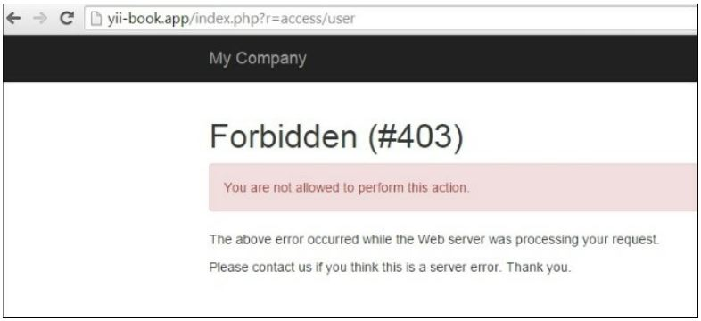

Использование фильтров контроллера
===
Во многих случаях нам нужно отфильтровать входящие данные или выполнить некоторые действия на основе данных. Например, с помощью пользовательских фильтров мы можем фильтровать посетителей по IP-адресу, заставлять пользователей использовать HTTPS или перенаправлять пользователя на страницу установки перед использованием приложения. 
В Yii2 фильтры по существу являются особым видом поведения, поэтому использование фильтров аналогично использованию поведений.
Yii имеет много встроенных полезных фильтров, которые включают:
* Core
* Custom
* Authentication
* Content Negotiator
* HttpCache
* PageCache
* RateLimiter
* Verb
* Cors

В этом рецепте мы реализуем следующее:
* Ограничение доступа к действию контроллера только авторизованными пользователями
* Ограничение доступа к действию контроллера указанными IP-адресами
* Ограничение доступа к определенным ролям пользователей

Подготовка 
---

1 Создайте новое приложение с помощью диспетчера пакетов Composer, как описано в официальном руководстве по адресу <http://www.yiiframework.com/doc-2.0/guide-start-installation.html> . По русски <http://yiiframework.domain-na.me/doc/guide/2.0/ru/start-installation..

2 Создайте app/components/AccessRule.php:
```php
<?php
namespace app\components;
use app\models\User;
class AccessRule extends \yii\filters\AccessRule {
    /* *
    * @inheritdoc
    */
    protected function matchRole($user)
    {
        if (empty($this->roles)) {
            return true;
        }
        $isGuest = $user->getIsGuest();
        foreach ($this->roles as $role) {
            switch($role) {
                case '?':
                    return ($isGuest) ? true : false;
                case User::ROLE_USER:
                    return (!$isGuest) ? true : false;
                case $user->identity->role: 
                    // Check if the user is logged in, and the roles match
                    return (!$isGuest) ? true : false;
                default:
                    return false;
            }
        }
        return false;
    }
}
```

3 Создайте app/controllers/AccessController.php:
```php
<?php
namespace app\controllers;
use app\models\User;
use Yii;
use yii\filters\AccessControl;
use app\components\AccessRule;
use yii\web\Controller;
class AccessController extends Controller
{
    public function behaviors()
    {
        return [
            'access' => [
                'class' => AccessControl::className(),
                // We will override the default rule config with the new AccessRule class
                'ruleConfig' => [
                    'class' => AccessRule::className(),
                ],
                'rules ' => [
                    [
                        'allow' => true,
                        'actions' => ['auth-only'],
                        'roles' => [User::ROLE_USER]
                    ],
                    [
                        'allow' => true,
                        'actions' => ['ip'],
                        'ips' => ['127.0.0.1'],
                    ],
                    [
                        'allow' => true,
                        'actions' => ['user'],
                        'roles' => [ User::ROLE_ADMIN],
                    ],
                    ['allow' => false,]
                ],
            ]
        ];
    }
    public function actionAuthOnly()
    {
        echo "Looks like you are authorized to run me.";
    }
    public function actionIp()
    {
        echo "Your IP is in our list. Lucky you!";
    }
    public function actionUser()
    {
        echo "You're the right man. Welcome!";
    }
}
```

4 Измените  User как здесь показано:
```php
<?php
namespace app\models;
class User extends \yii\base\Object implements \yii\web\IdentityInterface
{
    // add roles contstants
    CONST ROLE_USER = 200;
    CONST ROLE_ADMIN = 100;
    public $id;
    public $username;
    public $password;
    public $authKey;
    public $accessToken;
    public $role;
    private static $users = [
        '100' => [
            'id' => '100',
            'username' => 'admin',
            'password' => 'admin',
            'authKey' => 'test100key',
            'accessToken' => '100-token',
            'role' => USER::ROLE_ADMIN // add admin role for admin user
        ],
        '101' => [
            'id' => '101',
            'username' => 'demo',
            'password' => 'demo',
            'authKey' => 'test101key',
            'accessToken' => '101-token',
            'role' => USER::ROLE_USER // add user role for admin user
        ],
    ];
}
```

Как это сделать...
---

1 Чтобы использовать AccessControl, объявите его в методе behaviors() класса контроллера. Мы делаем это следующим образом:
```php
public function behaviors()
{
    return [
        'access' => [
            'class' => AccessControl::className(),
            'rules' => [
                [
                    'allow' => true,
                    'actions' => ['auth-only'],
                    ' roles' => ['@'],
                ],
                [
                    'allow' => true,
                    'actions' => ['ip'],
                    'ips' => ['127.0.0.1'],
                ],
                [
                    'allow' => true,
                    'actions' => ['user'],
                    ' roles ' => ['admin'],
                ],
                [
                    'allow' => true,
                    'actions' => ['user'],
                    'matchCallback' => function ($rule, $action) {
                        return preg_match('/MSIE 9/',$_SERVER['HTTP_USER_AGENT'])!== false;
                    }
                ],
                ['allow' => false]
            ],
        ]
    ];
}
```

2 Теперь попробуйте выполнить действия контроллера с помощью Internet Explorer и других браузерах с помощью имен пользователей admin и demo.

Как это работает...
---
Мы начнем с ограничения доступа к действию только авторизованным пользователям. См. следующий код в массив правил:
```php
[
    'allow' => true,
    'actions' => ['auth-only'],
    'roles' => [User::ROLE_USER]
],
```
Каждый массив здесь является правилом доступа. Для запрещающего правила можно использовать allow=true или allow=false. Для каждого правила существует несколько параметров.
По умолчанию Yii не запрещает все, поэтому рассмотрите возможность добавления ['allow' = > false] в конец списка правил, если вам нужна максимальная безопасность.
В нашем правиле мы используем два параметра. Первый параметр действия, который принимает массив действий, к которым будет применяться правило. Второй-параметр roles, который принимает массив ролей пользователей для определения пользователей, к которым применяется это правило.
Встроенный контроль доступа Yii2 поддерживает только две роли по умолчанию: guest (не вошедший в систему), представленный ? и авторизованный , представленный @.
С помощью простых элементов управления доступом мы можем просто ограничить доступ к определенным страницам или действиям контроллера на основе состояния входа. Если пользователи не вошли в систему при посещении этих страниц, Yii перенаправит их на страницу входа.
Правила выполняются один за другим, начиная сверху, пока не совпадет один. Если ничего не совпадает, то действие рассматривается как разрешенное.
Следующая задача-ограничить доступ к определенным IP-адресам. В этом случае используются следующие два правила доступа:
```php
[
    'allow' => true,
    'actions' => ['ip'],
    'ips' => ['127.0.0.1'],
],
```
Первое правило разрешает доступ к действию IP из списка указанных IP-адресов. В нашем случае мы используем адрес обратной связи, который всегда указывает на наш собственный компьютер. Попробуйте изменить его на 127.0.0.2, например, чтобы увидеть, как он работает, когда адрес не совпадает. Второе правило отрицает все, включая все остальные IP.
Далее мы ограничиваем доступ одной определенной ролью пользователя следующим образом:
```php
[
    'allow' => true,
    'actions' => ['user'],
    'roles' => [ User::ROLE_ADMIN],
],
```
Предыдущее правило позволяет пользователю с ролью, равной admin, запускать действие пользователя. Поэтому, если Вы войдете как администратор, он впустит вас, но если Вы войдете как демо, он не будет ничего делать.


Мы сами переопределили стандартный класс AccessRule, который находится в файле components/AccessRule.php. Внутри нашего класса AccessRule мы сами переопределили метод matchRole, где получаем и проверяем текущую роль пользователя и сопоставляем ее с ролями из наших правил.
Наконец, нам нужно запретить доступ к определенному браузеру. Для этого рецепта мы отрицаем только Internet Explorer 9. Само правило ставится сверху, поэтому оно выполняется первым, следующим образом:
```php
[
    'allow' => true,
    'actions' => ['user'],
    'matchCallback' => function ($rule, $action) {
        return preg_match('/MSIE 9/',$_SERVER['HTTP_USER_AGENT'])!== false;
    }
],
```
Метод обнаружения, который мы используем, не очень надежен, поскольку MSIE содержится во многих других строках агента пользователя. Для получения списка возможных строк агента пользователя можно обратиться к <http://www.useragentstring.com/>
В предыдущем коде мы использовали другое свойство правила фильтра с именем 'matchCallback'. Это свойство применяется только в том случае, если функции, описанные в данном свойстве, возвращают значение true.
Наша функция проверяет, содержит ли строка агента пользователя msie 9.0 sting. В зависимости от Ваших требований, вы можете указать любой PHP код.

Смотрите так же
---
Для получения дополнительной информации об управлении доступом и фильтрах обратитесь к следующему:
* <http://www.viiframework.com/doc-2.0/guide-structure-filters.html>
 по русски  <http://yiiframework.domain-na.me/doc/guide/2.0/ru/structure-filters#using-filters>
* <http://www.yiiframework.com/doc-2.0/yii-filters-accesscontrol.html>
* <http://www.yiiframework.com/doc-2.0/yii-filters-accessrnle.html>
* <https://github.com/yiisoft/yii2/hloh/master/docs/guide/structure-filters.md>
 по русски <https://github.com/yiisoft/yii2/blob/master/docs/guide-ru/structure-filters.md>
* <http://www.yiiframework.com/doc-2.0/guide-security-authorization.html#access-control-filter>
 по русски <http://yiiframework.domain-na.me/doc/guide/2.0/ru/security-authorization#filtry-kontrola-dostupa>
8 Рецепт Использование RBAC
