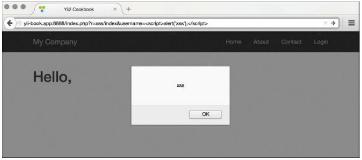
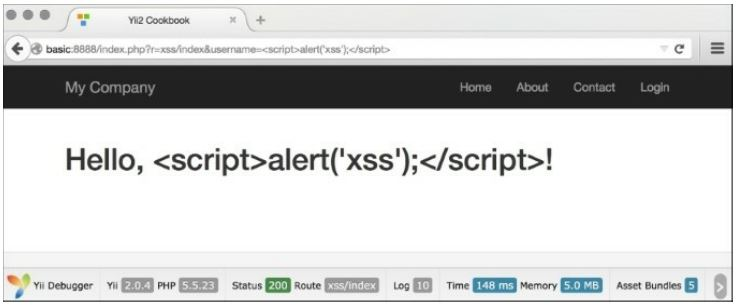
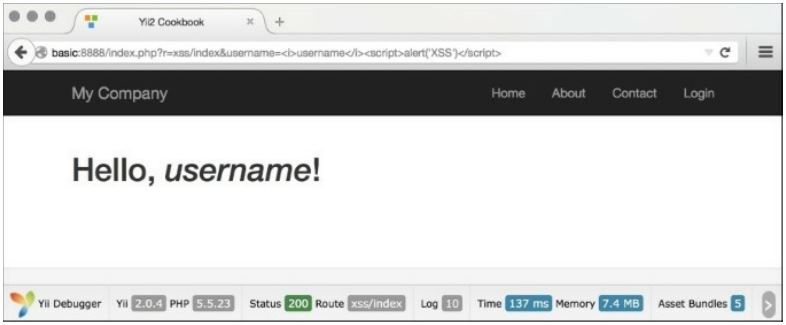

Предотвращение XSS
===
XSS означает межсайтовый скриптинг и представляет собой Тип уязвимости, которая позволяет внедрить клиентский скрипт (обычно JavaScript) на страницу, просматриваемую другими пользователями. Учитывая возможности клиентских сценариев, это может привести к очень серьезным последствиям, таким как обход проверок безопасности, получение учетных данных других Пользователей или утечка данных.
В этом рецепте мы увидим, как предотвратить xss, экранируя Выходные данные с помощью \yii\helpers\Html и \yii\helpers\HtmlPurifier.

Подготовка 
---

1 Создайте новое приложение с помощью диспетчера пакетов Composer, как описано в официальном руководстве по адресу <http://www.yiiframework.com/doc-2.0/guide-start-installation.html>. По русски <http://yiiframework.domain-na.me/doc/guide/2.0/ru/start-installation>.

2 Создайте controllers/XssController.php:
```php
<?php
namespace app\controllers;
use Yii;
use yii\helpers\Html;
use yii\web\Controller;
/**
* Class SiteController.
* @package app\controllers
*/
class XssController extends Controller
{
    /**
    * @return string
    */
    public function actionIndex()
    {
        $username = Yii::$app->request->get('username', 'nobody');
        return $this->renderContent(Html::tag('h1',
            'Hello, ' . $username .	'!'));
    }
}
```

3 Обычно он будет использоваться как  /xss/simple?username=Administrator. Однако, поскольку основной принцип безопасности фильтра ввода escape output не учитывался, злоумышленники смогут использовать его следующим образом:

```php
/xss/simple?username=<script>alert('XSS');</script>
```

4 Предыдущий код приведет к выполнению сценария, как показано на следующем снимке экрана:


Как это сделать...
---
Выполните следующие действия:

1 Чтобы предотвратить предупреждение XSS, показанное на предыдущем снимке экрана, нам нужно экранировать данные escape, прежде чем передавать их в браузер. Мы делаем это следующим образом:
```php
<?php
namespace app\controllers;
use Yii;
use yii\helpers\Html;
use yii\web\Controller;
/**
* Class SiteController.
* @package app\controllers
*/
class XssController extends Controller
{
    /**
    * @return string
    */
    public function actionIndex()
    {
        $username = Yii::$app->request->get('username', 'nobody');
        return $this->renderContent(Html::tag('h1',
            Html::encode('Hello, '	. $username .	'!')
            ));
    }
}
```

2 Теперь вместо предупреждения мы получим правильно экранированный HTML, как показано на следующем снимке экрана:


3 Поэтому основное правило-всегда экранировать все динамические данные. Например, мы должны сделать то же самое для имени ссылки :
```php
use \yii\helpers\Html;
echo Html::a(Html::encode($_GET['username']), array());
```
Вот и все. У вас есть страница, которая свободна от XSS. Теперь, что если мы хотим, чтобы некоторые HTML, чтобы пройти? Мы больше не можем использовать \yii\helpers\Html: : encode, потому что он будет отображать HTML как просто код, и нам нужно фактическое представление. К счастью, есть инструмент в комплекте с Yii, который позволяет фильтровать вредоносный HTML. Он называется HTML-Очиститель и может быть использован следующим образом:
```php
<?php
namespace app\controllers;
use Yii;
use yii\helpers\Html;
use yii\helpers\HtmlPurifier;
use yii\web\Controller;
/**
* Class SiteController.
* @package app\controllers
*/
class XssController extends Controller
{
    /**
    * @return string
    */
    public function actionIndex()
    {
        $username = Yii::$app->request->get('username', 'nobody');
        $content = Html::tag('h1', 'Hello, '. $username .'!');
        return $this->renderContent(HtmlPurifier::process($content));
    }
}
```
Теперь, если мы получаем доступ к действию HTML, используя URL-адрес ,такой как /xss/index?username=<i>username</i> < script>alert ('XSS') < / script>, HTML Очиститель удалит вредоносную часть, и мы получим следующий результат:


Как это работает...
---

1 Внутренне, \yii\helpers\Html::encode выглядит следующим образом:
```php
public static function encode($content, $doubleEncode = true)
{
     return htmlspecialchars($content, ENT_QUOTES | ENT_SUBSTITUTE, 
     Yii::$app 
     ? Yii::$app->charset 
     : 'UTF-8'
     , $doubleEncode);
}
```

2 Таким образом, в основном, мы используем внутреннюю функцию htmlspecialchars PHP, которая довольно безопасна, если не забыть передать правильную кодировку в третьем аргументе. \yii\helpers\HtmlPurifier использует библиотеку HTML-очистителя, которая является самым передовым решением для предотвращения XSS внутри HTML. Мы использовали его конфигурацию по умолчанию, которая подходит для большинства введенного пользователем контента.

Кое что еще.
---

Есть несколько вещей, чтобы знать о xss и HTML-Очиститель; они обсуждаются в следующем разделе. Типа межсайтового скриптинга  
Существует два основных вида инъекций или xss, которые заключаются в следующем:
* Непостоянный
* Настойчивый

Первый тип-это тот, который мы использовали в рецепте и является наиболее распространенным типом XSS; его можно найти в большинстве небезопасных веб-приложений. Данные, передаваемые пользователем или через URL, нигде не хранятся, поэтому вводимый скрипт будет выполняться только один раз и только для пользователя, который его ввел. Тем не менее, это не так безопасно, как кажется. Злонамеренные пользователи могут включить XSS в ссылку на другой веб-сайт, и их ядро будет выполняться, когда другой пользователь следует по ссылке.

Второй тип гораздо серьезнее, так как данные, введенные злоумышленником, хранятся в базе данных и показываются многим, если не всем, пользователям сайта. Используя этот тип XSS, вредоносные пользователи могут буквально уничтожить ваш сайт, приказав всем пользователям удалить все данные, к которым они имеют доступ.

Смотрите так же
---

Чтобы узнать больше о XSS и о том, как с ним работать, обратитесь к следующим ресурсам:
* <http://htmlpurifier.org/docs>
* <http://ha.ckers.org/xss.html>
* <http://shiflett.org/blog/2nn7/may/character-encoding-and-xss>
