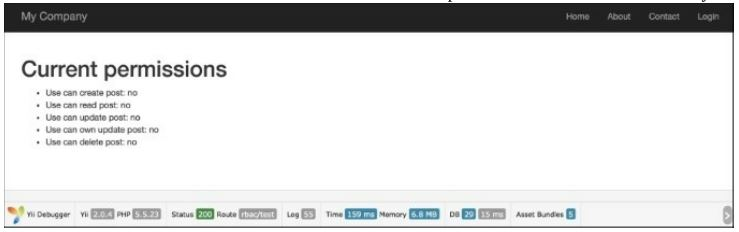
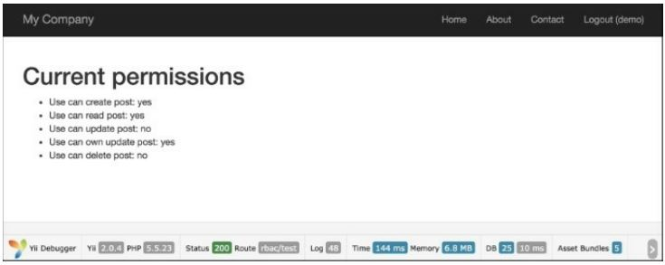
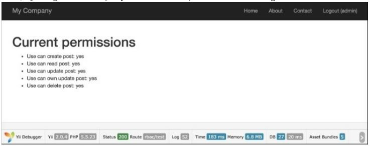
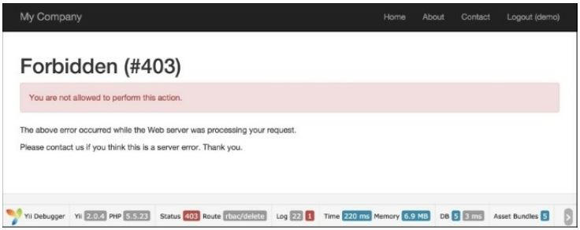
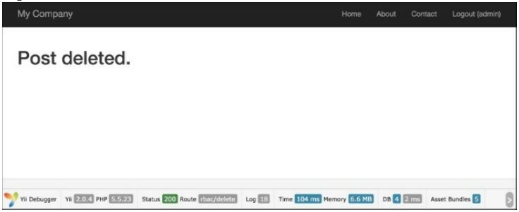

Использование RBAC
===

***Role-Based Access Control (RBAC)*** обеспечивает простое, но мощное централизованное управление доступом. Самый мощный метод контроля допуска имеющийся в Yii. Это описано в руководстве, но поскольку оно довольно сложное и мощное, его не так легко понять, не попав под капот немного. 
В этом рецепте мы возьмем иерархию ролей из окончательного руководства, импортируем ее и объясним, что происходит внутри.

Подготовка 
---

1 Создайте новое приложение с помощью диспетчера пакетов Composer, как описано в официальном руководстве по адресу <http://www.yiiframework.com/doc-2.0/guide-start-installation.html> . По русски <http://yiiframework.domain-na.me/doc/guide/2.0/ru/start-installation>.

2 Создайте базу данных MySQL и настройте ее.

3 Настройте компонент authManager в config/main.php и config/console.php следующим образом:
```php
return [
    // ...
    'components' => [
        'authManager' => [
            'class' => 'yii\rbac\DbManager',
        ],
        // ...
    ],
];
```

4 Запусти миграции:
***yii migrate --migrationPath=@yii/rbac/migrations***

Как это сделать...
---
Выполните следующие действия:

1 Создайте правило доступа rbac/AuthorRule.РНР:
```php
<?php
namespace app\rbac;
use yii\rbac\Rule;
/**
* Class AuthorRule.
* @package app\rbac
*/
class AuthorRule extends Rule
{
    public $name = 'isAuthor';
    /**
    * @param int|string $user
    * @param \yii\rbac\Item $item
    * @param array $params
    *
    * @return bool
    */
    public function execute($user, $item, $params)
    {
        return isset($params['post']) ? $params['post']->createdBy == $user : false;
    }
}
```

2 Создайте консольную команду command/RbacController.php, для инициализации команды RBAC rules:
```php
<?php
namespace app\commands;
use app\models\User;
use Yii;
use yii\console\Controller;
/**
* Class RbacController.
* @package app\commands
*/
class RbacController extends Controller
{
    public function actionInit()
    {
        $auth = Yii::$app->authManager;
        $createPost = $auth->createPermission('createPost');
        $createPost->description = 'Create a post';
        $updatePost = $auth->createPermission('updatePost');
        $updatePost->description = 'Update a post';
        $updatePost = $auth->createPermission('updatePost');
        $updatePost->description = 'Update a post';
        $deletePost = $auth->createPermission('deletePost');
        $deletePost->description = 'Delete a post';
        $readPost = $auth->createPermission('readPost');
        $readPost->description = 'Read a post';
        $authorRule = new \app\rbac\AuthorRule();
        // add permissions
        $auth->add($createPost);
        $auth->add($updatePost);
        $auth->add($deletePost);
        $auth->add($readPost);
        $auth->add($authorRule);
        // add the "updateOwnPost" permission and associate the rule with it.
        $updateOwnPost = $auth->createPermission('updateOwnPost');
        $updateOwnPost->description = 'Update own post';
        $updateOwnPost->ruleName = $authorRule->name;
        $auth->add($updateOwnPost);
        $auth->addChild($updateOwnPost, $updatePost);
        // create Author role
        $author = $auth->createRole('author');
        $auth->add($author);
        $auth->addChild($author, $createPost);
        $auth->addChild($author, $updateOwnPost);
        $auth->addChild($author, $readPost);
        // create Admin role
        $admin = $auth->createRole('admin');
        $auth->add($admin);
        $auth->addChild($admin, $updatePost);
        $auth->addChild($admin, $deletePost);
        $auth->addChild($admin, $author);
        // assign roles
        $auth->assign($admin, User::findByUsername('admin')->id);
        $auth->assign($author, User: : findByUsername('demo')->id);
        echo "Done!\n";
    }
}
```

3 Вот и все. Запустите его в консоли:

***yii rbac/init***

4 Создание controllers/RbacController.php следующим образом:
```php
<?php
namespace app\controllers;
use app\models\User;
use stdClass;
use Yii;
use yii\filters\AccessControl;
use yii\helpers\Html;
use yii\web\Controller;
/**
* Class RbacController.
*/
class RbacController extends Controller
{
    public function behaviors()
    {
    return [
        'access' => [
            'class' => AccessControl::className(),
            'rules' => [
                [
                    'allow' => true,
                    'actions' => ['delete'],
                    'roles' => ['deletePost'],
                ],
                [
                    'allow' => true,
                    'actions' => ['test'],
                ],
            ],
        ],
    ];
}

    public function actionDelete()
    {
        return $this->renderContent(Html::tag('h1', 'Post deleted.'));
    }
    /**
    * @param $description
    * @param $rule
    * @param array $params
    *
    * @return string
    */
    protected function renderAccess($description, $rule, $params = [])
    {
        $access = Yii::$app->user->can($rule, $params);
        return $description.': '.($access ? 'yes' :	'no');
    }
    public function actionTest()
    {
        $post = new stdClass();
        $post->createdBy = User::findByUsername('demo')->id;
        return $this->renderContent(
            Html::tag('h1', 'Current permissions').
            Html::ul([
                $this->renderAccess('Use can create post', 'createPost'),
                $this->renderAccess('Use can read post', 'readPost'),
                $this->renderAccess('Use can update post', 'updatePost'),
                $this->renderAccess('Use can own update post', 'updateOwnPost', [
                    'post' => $post,
                ]),
                $this->renderAccess('Use can delete post', 'deletePost'),
            ])
        );
    }
}
```

5 Теперь запустите rbac/test один раз, чтобы проверить доступ ко всем созданным разрешениям иерархии RBAC: 


6 Затем попробуйте войти как demo (пароль demo) и снова запустите rbac/test:


7 Затем попробуйте войти как admin (пароль admin) и снова запустить rbac/test:


8. Войдите как демо-пользователь и запустите rbac/delete:


9. Войдите как администратор и запустите rbac/delete:


Как это работает...
---
Yii реализует иерархию ролей в соответствии с ролей NIST RBAC. Она обеспечивает управление доступом на основе ролей функциональность через компонент authManagerapplication.
Иерархия RBAC представляет собой ориентированный ациклический граф, то есть набор узлов и их направленных соединений или ребер. Доступны три типа узлов: роли, разрешения и правила.
Роль представляет собой набор разрешений (например, создание и обновление записей). Роль может быть назначена одному или нескольким пользователям. Чтобы проверить, имеет ли пользователь указанное разрешение, мы можем проверить, назначена ли ему роль, содержащая это разрешение.
Роли и разрешения могут быть организованы в иерархию. В частности, роль может состоять из других ролей или разрешений, а разрешение может состоять из других разрешений. Yii реализует иерархию частичного порядка, которая включает в себя более специальную иерархию дерева. Хотя роль может содержать разрешение,она не соответствует действительности.
Для тестирования разрешений мы создали два действия. Первое действие test содержит средства проверки созданных разрешений и ролей. Второе действие-удалить, которое ограничено через фильтр доступа. Правило для фильтра доступа содержит следующий код:
```php
[
    'allow' => true,
    'actions' => ['delete'],
    'roles' => ['deletePost'],
],
```
Это означает, что мы разрешаем всем пользователям, имеющим разрешение deletePost, запускать действие deletePost. Yii начинает проверку с разрешения deletePost. Помимо того, что элемент правила доступа называется ролями, можно указать узел иерархии RBAC, будь то роль, правило или разрешение. Проверка updatePost является сложной:
```php
Yii::$app->user->can('updatePost', ['post' => $post]);
```
Мы используем второй параметр для передачи сообщения (в нашем случае мы смоделировали его с помощью stdclass). Если пользователь вошел в систему как demo, то для получения доступа нам нужно перейти от updatePost к author. Если вам повезет, вам нужно только пройти updatePost, updateOwnPost и author.
Поскольку updateOwnPost имеет определенное правило, он будет запущен с параметром, переданным checkAccess. Если результат равен true, то доступ будет предоставлен. Поскольку Yii не знает, что такое самый короткий путь, он пытается проверить все возможности, пока он не будет успешным, или не останется никаких альтернатив.

Кое что еще...
---
Есть несколько полезных трюков, которые помогут вам эффективно использовать RBAC, которые обсуждаются в следующих подразделах.

***Простая и эффективная иерархия***

Следуйте этим рекомендациям, где это возможно, чтобы максимизировать производительность и уменьшить сложность иерархии:
* Избегайте использования нескольких ролей одному пользователю
* Не подключайте узлы одного типа; например, избегайте подключения одной задачи к другой

***Именование ролей узлов***

Сложная иерархия становится трудной для понимания без использования какого-либо соглашения об именах. Одна из возможных конвенций, которая помогает ограничить путаницу, заключается в следующем:
[group_][own_]entity_action
Где own используется, когда правило определяет возможность изменения элемента только в том случае, если текущий пользователь является владельцем элемента, а группа-просто пространством имен. В сущности имя сущности, мы работаем  и действие, которые мы совершаем.
Например, если нам нужно создать правило, которое определяет, может ли пользователь удалить запись в блоге, мы назовем его blog_post_delete. Если правило определяет, может ли пользователь редактировать свой собственный комментарий блога, имя будет blog_own_comment_edit.

Смотрите так же
---
Чтобы узнать больше о SQL-инъекциях и работе с базами данных через Yii, обратитесь к следующему:
* <http://csrc.nist.gov/rbac/sandhu-ferraiolo-kuhn-00.pdf>
* <http://en.wikipedia.org/wiki/Role-based access control>
* <http://en.wikipedia.org/wiki/Directed acyclic graph>
* <https://www.yiiframework.com/doc/guide/2.0/en/security-authorization#rbac>
по русски <http://yiiframework.domain-na.me/doc/guide/2.0/ru/security-authorization#kontrol-dostupa-na-osnove-rolej-rbac> 
* Рецепт Использование пользовательского фильтра
