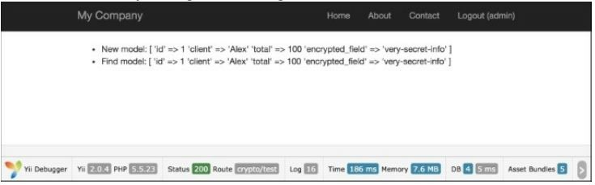
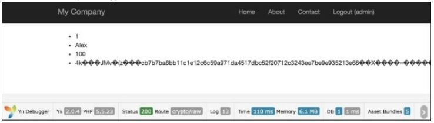

Шифрование / расшифровка данных
===
Платформа Yii2 содержит специальный компонент безопасности, который предоставляет набор методов для обработки общих задач, связанных с безопасностью. В \yii\base\security требует расширение openssl PHP вместо mcrypt.

Подготовка 
---

1 Создайте новое приложение с помощью диспетчера пакетов Composer, как описано в официальном руководстве по адресу <http://www.yiiframework.com/doc-2.0/guide-start-installation.html>. По русски <http://yiiframework.domain-na.me/doc/guide/2.0/ru/start-installation>.

2 Настройте подключение к базе данных и создайте таблицу с именем order следующим образом:
```php
DROP TABLE IF EXISTS 'order';
CREATE TABLE IF NOT EXISTS 'order' (
    'id' INT(10) UNSIGNED NOT NULL AUTO_INCREMENT,
    'client' VARCHAR(255) NOT NULL,
    'total' FLOAT NOT NULL,
    'encrypted_field' BLOB NOT NULL,
    PRIMARY KEY ('id')
);
```

3 Создайте модель Order с помощью Gii.

Как это сделать...
---
1 Добавьте дополнительный параметр ключа в config/params.php, следующим образом:
```php
<?php
return [
    'adminEmail' => 'admin@example.com',
    'key' => 'mysecretkey'
];
```

2 Добавьте поведения и вспомогательные свойства в модель Order следующим образом:
```php
public $encrypted_field_temp;
public function behaviors()
{
    return [
        [
            'class' => AttributeBehavior::className(),
            'attributes' => [
                ActiveRecord::EVENT_BEFORE_INSERT => 'encrypted_field',
                ActiveRecord::EVENT_BEFORE_UPDATE => 'encrypted_field',
            ],
            'value' => function ($event) {
                $event->sender->encrypted_field_temp = $event->sender->encrypted_field;
                return Yii::$app->security->encryptByKey( $event->sender->encrypted_field,Yii::$app->params['key']);
            },
        ],
        [
            'class' => AttributeBehavior::className(),
            'attributes' => [
            ActiveRecord::EVENT_AFTER_INSERT => 'encrypted_field',
            ActiveRecord::EVENT_AFTER_UPDATE => 'encrypted_field',
        ],
        'value' => function ($event) {
                return $event->sender->encrypted_field_temp;
            },
        ],
        [
            'class' => AttributeBehavior::className(),
            'attributes' => [
            ActiveRecord::EVENT_AFTER_FIND => 'encrypted_field',
        ],
        'value' => function ($event) {
            return Yii::$app
            ->security
            ->decryptByKey($event
                ->sender
                ->encrypted_field, Yii::$app->params['key']
                );
            },
        ],
    ];
}
```

3 Добавить controllers/CryptoController.php:
```php
<?php
namespace app\controllers;
use app\models\Order;
use Yii;
use yii\db\Query;
use yii\helpers\ArrayHelper;
use yii\helpers\Html;
use yii\helpers\VarDumper;
use yii\web\Controller;
/**
* Class CryptoController.
* @package app\controllers
*/
class CryptoController extends Controller
{
    public function actionTest()
    {
        $newOrder = new Order();
        $newOrder->client = "Alex";
        $newOrder->total = 100;
        $newOrder->encrypted_field = 'very-secret-info';
        $newOrder->save();
        $findOrder = Order::findOne($newOrder->id);
            return $this->renderContent(Html::ul([
                'New model: '. VarDumper::dumpAsString($newOrder->attributes),
                'Find model: '. VarDumper::dumpAsString($findOrder->attributes)
                ]));
    }
    public function actionRaw()
    {
        $row = (new Query())->from('order')
            ->where(['client' => 'Alex'])
            ->one();
            return $this->renderContent(Html::ul($row));
    }
}
```

4. Запустите crypto/test и вы получите следующее:


 5. Для просмотра необработанных данных запустите crypto/raw:


Как это работает...
---
Во-первых, мы добавили AttributeBehavior, который автоматически обрабатывает наши данные, когда происходят определенные события. Наши определенные события ActiveRecord: : EVENT_AFTER_INSERT,
ActiveRecord::EVENT_AFTER_UPDATE and ActiveRecord::EVENT_AFTER_FIND.
Во время событий вставки и обновления мы расшифровываем наши данные специальным методом: Yii:: $app ->security ->encryptByKey();. Этот метод использует HKDF и случайную соль для расшифровки наших данных перед их сохранением в базе данных. После получения данных из базы данных мы можем также использовать ActiveRecord:: EVENT_AFTER_FIND метод расшифровки наших данных. В этом случае мы также используем специальный метод Yii2 Yii:: $app ->security ->encryptByKey(); .Этот метод принимает два параметра: зашифрованные данные и ключ. 

Это еще не все... 
---
Помимо шифрования данных и расшифровки данных, безопасный компонент также обеспечивает вывод ключей с использованием стандартных алгоритмов, предотвращение подделки данных и проверку пароля.

***Работа с паролями***

Проверка пароля:
```php
if (Yii::$app->getSecurity()->validatePassword($password, $hash)) {
 // all good, logging user in
} else {
 // wrong password
}
```
Смотрите так же
---
Чтобы узнать больше о, обратитесь к <http://www.yiiframework.com/doc-2.0/guide-security-passwords.html>
По русски  <http://yiiframework.domain-na.me/doc/guide/2.0/ru/security-passwords>
