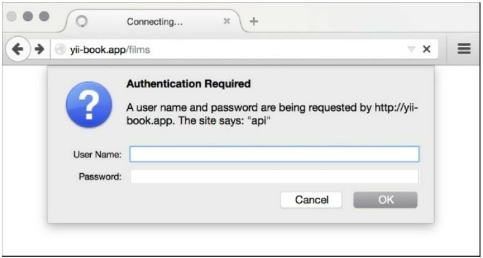

Идентификация
===
В этом рецепте будет настроена модель аутентификации.

Подготовка
---
Повторите все шаги из раздела создание рецепта сервера REST в разделе Подготовка и как это сделать.

Как это сделать...
---

1 Изменить @app/controllers/FilmController следующим образом:
```php
<?php
namespace app\controllers;
use app\models\User;
use Yii;
use yii\helpers\ArrayHelper;
use yii\rest\ActiveController;
use yii\filters\auth\HttpBasicAuth;
class FilmController extends ActiveController
{
    public $modelClass = 'app\models\Film';
    public function behaviors()
    {
        return ArrayHelper::merge(parent::behaviors(),[
            'authenticator' => [
                'authMethods' => [
                    'basicAuth' => [
                        'class' =>HttpBasicAuth::className(),
                        'auth' => function ($username,$password) {
                                 $user =User::findByUsername($username);
                                 if ($user !== null && $user->validatePassword($password)){
                                    return $user;
                                 }
                                 return null;
                        },
                    ]
                ]
            ]
        ]);
    }
}
```
Откройте http://yii-book.app/films в браузере и убедитесь, что мы настраиваем обычную аутентификацию HTTP:


Давайте попробуем аутентифицироваться. Запустите это в консоли:


***curl -i -H "Accept:application/json" "http://yii-book.app/films"***

И вы получите следующее:
```php
HTTP/1.1 401 Unauthorized
Date: Thu, 24 Sep 2015 01:01:24 GMT
Server: Apache
X-Powered-By: PHP/5.5.23
Www-Authenticate: Basic realm="api"
Content-Length: 149
Content-Type: application/json; charset=UTF-8
{"name":"Unauthorized","message":"You are requesting with an invalid
credential.","code":0,"status":401,"type":"yii\\web\\UnauthorizedHttpException"}
```
1 А ТЕПЕРЬ ПОПРОБУЙТЕ AUTH С CURL:

***curl -i -H "Accept:application/json" -u admin:admin "http://yii-book.app/films"***

2 Затем вы должны получить ответ, который выглядит так:
```php
HTTP/1.1 200 OK
Date: Thu, 24 Sep 2015 01:01:40 GMT
Server: Apache
X-Powered-By: PHP/5.5.23
Set-Cookie: PHPSESSID=8b3726040bf8850ebd07209090333103; path=/; HttpOnly
Expires: Thu, 19 Nov 1981 08:52:00 GMT
Cache-Control: no-store, no-cache, must-revalidate, post-check=0, pre-check=0
Pragma: no-cache
X-Pagination-Total-Count: 5
X-Pagination-Page-Count: 1
X-Pagination-Current-Page: 1
X-Pagination-Per-Page: 20
Link: <http://yii-book.app/films?page=1>; rel=self
Content-Length: 301
Content-Type: application/json; charset=UTF-8
[{"id":1,"title":"Interstellar","release_year":2014},{"id":2,"title":"Harry Potter
and the Philosopher's Stone","release_year":2001},{"id":3,"title":"Back to the
Future","release_year":1985},{"id":4,"title":"Blade Runner","release_year":1982},
{"id":5,"title":"Dallas Buyers Club","release_year":2013}]
```

Как это работает...
---
Мы также добавили поведение authenticator к классу HttpBasicAuth, так мы сможем проверить подлинность только логин и пароль. Можно реализовать любой метод проверки подлинности, описанный в официальном руководстве в разделе веб-службы RESTful.

Есть еще.
---
Существует несколько способов отправки маркера доступа:
* HTTP Basic Auth
* Параметр запроса
* Протокол oauth
Yii поддерживает все эти методы аутентификации.

Смотрите так же
---
Для получения дополнительной информации обратитесь к <http://www.yiiframework.com/doc-2.0/guide-rest-ratp-limiting.html>.
По русски <http://yiiframework.domain-na.me/doc/guide/2.0/ru/rest-rate-limiting> 
