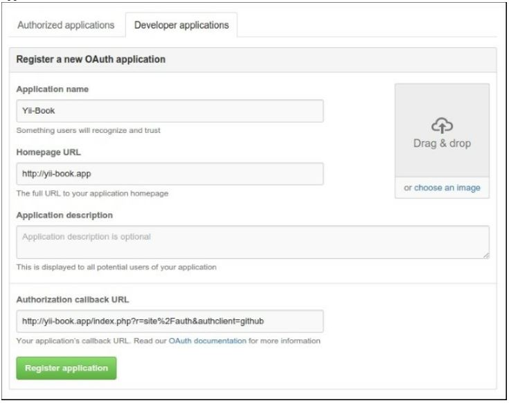
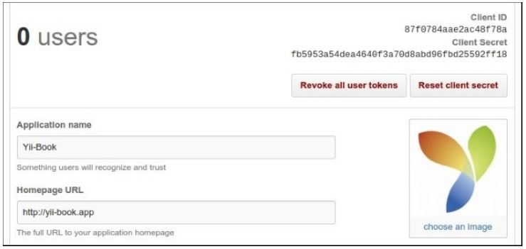
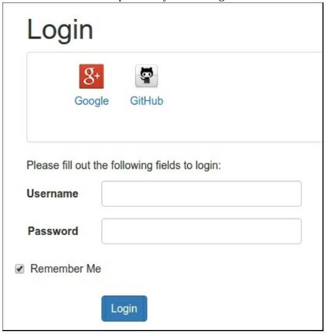
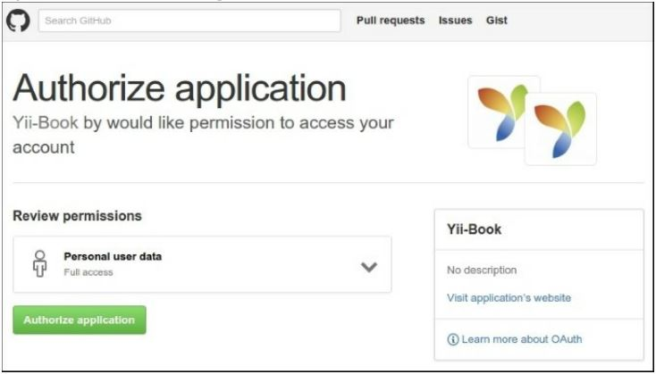

Проверка подлинности клиента
===
Это расширение добавляет потребителей OpenID, OAuth и OAuth2 для платформы yii 2.0.

Подготовка 
---

1 Создайте новое приложение с помощью диспетчера пакетов Composer, как описано в официальном руководстве по адресу <http://www.yiiframework.com/doc-2.0/guide-start-installation.html>. По русски <http://yiiframework.domain-na.me/doc/guide/2.0/ru/start-installation>

2 Установите расширение с помощью следующей команды:

***composer require yiisoft/yii2-authclient***

Как это сделать...
---
1 Откройте страницу приложения GitHub https://github.com/settings/applications и добавить свое новое приложение:


2 Получить Client ID и Client Secret:


3 Настройте веб-конфигурацию и задайте соответствующие параметры для компонента authClientCollection:
```php
'components' => [
    // ...
    'authClientCollection' => [
        'class' => 'yii\authclient\Collection',
        'clients' => [
            'google' => [
                'class' =>'yii\authclient\clients\GoogleOpenId'
            ],
            'github' => [
                'class' => 'yii\authclient\clients\GitHub',
                'clientId' => '87f0784aae2ac48f78a',
                'clientSecret' =>'fb5953a54dea4640f3a70d8abd96fbd25592ff18',
            ],
        // etc.
        ],
    ],
],
```

4 Откройте SiteController и добавьте автономное действие auth и метод обратного вызова успеха:
```php
use yii\authclient\ClientInterface;
public function actions()
{
    return [
        // ...
        'auth' => [
            'class' => 'yii\authclient\AuthAction',
            'successCallback' => [$this, 'onAuthSuccess'],
        ],
    ];
}
public function onAuthSuccess(ClientInterface $client)
{
    $attributes = $client->getUserAttributes(); \yii\helpers\VarDumper::dump($attributes, 10, true); exit;
}
```

5 Откройте views/site/login.php файл и вставьте виджет Authchoice:
```php
<div class="site-login">
    <h1><?= Html::encode($this->title) ?></h1>
    <div class="panel panel-default">
        <div class="panel-body">
            <?= yii\authclient\widgets\AuthChoice::widget(['baseAuthUrl' =>
                ['site/auth ' ],
                'popupMode' => false,
            ]) ?>
        </div>
    </div>
    <p>Please fill out the following fields to login:</p>
</div>
```

6 Вы увидите значки для настроенных поставщиков:


7 Попробуйте авторизоваться у поставщика GitHub:


8 В случае успеха ваш обратный вызов покажет атрибуты авторизованного пользователя:
```php
[
    'login' => 'Name'
    'id' => 0000000
    'avatar_url' =>'https://avatars.githubusercontent.com/u/0000000?v=3'
    'gravatar_id' => ''
    'url' => 'https://api.github.com/users/Name'
    'html_url' => 'https://github.com/Name'
    'name' => 'YourName'
    'blog' =>site.com'
    'email => mail@site.com'
]
```

9 Создайте собственный код авторизации в методе onAuthSuccess, как в примере <https://github.com/yiisoft/yii2-authclient/blob/master/docs/guide/quick-start.md>.
По русски <https://github.com/yiisoft/yii2-authclient/blob/master/docs/guide-ru/quick-start.md> 

Как это работает...
---
Расширение предоставляет клиентов OpenID, OAuth и oauth2 auth для приложения.
Виджет AuthChoice открывает страницу аутентификации на сайте выбранной службы, сохраняя действие auth
URL-адрес. После аутентификации текущая служба перенаправляет пользователей обратно при отправке данных аутентификации 
POST запрос. AuthAction получает запрос и вызывает соответствующий обратный вызов.
Вы можете использовать любой существующий клиент или создать свой собственный.

Смотрите так же
---
Для получения дополнительной информации об использовании расширений см.:
* <https://github.com/yiisoft/yii2-authclient/tree/master/docs/guide>
по русски <https://github.com/yiisoft/yii2-authclient/tree/master/docs/guide-ru>
* <http://www.yiiframework.com/doc-2.0/ext-authclient-index.html>

 Дополнительные сведения о технологиях аутентификации OpenID, OAuth и OAuth2 см. в разделе:
* <http://openid.net>
* <http://oauth.net>
