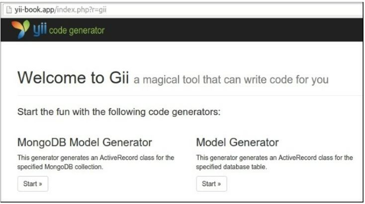
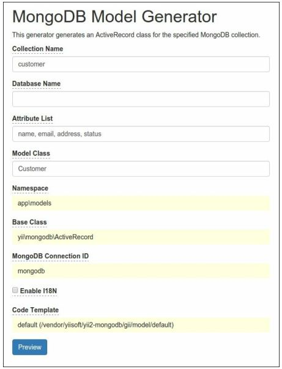
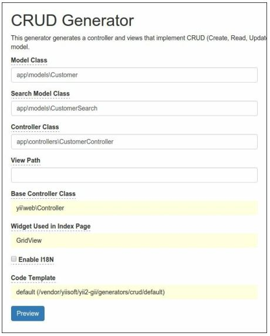
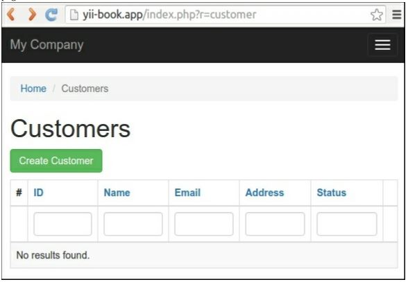
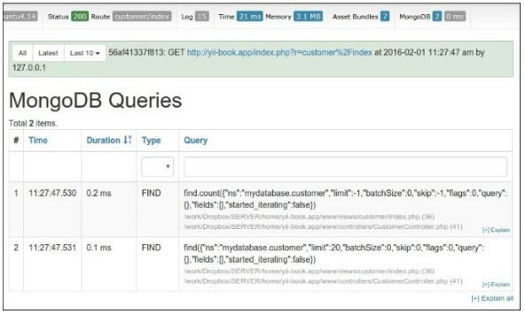

MongoDB driver
===
Это расширение обеспечивает интеграцию MongoDB для фреймворка Yii2 и позволяет работать с записями коллекции MongoDB через модель ActiveRecord.

Подготовка 
---

1 Создайте новое приложение с помощью диспетчера пакетов Composer, как описано в официальном руководстве по адресу <http://www.yiiframework.com/doc-2.0/guide-start-installation.html>. 
По русски <http://yiiframework.domain-na.me/doc/guide/2.0/ru/start-installation>.

2 Установите MongoDB, используя правильный процесс установки из <https ://docs.mongodb. org/ma nual/installation/> для вашей системы.

3 Установите раширение php php5-mongo .

4 Установите компонент с помощью следующей команды:

***composer require yiisoft/yii2-mongodb***

Как это сделать...
---

1 Прежде всего, создайте новую базу данных MongoDB. Запустите его в оболочке mongo-client и введите имя базы данных:
```php
mongo
> use mydatabase
```

2 Добавьте эту информацию о соединении в раздел конфигурации компонентов:
```php
return [
    // ...
    'components' => [
        // ...
        'mongodb' => [
            'class' => '\yii\mongodb\Connection',
            'dsn' =>  'mongodb://localhost:27017/mydatabase',
        ],
    ],
];
```

3 Добавьте новый контроллер консоли в файл конфигурации консоли:
```php
return [
    // ...
    'controllerMap' => [
        'mongodb-migrate' => 'yii\mongodb\console\controllers\MigrateController'
    ],
];
```

4 Создайте новую миграцию с помощью команды shell:

***php yii mongodb-migrate/create create_customer_collection***

5 Введите следующий код в методы up() и down ():
```php
<?php
use yii\mongodb\Migration;
class m160201_102003_create_customer_collection extends Migration
{
    public function up()
    {
        $this->createCollection('customer');
    }
    public function down()
    {
        $this->dropCollection('customer');
    }
}
```

6 Примениете миграцию:

***php yii mongodb-migrate/up***

7 Поместите панель отладки MongoDB и генератор моделей в свою конфигурацию:
```php
if (YII_ENV_DEV) {
    // configuration adjustments for 'dev' environment
    $config['bootstrap'][] = 'debug';
    $config['modules']['debug'] = [
        'class' => 'yii\debug\Module',
        'panels' => [
            'mongodb' => [
                'class' => 'yii\mongodb\debug\MongoDbPanel',
            ],
        ],
    ];
    $config['bootstrap'][] = 'gii';
    $config['modules']['gii'] = [
        'class' => 'yii\gii\Module',
        'generators' => [
            'mongoDbModel' => [
                'class' => 'yii\mongodb\gii\model\Generator'
            ]
        ],
    ];
}
```

8. Запустите генератор Gii:


9. Запуск новой модели генератора mongodb для создания новой модели для своей коллекции:


10 Нажмите кнопки Preview и Generate.

11 Убедитесь, что у вас есть новая модель, app\models\customer:
```php
<?php
namespace app\models;
use Yii;
use yii\mongodb\ActiveRecord;
/**
* This is the model class for collection "customer".
*
* @property \MongoId|string $_id
* @property mixed $name
* @property mixed $email
* @property mixed $address
* @property mixed $status
*/
class Customer extends ActiveRecord
{
    public static function collectionName()
    {
        return ' customer ' ;
    }
    public function attributes()
    {
        return [
            '_id',
            'name',
            'email',
            'address',
            'status',
        ];
    }
    public function rules()
    {
        return [
            [['name', 'email', 'address', 'status'], 'safe']
        ];
    }
    public function attributeLabels()
    {
        return [
            '_id' => 'ID',
            'name' => ' Name',
            'email' => 'Email',
            'address' => 'Address',
            'status' => 'Status',
        ];
    }
}
```

12 Запустите Gii снова и сгенерируйте CRUD:


13 Убедитесь, что создан класс Customercontroller, и запустите новую страницу Customer manager


14 Вы можете создавать, обновлять и удалять данные Ваших клиентов прямо сейчас

15 Найдите панель отладки в Нижнем колонтитуле страницы


16 Вы можете увидеть общее количество запросов MongoDB и общее время выполнения. Нажмите на значок count и проверьте запросы:


Основное использование
Доступ к базам данных и коллекциям можно получить через экземпляр  \yii\mongodb\collection:
```php
$collection = Yii::$app->mongodb->getCollection('customer');$collection->insert(['name'=> 'John Smith', 'status' => 1]);
```
Для выполнения запросов поиска следует использовать \yii\mongodb\Query:
```php
use yii\mongodb\Query;
$query = new Query;
// compose the query
$query->select(['name', 'status'])
    ->from('customer')
    ->limit(10);
// execute the query
$rows = $query->all();
```
***Примечание***. идентификатор документа MongoDB (поле "_id") не является скалярным, а является экземпляром класса \MongoId.
Преобразование значений integer или string $id в \MongoId не должно волновать, так как построитель запросов преобразует их автоматически:
```php
$query = new \yii\mongodb\Query;
$row = $query->from('item')
    ->where(['_id' => $id]) // implicit typecast to \MongoId
    ->one();
```
Чтобы получить фактическую строку идентификатора Mongo, необходимо типизировать экземпляр \Mongoid в строку:
```php
$query = new Query;
$row = $query->from('customer')->one();
var_dump($row['_id']); // outputs: "object(MongoId)"var_dump((string)$row['_id']);
```

Как это работает...
---
Классы Query, ActiveQuery, и ActiveRecord расширяют  расширение распространяемое в yii\db\QueryInterface and yii\db\BaseActiveRecord, и поэтому они совместимы со встроенными  Query, ActiveQuery и ActiveRecord.
Вы можете использовать класс yii\mongodb\ActiveRecord, установленным для моделей, а в yii\mongodb\ActiveQuery Builder для извлечения моделей и использовать их в поставщике данных:
```php
use yii\data\ActiveDataProvider;
use app\models\Customer;
$provider = new ActiveDataProvider([
    'query' => Customer::find(),
    'pagination' => [
        'pageSize' => 10,
    ]
]);
```
Для получения общей информации о том, как использовать ActiveRecord Yii, пожалуйста, обратитесь к главе 3, ActiveRecord, Model, and Database.

Смотрите так же
---

 Дополнительные сведения о расширении см. по следующим URL-адресам:
* <https://github.com/yiisoft/yii2-mongodb/hloh/master/docs/gnide/RFADME.md>
По русски <https://github.com/yiisoft/yii2-mongodb/tree/master/docs/guide-ru>
* <http://www.yiiframework.com/doc-2.0/ext-mongodb-index.html>

 А также сведения о исходной библиотеки, см.:
* <https://docs.mongodb.org/manual/>
* Для использования ActivRecord  см. в главе 3, ActiveRecord, Model, and Database
