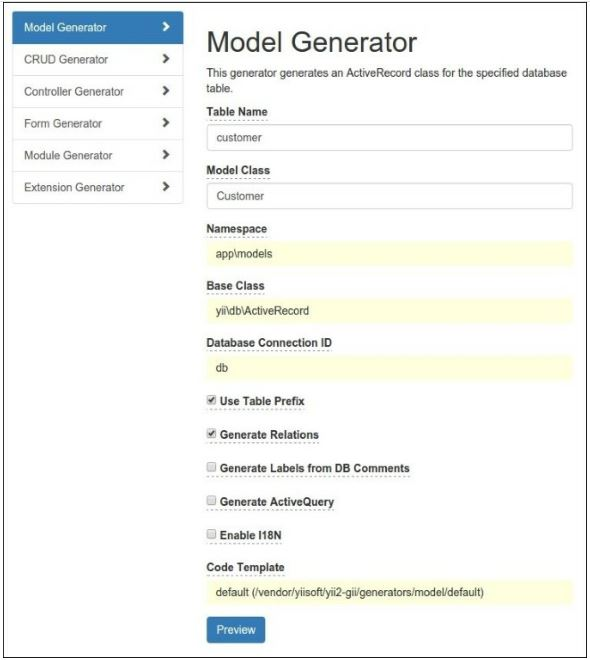
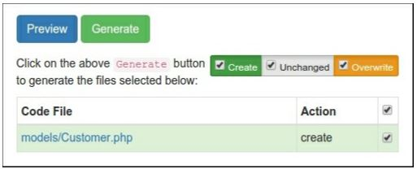
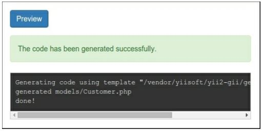
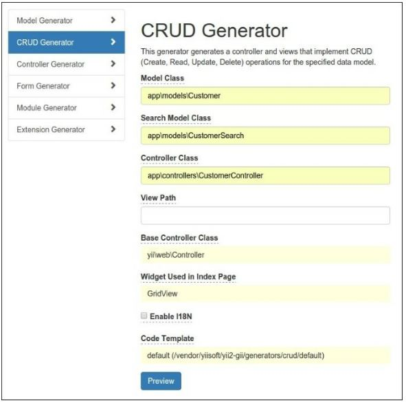
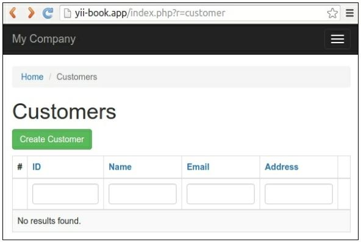

Генератор кода Gii
==
Это расширение предоставляет веб-генератор кода под названием Gii для приложений Yii 2. Вы можете использовать Gii для быстрого создания моделей, форм, модулей, CRUD и многих других.

Подготовка 
--

1 Создайте новое приложение с помощью диспетчера пакетов Composer, как описано в официальном руководстве по адресу <http://www.yiiframework.com/doc-2.0/guide-start-installation.html>. 
По русски <http://yiiframework.domain-na.me/doc/guide/2.0/ru/start-installation>.

2 Создайте новую миграцию с помощью команды shell:

***php yii migrate/create create_customer_table***

3 Поместите следующий код в методы up() и down ():
```php
use yii\db\Schema;
use yii\db\Migration;
class m160201_154207_create_customer_table extends Migration
{
    public function up()
    {
        $tableOptions = null;
        if ($this->db->driverName === 'mysql') {
            $tableOptions = 'CHARACTER SET utf8 COLLATE utf8_unicode_ci ENGINE=InnoDB';
        }
        $this->createTable('{{%customer}}',	[
            'id' => Schema::TYPE_PK,
            'name' => Schema::TYPE_STRING .	' NOT NULL',
            'email' => Schema::TYPE_STRING .	' NOT NULL',
            'address' => Schema::TYPE_STRING,
        ], $tableOptions);
    }
    public function down()
    {
        $this->dropTable('{{%customer}}');
    }
}
```

4 Запустите миграцию:

***php yii migrate/up***

Как это сделать...
---
В своих проектах вы можете использовать это расширение двумя способами:
* Работа с GUI
* Работа с CLI

***Работа с GUI***

1 Убедитесь, что файл веб-конфигурации содержит следующий код:
```php
if (YII_ENV_DEV) {
    $config['bootstrap'][] = 'gii';
    $config['modules']['gii'] = [
        'class' => 'yii\gii\Module',
    ];
}
```

2 Ваш  файл web/index.php будет определять среду разработки:
```php
defined('YII_ENV') or define('YII_ENV', 'dev');
```
Предыдущая конфигурация гласит, что в среде разработки приложение должно включать модуль с именем gii, который относится к классу yii\gii\Module.
По умолчанию модуль разрешает доступ с IP-адреса 127.0.0.1. Если вы работаете от другого местоположение, добавьте свой адрес в свойстве allowedIP:
```php
$config['modules']['gii'] = [
    'class' => 'yii\gii\Module',
    allowedIPs = ['127.0.0.1',	'::1',	'192.168.0.*'],
];
```

3 Перейдите к gii вашего приложения: http://localhost/index.php?r=gii.


4 Нажмите на кнопку Model Generator и введите имя таблицы и название модели в форме:


5 Нажмите кнопку Preview. Необходимо просмотреть список рекомендуемых файлов:


6 Если вы хотите восстановить существующие файлы, Gii пометит их желтым цветом:


7 В этом случае вы можете посмотреть разницу между существующими и новыми файлами и замените, если необходимо.

8 После всего этого нажмите кнопку Generate:


9 Убедитесь, что новый класс \app\models\customer существует.

10  CRUD-это аббревиатура для четырех общих задач, использующих данные на большинстве веб-сайтов: создание, чтение, обновление и удаление. Чтобы создать CRUD с помощью Gii, выберите раздел генератор CRUD. Укажите класс модели и введите другие поля:


11  Создание новых элементов:


12 После этого попробуйте открыть новый контроллер:


Вы увидите таблицу, показывающую клиентов в таблице базы данных. Попробуйте создать новый элемент. Сетку можно отсортировать или отфильтровать, введя условия фильтра в заголовках столбцов.

***Работа с  CLI***

GII также предоставляет контроллер консоли для генерации кода.

1 Убедитесь, что конфигурация консоли содержит параметры модуля Gii:
```php
return [
    // ...
    'modules' => [
        'gii' => 'yii\gii\Module',
    ],
    // ...
];
```

2 Выполните любую команду оболочки для справки:
```php
php yii help gii
php yii help gii/model
```

3 Введите следующую команду, чтобы запустить процесс создания модели:

***php yii gii/model --tableName=customer --modelClass=Customer --useTablePrefix=1***

4 Убедитесь, что новый класс \app\models\customer существует.

5 Создание CRUD для Вашей модели:

***php yii gii/crud --modelClass=app\\models\\Customer\ --searchModelClass=app\\models\\CustomerSearch\ --controllerClass=app\\controllers\\CustomerController***

Как это работает...
---
GII  позволяет создавать некоторые стандартные элементы кода, вместо ручного набора. Он предоставляет веб-интерфейсы и консольные интерфейсы для работы с каждым генератором.

Смотрите так же
---

Дополнительные сведения об использовании расширения см. в разделе:
*<http://www.yiiframework.com/doc-2.0/gurde-start-gii.html>
по русски <http://yiiframework.domain-na.me/doc/guide/2.0/ru/start-gii>
* <http://www.viiframework.com/doc-2.0/ext-gii-indpx.hrml>
* <https://github.com/yiisoft/yEZ-gii/tree/master/docs/guide>
по русски <https://github.com/yiisoft/yii2-gii/tree/master/docs/guide-ru>

Для интеграции MongoDB обратитесь к  рецепта созданию виджета в главе 8, расширение Yii
