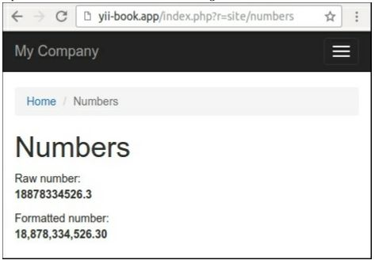

Создание помощников
===
В пространстве имен yii\helpers много встроенных помощников платформы, таких как stringHelper. Они содержат наборы полезных статических методов для работы со строками, файлами, массивами и другими объектами.
Во многих случаях для дополнительного поведения можно создать собственный помощник и поместить в него любую статическую функцию.Например, мы реализуем номер помощника в этом рецепте.

Подготовка 
---
Создайте новое приложение с помощью диспетчера пакетов Composer, как описано в официальном руководстве по адресу <http://www.yiiframework.com/doc-2.0/guide-start-installation.html>. 
По русски <http://yiiframework.domain-na.me/doc/guide/2.0/ru/start-installation>.

Как это сделать...
---

1 Создайте в проекте каталог helpers и запишите класс NumberHelper:
```php
<?php
namespace app\helpers;
class NumberHelper
{
    public static function format($value, $decimal = 2)
    {
        return number_format($value, $decimal, '.',	',');
    }
}
```

2 Добавьте метод actionNumbers в SiteController:
```php
<?php...
class SiteController extends Controller
{
    public function actionNumbers()
    {
        return $this->render('numbers', ['value' => 18878334526.3]);
    }
}
```

3 Добавить в представление views/site/numbers.php:
```php
<?php
use app\helpers\NumberHelper;
use yii\helpers\Html;
/* @var $this yii\web\View */
/* @var $value float */
$this->title = 'Numbers';
$this->params['breadcrumbs'][] = $this->title;
?>
<div class="site-numbers">
    <h1><?= Html::encode($this->title) ?></h1>
    <p>
        Raw number:<br />
        <b><?= $value ?></b>
    </p>
    <p>
        Formatted number:<br />
        <b><?= NumberHelper::format($value) ?></b>
    </p>
</div>
```

4. Откройте действие. Вы должны увидеть следующий результат:


В других случаях можно указать другое количество десятичных чисел. Рассмотрим следующий пример:
NumberHelper::format($value, 3)

Как это работает...
---
Любой помощник в Yii2 - это просто набор функций, реализованных в виде статических методов в соответствующих классах.
Можно использовать помощник для реализации любых различных форматов вывода, для манипуляций со значениями любых переменных и для других случаев.

***Замечание***: Обычно статические помощники-это легкие чистые функции с небольшим количеством аргументов. Избегайте использования бизнес-логики и других сложных манипуляций в помощниках. Используйте виджеты или другие компоненты вместо помощников в других случаях.

Смотитре так же
---
Для получения дополнительной информации о помощниках, обратитесь к: <http://www.yijframework.eom/doc-2.0/guide-helper-overview.html>.
По русски <http://yiiframework.domain-na.me/doc/guide/2.0/ru/helper-overview>
 
Примеры встроенных помощников см. в разделе источники в каталоге помощников framework. Для структуры обратитесь к:<https://github.rom/yiisoft/yii2/tree/mastpr/framework/helpers>.
