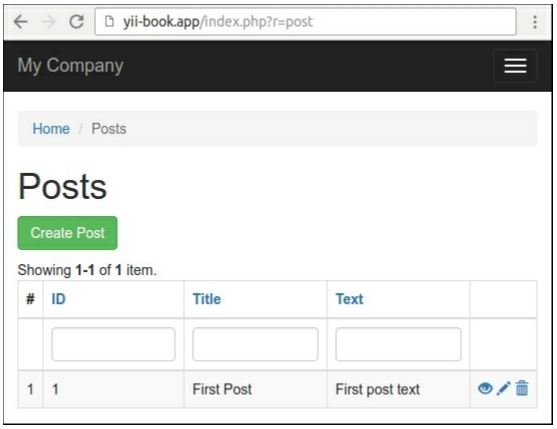

Создание многократно используемых действий контроллера
===
Общие действия, такие как удаление модели AR первичным ключом или получение данных для автозаполнения AJAX, могут быть перемещены в многократно используемые действия контроллера, а затем присоединены к контроллерам по мере необходимости.
В этом рецепте мы создадим повторно используемое действие удаления, которое удалит указанную модель AR по ее первичному ключу.

Подготовка 
---

1 Создайте новое приложение с помощью диспетчера пакетов Composer, как описано в официальном руководстве по адресу <http://www.yiiframework.com/doc-2.0/guide-start-installation.html>. 
По русски <http://yiiframework.domain-na.me/doc/guide/2.0/ru/start-installation>.

2 Создайте новую базу данных и настройте ее.

3 Создайте и примените следующую миграцию:
```php
<?php
use yii\db\Migration;
class m160308_093233_create_post_table extends Migration
{
    public function up()
    {
        $this->createTable('{{%post}}',	[
            'id' => $this->primaryKey(),
            'title' => $this->string()->notNull(),
            'text' => $this->text()->notNull(),
        ]);
    }
    public function down()
    {
        $this->dropTable('{{%post}}');
    }
}
```

4 Создайте модели для Post и Comment с помощью Gii.

5 Сгенерируйте стандартный crud для контроллера app\controllers\PostController в GII.

6 Убедитесь, что CRUD нормально работает:


7 В случае успеха добавьте набор примеров записей.

Как это сделать...
---
Выполните следующие действия:

1 Создайте каталог действий и добавьте автономное действие DeleteAction:
```php
<?php
namespace app\actions;
use yii\base\Action;
use yii\base\InvalidConfigException;
use yii\web\MethodNotAllowedHttpException;
use yii\web\NotFoundHttpException;
class DeleteAction extends Action
{
    public $modelClass;
    public $redirectTo = ['index'];
    
    public function init()
    {
        if (empty($this->modelClass)) {
            throw new InvalidConfigException('Empty model class.');
        }
        parent::init();
    }

    public function run($id)
    {
        if (!\Yii::$app->getRequest()->getIsPost()) {
            throw new MethodNotAllowedHttpException('Method not allowed.');
        }
        $model = $this->findModel($id);
        $model->delete();
        return $this->controller->redirect($this->redirectTo);
    }
    /**
    * @param $id
    * @return \yii\db\ActiveRecord
    * @throws NotFoundHttpException
    */
    private function findModel($id)
    {
        $class = $this->modelClass;
        if (($model = $class::findOne($id)) !== null) {
            return $model;
        } else {
            throw new NotFoundHttpException('Page does not exist.');
        }
    }
}
```

2 Теперь нам нужно подключить его к контроллерам controllers/PostController.php. Удалите метод actionDelete и поведения контроллера и присоедините собственное действие в методе действия:
```php
<?php
namespace app\controllers;
use app\actions\DeleteAction;
use Yii;
use app\models\Post;
use app\models\PostSearch;
use yii\web\Controller;
use yii\web\NotFoundHttpException;
class PostController extends Controller
{
    public function actions()
    {
        return [
            'delete' => [
                'class' => DeleteAction::className(),
                'modelClass' => Post::className(),
            ],
        ];
    }
    public function actionIndex() {	...	}
    public function actionView($id) {	...	}
    public function actionCreate() {	...	}
    public function actionUpdate($id) {	...	}
    protected function findModel($id)
    {
        if (($model = Post::findOne($id)) !== null) {
            return $model;
        } else {
            throw new NotFoundHttpException('The requested page does not exist.');
        }
    }
}
```

3 Вот и все. Убедитесь, что операция удаления по-прежнему работает правильно, и после удаления вы будете перенаправлены на соответствующее действие индекса.

Как это работает...
---
Чтобы создать действие внешнего контроллера, необходимо расширить класс из yii\base\Action. Единственный обязательный метод для реализации выполняется. В нашем случае он принимает параметр $id из $_GET с помощью функции автоматической привязки параметров Yii и пытается удалить соответствующую модель.
Чтобы сделать его настраиваемым, мы создали два общедоступных свойства, настраиваемых из контроллера. Это modelName, который содержит имя модели, с которой мы работаем, и redirectTo, который задает маршрут, на который пользователь будет перенаправлен.
Сама конфигурация выполняется путем реализации метода действий в контроллере. Там можно присоединить действие один или несколько раз и настроить его общие свойства.
Вы можете получить доступ к исходному объекту контроллера через свойство controller, если это необходимо для перенаправления на другое действие или визуализации определенного представления.

Смотрите так же
---
Дополнительные сведения о контроллерах и действиях см. в разделе 
<https://www.yiiframework.com/doc/guide/2.0/en/structure-controllers> 
по русски <http://yiiframework.domain-na.me/doc/guide/2.0/ru/structure-controllers>
