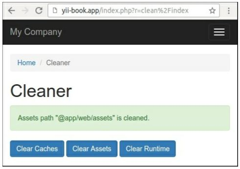

Создание повторно используемых контроллеров
===
В Yii можно создавать повторно используемые контроллеры. Если вы создаете много приложений или контроллеров одного типа, перемещение всего общего кода в повторно используемый контроллер сэкономит вам много времени.
В этом рецепте мы попытаемся создать общий cleanController, который очистит временные каталоги и очистит кэшированные данные.

Подготовка 
---
Создайте новое приложение с помощью диспетчера пакетов Composer, как описано в официальном руководстве по адресу <http://www.yiiframework.com/doc-2.0/guide-start-installation.html>. 
По русски <http://yiiframework.domain-na.me/doc/guide/2.0/ru/start-installation>.

Как это сделать...
---
Для создания повторно используемых контроллеров выполните следующие действия:

1 Создайте каталог cleaner и добавьте автономный контроллер CleanController:
```php
<?php
namespace app\cleaner;
use Yii;
use yii\filters\VerbFilter;
use yii\helpers\FileHelper;
use yii\web\Controller;
class CleanController extends Controller
{
    public $assetPaths = ['@app/web/assets'];
    public $runtimePaths = ['©runtime'];
    public $caches = ['cache'];
    public function behaviors()
    {
        return [
            'verbs' => [
                'class' => VerbFilter::className(),
                'actions' => [
                    ' assets ' => [' post' ],
                    'runtime' => ['post'],
                    ' cache' => [' post' ],
                ],
            ],
        ];
    }
    public function actionIndex()
    {
        return $this->render('@app/cleaner/views/index');
    }
    public function actionAssets()
    {
        foreach ((array)$this->assetPaths as $path) {
            $this->cleanDir($path);
            Yii::$app->session->addFlash(' cleaner','Assets path "'	. $path .	'" is cleaned.');
        }
        return $this->redirect(['index']);
    }
    public function actionRuntime()
    {
        foreach ((array)$this->runtimePaths as $path) {
            $this->cleanDir($path);
            Yii::$app->session->addFlash('cleaner','Runtime path "'	. $path .	'" is cleaned.');
        }
        return $this->redirect(['index']);
    }
    public function actionCache()
    {
        foreach ((array)$this->caches as $cache) {
            Yii::$app->get($cache)->flush();
            Yii::$app->session->addFlash('cleaner','Cache "'	. $cache . '" is cleaned.');
        }
        return $this->redirect(['index']);
    }
    private function cleanDir($dir)
    {
        $iterator = new \DirectoryIterator(Yii::getAlias($dir));
        foreach($iterator as $sub) {
            if(!$sub->isDot() && $sub->isDir()) {
                FileHelper::removeDirectory($sub->getPathname());
            }
        }
    }
}
```

2 Создание представления cleaner/views/index.php для метода actionIndex:
```php
<?php
    use yii\helpers\Html;
    /* @var $this yii\web\View */
    $this->title = 'Cleaner';
    $this->params['breadcrumbs'][] = $this->title;
?>
<div class="clean-index">
    <h1><?= Html::encode($this->title) ?></h1>
    <?php if (Yii::$app->session->hasFlash('cleaner' )): ?>
        <?php foreach ((array)Yii::$app->session->getFlash('cleaner', []) as $message):?>
            <div class="alert alert-success">
                <?= $message ?>
            </div>
        <?php endforeach; ?>
    <?php endif; ?>
    <p>
        <?= Html::a('Clear Caches', ['cache'], [
            'class' => 'btn btn-primary',
            'data' => [
                'confirm' => 'Are you sure you want to clear all cache data?', 'method ' => 'post',
            ],
        ]) ?>
        <?= Html::a('Clear Assets', ['assets'],
            ['class' => 'btn btn-primary',
            'data' => [
                'confirm' => 'Are you sure you want to clear all temporary assets?',
                'method ' => 'post',
            ],
        ]) ?>
        <?= Html::a('Clear Runtime', ['runtime'],
            ['class' => 'btn btn-primary',
            'data' => [
                'confirm' => 'Are you sure you want to clear all runtime files?',
                'method ' => 'post',
            ],
        ]) ?>
    </p>
</div>
```

3 Подключите контроллер к приложению через раздел controllerMap config/web.php:
```php
$config = [
    'id' => 'basic',
    'basePath' => dirname(__DIR__),
    'bootstrap' => ['log'],
    'controllerMap' => [
        'clean' => 'app\cleaner\CleanController',
    ],
    'components' => [
    ]...
];
```

4 Добавить новый пункт в Главное меню:
```php
echo Nav::widget([
    'options' => ['class' => 'navbar-nav navbar-right'],
    'items' => [
        ['label' => 'Home', 'url' => ['/site/index']],
        ['label' => 'Cleaner', 'url' => ['/clean/index']],
        ['label' => 'About', 'url' => ['/site/about']],
    ],
]);
```

5 Откройте контроллер и очистите активы:


6 Если вы используете шаблон приложения yii2-app-advanced, просто укажите правильные пути в конфигурации:
```php
'controllerMap' => [
    'clean' => 'app\cleaner\CleanController',
    'assetPaths' => [
        '@backend/web/assets',
        '@frontend/web/assets',
    ],
    'runtimePaths' => [
        '@backend/runtime',
        '@frontend/runtime',
        '@console/runtime',
    ],
],
```
Теперь мы можем прикрепить контроллер к любому приложению.

Как это работает...
---
При запуске приложения и передаче маршрута, такого как clean/index, перед выполнением cleanController::actionIndex Yii проверяет, определен ли controllerMap. Поскольку у нас есть чистый контроллер, определенный там, Yii выполняет его вместо того, чтобы идти обычным путем.
В самом контроллере мы определили свойства assetPaths, runtimePaths и caches, чтобы иметь возможность подключать контроллер к приложениям с различными структурами каталогов и кэша. Мы устанавливаем его прикрепляя регулятор.

Смотрите так же
---
Чтобы узнать больше о контроллерах и о карте контроллеров, обратитесь к <http://www.yiiframework.com/doc-2.0/guide-structure-controllers.html>
По русски <http://yiiframework.domain-na.me/doc/guide/2.0/ru/structure-controllers> 
