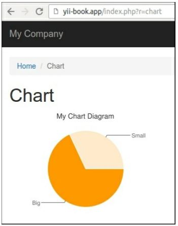

Создание виджета
===
Виджет-это многократно используемая часть представления, которая не только отображает некоторые данные, но и делает это в соответствии с некоторой логикой. Он может даже получать данные из моделей и использовать свои собственные представления, поэтому он похож на уменьшенную многоразовую версию модуля.
Давайте создадим виджет, который будет рисовать круговую диаграмму с помощью Google API.

Подготовка 
---
Создайте новое приложение с помощью диспетчера пакетов Composer, как описано в официальном руководстве по адресу <http://www.yiiframework.com/doc-2.0/guide-start-installation.html>. 
По русски <http://yiiframework.domain-na.me/doc/guide/2.0/ru/start-installation>.

Как это сделать...
---

1 Создайте каталог виджетов и добавьте класс Chartwidget:
```php
<?php
namespace app\widgets;
use yii\base\Widget;
class Chartwidget extends Widget
{
    public $title;
    public $width = 300;
    public $height = 200;
    public $data = [];
    public $labels = [];
    public function run()
    {
        $path = 'http://chart.apis.google.com/chart';
        $query = http_build_query([
            'chtt' => $this->title,
            ' cht' => 'pc',
            'chs' => $this->width .	'x'	. $this->height,
            'chd' => 't:'	. implode(',', $this->data),
            ' chds ' => 'a',
            'chl' => implode('|', $this->labels),
            ' chxt' => 'y',
            'chxl' => '0:|0|' . max($this->data)
        ]);
        $url = $path .	'?'	. $query;
        return $this->render('chart', [
            'url' => $url,
        ]);
    }
}
```

2 Создать вид widgets/views/chart.php:
```php
<?php
use yii\helpers\Html;
/* @var $this yii\web\View */
/* @var $url string */
?>
<div class="chart">
    <?= Html::img($url) ?>
</div>
```

3 Теперь создайте контроллер Chartcontroller:
```php
<?php
namespace app\controllers;
use yii\base\Controller;
class Chartcontroller extends Controller
{
    public function actionIndex()
    {
        return $this->render('index');
    }
}
```

4 Добавить представление views/chart/index.php:
```php
<?php
use app\widgets\ChartWidget;
use yii\helpers\Html;
/* @var $this yii\web\View */
$this->title = 'Chart';
$this->params['breadcrumbs'][] = $this->title;
?>
<div class="site-about">
    <h1><?= Html::encode($this->title) ?></h1>
    <?= ChartWidget::widget([
        'title' => 'My Chart Diagram',
        'data' => [100 - 32,32,],
        'labels' => [
            'Big',
            'Small',
        ],
    ]) ?>
</div>
```

5 Теперь попробуйте запустить действие index контроллера. Вы должны увидеть круговую диаграмму, как показано ниже:


6 Вы можете показать любую диаграмму с различными размерами и наборами данных.

Как это работает...
---
Как и в любом другом типе расширения, мы создаем некоторые общие свойства, которые можно настроить при вызове виджета с помощью его метода widget. В этом случае мы настраиваем Заголовок, набор данных и метки данных.
Основным методом виджета является run(). В нашем виджете мы генерируем URL и визуализируем представление виджета, которое использует Google charting API для печати тега .

Смотрите так же
---
Чтобы узнать больше о виджетах, обратитесь к <https://www.yiiframework.com/doc/guide/2.0/en/structure-widgets> 
 по русски  https://www.yiiframework.com/doc/guide/2.0/ru/structure-widgets 

Изготовление расширений дистрибутив - готовый рецепт в этой главе
