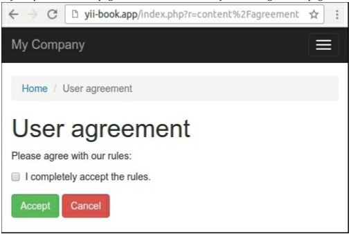
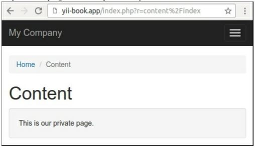

Создание фильтров
===
Фильтр-это класс, который может выполняться до / после выполнения действия. Его можно использовать для изменения контекста выполнения или оформления выходных данных. В нашем примере мы реализуем простой фильтр доступа, которая позволит пользователю видеть содержимое только после принятия пользовательского соглашения.

Подготовка 
---
Создайте новое приложение с помощью диспетчера пакетов Composer, как описано в официальном руководстве по адресу <http://www.yiiframework.com/doc-2.0/guide-start-installation.html>. 
По русски <http://yiiframework.domain-na.me/doc/guide/2.0/ru/start-installation>.

Как это сделать...
---

1 Создание модели формы соглашения:
```php
<?php
namespace app\models;
use yii\base\Model;
class AgreementForm extends Model
{
    public $accept;
    public function rules()
    {
        return [
            ['accept', 'required'],
            ['accept', 'compare', 'compareValue' => 1, 'message' => 'You must agree the rules.'],
        ];
    }
    public function attributeLabels()
    {
        return [
             'accept' => 'I completely accept the rules.'
        ];
    }
}
```

2 Создание службы проверки соглашений:
```php
<?php
namespace app\services;
use Yii;
use yii\web\Cookie;
class AgreementChecker
{
    public function isAllowed()
    {
        return Yii::$app->request->cookies->has('agree');
    }
    public function allowAccess()
    {
        Yii::$app->response->cookies->add(new Cookie([
            'name' => 'agree',
            'value' => 'on',
            'expire' => time() + 3600 * 24 * 90, // 90 days
        ]));
    }
}
```

 Он инкапсулирует работу с cookies соглашения.

 3 Создание класса фильтра:
```php
<?php
namespace app\filters;
use app\services\AgreementChecker;
use Yii;
use yii\base\ActionFilter;
class AgreementFilter extends ActionFilter
{
    public function beforeAction($action)
    {
        $checker = new AgreementChecker();
        if (!$checker->isAllowed()) {
            Yii::$app->response->redirect(['/content/agreement'])->send();
            return false;
        }
        return true;
    }
}
```

4 Создайте контроллер контента и присоедините фильтр к его поведениям:
```php
<?php
namespace app\controllers;
use app\filters\AgreementFilter;
use app\models\AgreementForm;
use app\services\AgreementChecker;
use Yii;
use yii\web\Controller;
class ContentController extends Controller
{
    public function behaviors()
    {
        return [
            [
            'class' => AgreementFilter::className(),
            'only' => ['index'],
            ],
        ];
    }
    public function actionIndex()
    {
        return $this->render('index');
    }
    public function actionAgreement()
    {
        $model = new AgreementForm();
        if ($model->load(Yii::$app->request->post()) && $model->validate()) {
            $checker = new AgreementChecker();
            $checker->allowAccess();
            return $this->redirect(['index']);
        } else {
            return $this->render('agreement', [
                'model' => $model,
            ]);
        }
    }
}
```

5 Добавьте views/content/index.php с личным контентом:
```php
<?php
    use yii\helpers\Html;
    /* 
       @var $this yii\web\View 
    */
    $this->title = 'Content';
    $this->params['breadcrumbs'][] = $this->title;
?>
<div class="site-about">
    <h1><?= Html::encode($this->title) ?></h1>
    <div class="well">This is our private page.</div>
</div>
```

6 Добавьте views/content/agreement.php на форму:
```php
<?php
    use yii\helpers\Html;
    use yii\bootstrap\ActiveForm;
    /* @var $this yii\web\View */
    /* @var $form yii\bootstrap\ActiveForm */
    /* @var $model app\models\AgreementForm */
    $this->title = 'User agreement';
    $this->params['breadcrumbs'][] = $this->title;
?>
<div class="site-login">
    <h1><?= Html::encode($this->title) ?></h1>
    <p>Please agree with our rules:</p>
    <?php $form = ActiveForm::begin(); ?>
        <?= $form->field($model, 'accept')->checkbox() ?>
        <div class="form-group">
            <?= Html::submitButton('Accept', ['class' => 'btn btn-success']) ?>
            <?= Html::a('Cancel', ['/site/index'], ['class' => 'btn btn-danger']) ?>
        </div>
    <?php ActiveForm::end(); ?>
</div>
```

7 Добавьте пункт главного меню в файл views/layouts/main.php:
```php
echo Nav::widget([
    'options' => ['class' => 'navbar-nav navbar-right'],
    'items' => [
        ['label' => 'Home', 'url' => ['/site/index']],
        ['label' => 'Content', 'url' => ['/content/index']],
        ['label' => 'About', 'url' => ['/site/about']],
    ];
]);
```

8 Попробуйте открыть страницу содержимого. Фильтр должен перенаправить вас на страницу соглашения:


9 Только после принятия правил, вы можете увидеть содержимое:


10 Также, вы можете прикрепить фильтр к другим контроллерам или модулям.

Как это работает...
---
Фильтр должен расширить в  класс yii\base\ActionFilter , который расширяет базовый метод yii\base\Behavior. Мы можем переопределить метод beforeAction или afterAction, если мы хотим сделать пост - и предфильтрацию.
Например, мы можем проверить доступ пользователей и выдать соответствующие HTTP-исключения в случае сбоя. В этом рецепте мы перенаправляем пользователя на страницу соглашения, если определенное значение cookie не существует:
```php
class AgreementFilter extends ActionFilter
{
    public function beforeAction($action)
    {
        $checker = new AgreementChecker();
        if (!$checker->isAllowed()) {
            Yii::$app->response->redirect(['/content/agreement'])->send();
            return false;
        }
        return true;
    }
}
```
Вы можете прикрепить фильтры к любому контроллеру или модулю. Чтобы указать список необходимых маршрутов, просто используйте опции only или except. Например, мы применяем наш фильтр только для индексного действия контроллера:
```php
public function behaviors()
{
    return [
        [
        'class' => AgreementFilter::className(),
        ' only' => ['index'],
        ],
    ];
}
```

***Замечание***:Не забудьте вернуть значение true в случае успеха из метода beforeAction. В противном случае действие контроллера не будет выполнено.

Смотрите так же
---
Дополнительные сведения о фильтрах см. в разделе  <http://www.yiiframework. com/doc -2.0/guide-structure -filters.html>. 
По русски https://www.yiiframework.com/doc/guide/2.0/ru/structure-filters

Для встроенного кэша и фильтров управления доступом обратитесь к:
http://www.yiiframework.com/doc-2.0/guide-caching-http.html
по русски https://www.yiiframework.com/doc/guide/2.0/ru/caching-http

Рецепт создания моделей поведения
