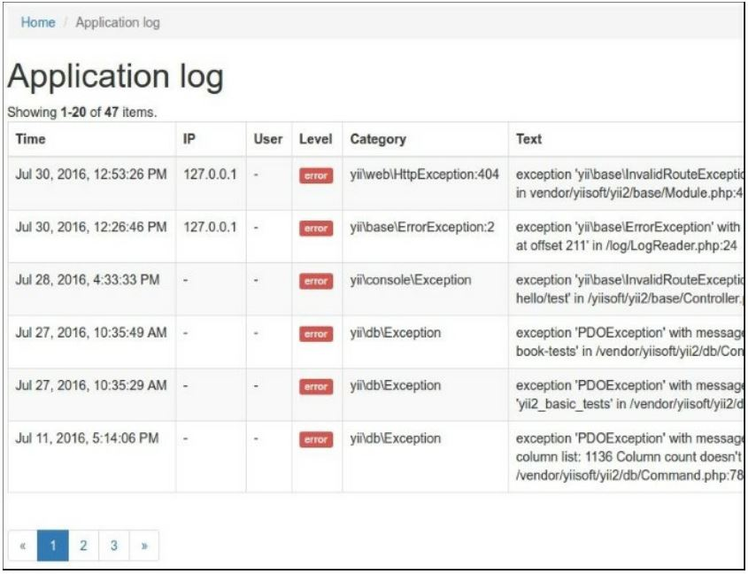

Создание модулей
===
Если вы создали сложную часть приложения и хотите использовать ее с некоторой степенью настройки в следующем проекте, скорее всего, вам нужно создать модуль. В этом рецепте мы увидим, как создать модуль просмотра журнала приложений.

Подготовка 
---
Создайте новое yii2-app-basic приложение с помощью диспетчера пакетов Composer, как описано в официальном руководстве по адресу <http://www.yiiframework.com/doc-2.0/guide-start-installation.html>. 
По русски <http://yiiframework.domain-na.me/doc/guide/2.0/ru/start-installation>

Как это сделать...
---
Давайте сначала немного спланируем.
В yii2-app-basic с конфигурацией по умолчанию все записи журнала хранятся в runtime/logs/app.log. Мы можем извлечь все сообщения из этого файла с помощью регулярных выражений и отобразить их в виджете GridView. Кроме того, мы должны позволить пользователю настроить путь к пользовательскому файлу журнала.
Выполните следующие действия:

1 Создайте каталог modules/log и создайте класс Module с опцией new file:
```php
<?php
namespace app\modules\log;
class Module extends \yii\base\Module
{
    public $file = '@runtime/logs/app.log';
}
```

2 Создайте простую модель для переноса строк из файла журнала:
```php
<?php
namespace app\modules\log\models;
use yii\base\Object;
class LogRow extends Object
{
    public $time;
    public $ip;
    public $userId;
    public $sessionId;
    public $level;
    public $category;
    public $text;
}
```

3 Напишите класс чтения файла журнала, который будет анализировать строки файла, изменять их порядок и возвращать массив экземпляров моделей LogRow:
```php
<?php
namespace app\modules\log\services;
use app\modules\log\models\LogRow;
class LogReader
{
    public function getRows($file)
    {
        $result = [];
        $handle = @fopen($file, "r");
        if ($handle) {
            while (($row = fgets($handle)) !== false) {
                $pattern = '#A'	.
                    '(?P<time>\d{4}\-\d{2}\-\d{2} \d{2}:\d{2}:\d{2}) ' .
                    '\[(?P<ip>[A\]]+)\]' .
                    '\[(?P<userId>[A\]]+)\]' .
                    '\[(?P<sessionId>[A\]]+)\]' .
                    '\[(?P<level>[A\]]+)\]'	.
                    '\[(?P<category>[A\]]+)\]'	.
                    ' (?P<text>.*?)' .
                    '(\$\_(GET|POST|REQUEST|COOKIE|SERVER) = \[)?' .
                    '$#i';
                    if (preg_match($pattern, $row, $matches)) {
                        if ($matches['text']) {
                            $result[] = new LogRow([
                                'time' => $matches['time'],
                                'ip' => $matches['ip'],
                                'userid' => $matches['userId'],
                                'sessionid' => $matches['sessionId'],
                                'level' => $matches['level'],
                                'category' => $matches['category'],
                                'text' => $matches['text'],
                            ]);
                        }
                    }
            }
            fclose($handle);
        }
            return array_reverse($result);
    }
}
```

4 Добавьте помощника для отображения симпатичных HTML-бейджиков для уровней логов:
```php
<?php
namespace app\modules\log\helpers;
use yii\helpers\ArrayHelper;
use yii\helpers\Html;
class LogHelper
{
    public static function levelLabel($level)
    {
        $classes = [
            ' error ' => 'danger',
            'warning' => 'warning',
            ' info ' => 'primary',
            'trace' => 'default',
            'profile' => 'success',
            'profile begin' => 'info',
            'profile end' => 'info',
        ];
        $class = ArrayHelper::getValue($classes, $level, 'default');
        return Html::tag('span', Html::encode($level), ['class' => 'label-' . $class]);
    }
}
```

5 Создайте контроллер модуля, который получит массив строк от читателя и передаст их в ArrayDataProvider:
```php
<?php
namespace app\modules\log\controllers;
use app\modules\log\services\LogReader;
use yii\data\ArrayDataProvider;
use yii\web\Controller;
class DefaultController extends Controller
{
    public function actionIndex()
    {
        $reader = new LogReader();
        $dataProvider = new ArrayDataProvider([
            'allModels' => $reader->getRows($this->getFile()),
        ]);
        return $this->render('index', [
            'dataProvider' => $dataProvider,
        ]);
    }
    private function getFile()
    {
            return \Yii::getAlias($this->module->file);
    }
}
```

6 Теперь создайте файл представления modules/log/default/index.php:
```php
<?php
use app\modules\log\helpers\LogHelper;
use app\modules\log\models\LogRow;
use yii\grid\GridView;
use yii\helpers\Html;
/* @var $this yii\web\View */
/* @var $dataProvider yii\data\ArrayDataProvider */
$this->title = 'Application log';
$this->params['breadcrumbs'][] = $this->title;
?>
<div class="log-index">
    <h1><?= Html::encode($this->title) ?></h1>
    <?= GridView::widget([
        'dataProvider' => $dataProvider,
        'columns' => [
            [
                'attribute' => 'time',
                'format' => 'datetime',
                'contentOptions' => [
                    'style' => 'white-space: nowrap',
                ],
            ],
            ' ip:text :IP',
            'userid:text:User ',
            [
                'attribute' => 'level',
                'value' => function (LogRow $row) {
                    return LogHelper::levelLabel($row->level);
                },
                'format' => 'raw',
            ],
            'category',
            ' text',
        ],
    ]) ?>
</div>
```

7 Подключите модуль к приложению в config/web.php:
```php
$config = [
    'id' => 'basic',
    'basePath' => dirname(__DIR__),
    'bootstrap' => ['log'],
    'modules' => [
        'log' => 'app\modules\log\Module',
    ],
    'components' => [
    
    ],
    ...
];
```

8 Добавьте ссылку на контроллер в файл views/layouts/main.php:
```php
echo Nav::widget([
    'options' => ['class' => 'navbar-nav navbar-right'],
    'items' => [
        ['label' => 'Home', 'url' => ['/site/index']],
        ['label' => 'Log', 'url' => ['/log/default/index']],
        ['label' => 'About', 'url' => ['/site/about']],
        ['label' => 'Contact', 'url' => ['/site/contact']],
    ],
]);
NavBar::end();
```

9 Перейти к url/index.php?r=log и убедиться, что модуль работает:


Как это работает...
---
Можно группировать контроллеры, модели, представления и другие компоненты по отдельным модулям и присоединять их к приложению. Вы можете сгенерировать шаблон модуля с помощью Gii или сделать это вручную.
Каждый модуль содержит основной класс модуля, где мы можем определить настраиваемые свойства, определить пути изменения, присоединить контроллеры и так далее. По умолчанию модуль, сгенерированный с помощью Gii, выполняет index action контроллера по умолчанию.

Смотрите так же
---

* Дополнительные сведения о модулях и рекомендациях см. в разделе
<http://www.yiiframework.com/doc-2.0/guide-structure-modules.html>
По русски <https://www.yiiframework.com/doc/guide/2.0/ru/structure-modules>
* Делая расширения распределени-готовый рецепт
